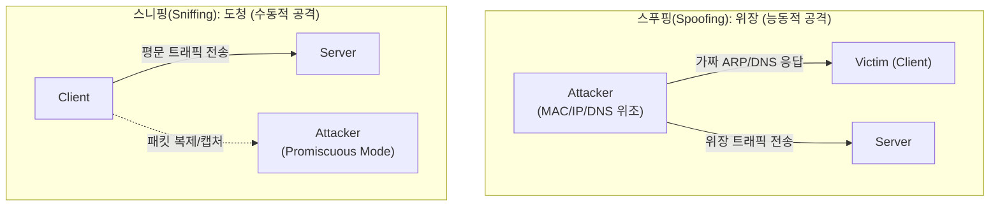

# 스니핑(Sniffing)과 스푸핑(Spoofing)

---

## I. 네트워크 보안을 위협하는 양대 공격 기법, 스니핑과 스푸핑의 개요

* **정의**:
* **스니핑(Sniffing)**: 네트워크 상에 전송되는 패킷을 몰래 도청(Eavesdropping)하여 기밀성을 훼손하는 수동적(Passive) 공격 기법
* **스푸핑(Spoofing)**: 송신자의 식별 정보([[MAC]], IP, [[DNS(Domain Name System)|DNS]] 등)를 위/변조하여 신뢰받는 호스트나 시스템으로 기만하는 능동적(Active) 공격 기법

* **등장배경 및 특징**:
* 기존 [[TCP]]/IP 프로토콜의 취약점(인증 부재, 평문 전송 등) 악용
* 해킹의 사전 준비 단계(스니핑) 및 중간자 공격(MITM)의 핵심 수단(스푸핑)으로 활용
* 최근 AI 기술 발전에 따라 [[딥페이크]] 기반 생체/음성 스푸핑 등 공격 벡터 다변화

---

## II. 스니핑과 스푸핑의 개념도 및 핵심 기술 요소

### 가. 스니핑 및 스푸핑의 공격 개념도 및 동작 원리

* 스니핑은 무차별 모드(Promiscuous Mode)를 통해 네트워크 트래픽을 몰래 엿보며, 스푸핑은 송신자 주소나 응답을 변조하여 시스템의 신뢰 관계를 악용하고 기만함

### 나. 스니핑 및 스푸핑의 핵심 기술 및 대응 요소

| 구분 | 요소기술(키워드) | 세부 설명 |
| --- | --- | --- |
| **스니핑(공격)** | **Promiscuous Mode** | 자신의 MAC 주소와 무관하게 네트워크 인터페이스에 도달하는 모든 패킷을 수신하는 모드 |
| **스니핑(공격)** | **Port Mirroring** | 스위치를 통과하는 트래픽을 특정 포트로 복제하여 스니퍼(Attacker)가 캡처할 수 있도록 악용 |
| **스푸핑(공격)** | **[[ARP]] Spoofing** | 공격자의 MAC 주소를 게이트웨이의 MAC 주소로 위장하는 ARP Reply를 브로드캐스트하여 트래픽 가로채기 |
| **스푸핑(공격)** | **IP Spoofing** | 패킷의 출발지 IP 주소를 신뢰받는 내부 호스트의 IP로 위조하여 방화벽이나 ACL(접근제어) 우회 |
| **스푸핑(공격)** | **DNS Spoofing** | DNS 쿼리에 대해 위조된 IP 응답(DNS Cache Poisoning)을 보내어 사용자를 피싱 사이트로 유도 |
| **방어/대응** | **[[End-to-End]] [[암호화]]** | 스니핑에 대응하기 위해 [[IP Sec|IPsec]]([[네트워크 계층]]), TLS 1.3([[전송 계층]]) 등을 통한 패킷 [[기밀성]] 확보 |
| **방어/대응** | **MAC-IP Binding/DAI** | ARP 스푸핑 방지를 위해 동적 ARP 검사(Dynamic ARP Inspection) 및 포트 보안(Port Security) 적용 |
| **방어/대응** | **[[DNSSEC(Domain Name System Security Extension)|DNSSEC]]** | DNS 스푸핑 방지를 위해 공개키 암호화 기반으로 DNS 응답 데이터의 [[무결성]] 및 인증 검증 |

---

## III. 스니핑과 스푸핑의 비교 및 최근 보안 동향

### 가. 스니핑과 스푸핑 비교

| 비교 항목 | 스니핑 (Sniffing) | 스푸핑 (Spoofing) |
| --- | --- | --- |
| **공격 성격** | 수동적 공격 (Passive Attack) | 능동적 공격 (Active Attack) |
| **침해 보안 요건** | **기밀성 (Confidentiality)** 훼손 | **무결성(Integrity), 인증(Authentication)** 훼손 |
| **공격의 목적** | ID/PW, 계좌정보 등 중요 데이터 수집 | 중간자 공격(MITM), [[세션]] 하이재킹, 피싱 유도 |
| **탐지 난이도** | 트래픽 변화가 없어 탐지 매우 어려움 (은닉성) | 트래픽 흐름 변경, 중복 식별자 발생으로 탐지 상대적 용이 |
| **대표 방어 기법** | 트래픽 암호화, 스니퍼 탐지 도구(Anti-Sniff) 사용 | 패킷 필터링(Ingress/Egress), 강력한 사용자/기기 인증 |

### 나. 최신 위협 트렌드 및 향후 전망

* **SNI 스니핑 위협 및 ECH 도입**: TLS 1.3 환경에서도 평문으로 노출되는 SNI(Server Name Indication)를 스니핑하는 위협을 방지하기 위해, 암호화된 클라이언트 헬로(ECH, Encrypted Client Hello) 표준화 및 적용 확산
* **AI/딥페이크 기반 스푸핑 진화**: 단순 IP/MAC 위조를 넘어, 딥페이크 및 음성 합성 기술을 활용한 신원 위장(Identity Spoofing) 공격이 급증함에 따라 [[FIDO]] 기반의 다중 요소 인증(MFA) 및 [[생체 인증]] 우회 방지 기술 도입 필수
* **제로 트러스트([[제로 트러스트 보안모델|Zero Trust]]) 아키텍처 의무화**: 스푸핑을 통해 내부망에 침투하더라도, '아무도 신뢰하지 않는' 제로 트러스트 원칙에 따라 마이크로 [[세그멘테이션]] 및 지속적 행위 기반 인증을 통한 횡적 이동(Lateral Movement) 차단 체계 구축 주류화

---

### 🔗 연관 토픽

- **소속 도메인**: [[00_보안_MOC|🛡️ 보안]]
- **세부 분류**: `1. 정보보안 원칙 & 거버넌스 · 인증`
- **핵심 연관 토픽**:
  - [[암호화|암호화 (Encryption)]]
  - [[제로 트러스트 보안모델|제로 트러스트 (Zero Trust) 보안모델]]
  - [[기밀성]]
  - [[IP Sec]]
  - [[DNSSEC(Domain Name System Security Extension)]]
