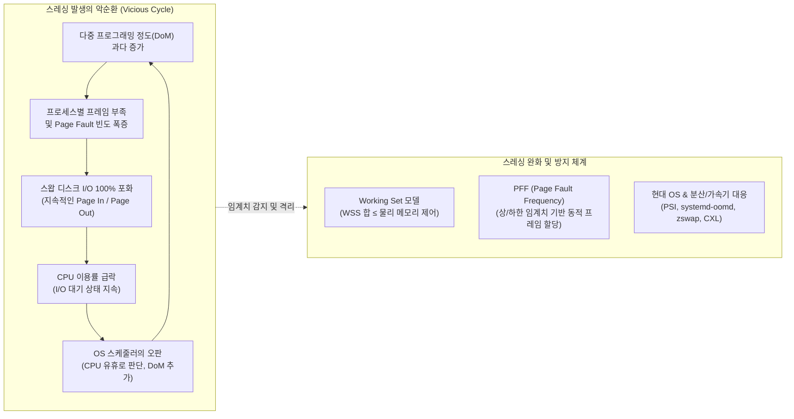

# 스레싱 (Thrashing)

---

## I. 가상 메모리 과부하로 인한 시스템 성능 고갈, 스레싱의 개요

* **정의**: 프로세스의 실제 실행 시간보다 페이지 교체(Page Fault에 따른 Swap In/Out)에 소요되는 I/O 시간이 더 많아져 [[CPU]] 이용률이 급격히 0에 수렴하는 시스템 성능 고갈 현상
* **발생 배경**: 과도한 다중 프로그래밍 정도(DoM) 설정 시 프로세스별 필요 물리 프레임 결여, 시스템의 Working Set 미수용
* **특징**: CPU 이용률 급감, 디스크 I/O 큐 100% 포화, 전반적 입출력 병목 및 시스템 무응답([[커널|Kernel]] Lockup) 유발

---

## II. 스레싱의 개념도 및 핵심 기술 요소

### 가. 스레싱의 메커니즘 및 동작 원리

* 페이지 부재로 인한 I/O 대기 시 OS가 CPU 유휴로 오인하여 프로세스를 추가 실행하면서 스레싱이 가속화되며, 프레임 할당 제어 및 모니터링을 통한 사전 차단이 필수적임.

### 나. 스레싱의 핵심 기술 및 구성 요소

| 구분 | 핵심 기술(키워드) | 세부 설명 |
| --- | --- | --- |
| 발생 원인 | 다중 프로그래밍 정도(DoM) | 물리 메모리 용량 한계를 초과하여 동시 실행 프로세스를 과도하게 늘릴 때 발생 |
| 발생 원인 | Working Set 미수용 | 프로세스들이 집중 참조하는 페이지 집합(Working Set Size)의 총합이 실 메모리를 초과 |
| 전통적 예방 | Working Set ($W(t, \Delta)$) | 참조 시간 윈도우($\Delta$) 내 접근 페이지 집합을 메모리에 상주, 부족 시 [[프로세스]] 스왑아웃 |
| 전통적 예방 | PFF (Page Fault Frequency) | 페이지 부재 빈도 상한선(Upper) 초과 시 프레임 추가 할당, 하한선(Lower) 미만 시 회수 |
| OS 최적화 | zswap / zram | 스왑 공간 기록 전 메모리 내 압축 캐싱을 수행하여 느린 스토리지 I/O 레이턴시 완화 |
| 모니터링 | Linux PSI (Pressure Stall Info) | CPU, Memory, I/O 자원 고갈 대기 시간을 실시간 추적하여 스레싱 전조 상태 감지 |
| 자원 격리 | cgroup v2 & systemd-oomd | cgroup 메모리 상한 제어(`memory.high/max`) 및 PSI 임계치 초과 시 조기 정리 수행 |
| 가속기/AI | UVM & [[CXL]] Memory Pool | [[GPU]] VRAM 오버서브스크립션 스레싱 방지 및 CXL 3.0 기반 바이트 단위 메모리 풀링 확장 |

---

## III. 스레싱 대응 패러다임: 전통적 OS vs 현대 클라우드·AI 환경 비교

### 가. 환경별 스레싱 비교

| 비교 항목 | 전통적 [[가상 메모리]] 환경 | 현대 클라우드 및 AI 가속 환경 |
| --- | --- | --- |
| **발생 계층** | 단일 노드 OS 커널 (DRAM $\leftrightarrow$ Swap Disk) | [[컨테이너]] 노드(K8s) 및 AI 가속기 (GPU VRAM $\leftrightarrow$ Host DRAM) |
| **주요 원인** | 과도한 DoM, 비효율적 [[페이지 교체 알고리즘]] | 대규모 컨테이너 집적, 초대형 [[초거대 언어 모델|LLM]] 학습/추론 시 UVM 과다 이주 |
| **감지 방식** | 단순 CPU Utilization 급감, Disk I/O [[Queue]] 모니터링 | Linux 커널 PSI(`memory.pressure`), GPU Interconnect 병목 관측 |
| **해결 기법** | 프로세스 일시 중단(Swap-out), Working Set/PFF 적용 | Pod Eviction, systemd-oomd 자동 강제 종료, CXL 메모리 풀링 |
| **영향도** | 단일 호스트 시스템 전체 멈춤(Kernel Lockup) | 서비스 [[SLA]] 저하, 분산 분할 파이프라인 학습 지연(Straggler 발생) |

* 현대 대규모 분산 환경에서는 단순 스왑 제어를 넘어 Linux PSI 기반 자동화와 CXL/대역폭 확장 중심의 통합 [[메모리 관리]] 아키텍처로 진화함.

---

### 🔗 연관 토픽

- **소속 도메인**: [[00_운영체제_MOC|⚙️ 운영체제]]
- **세부 분류**: `1. 프로세스 & 스레드 관리`
- **핵심 연관 토픽**:
  - [[프로세스]]
  - [[커널|커널(Kernel)]]
  - [[컨테이너|컨테이너 (Container)]]
  - [[가상 메모리]]
  - [[메모리 관리]]
