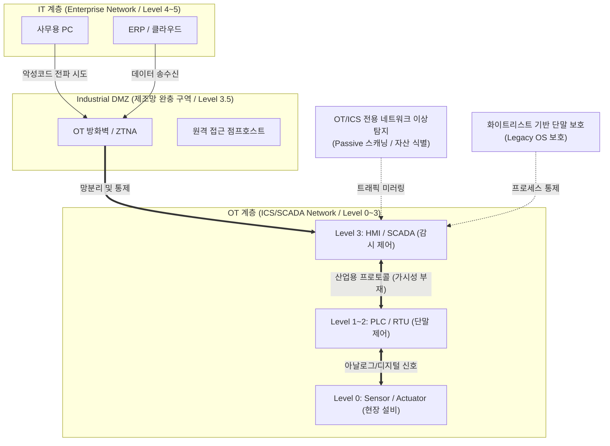

# 스마트팩토리 보안취약점 및 대응방안

---

## I. IT/OT 융합 환경의 초연결 제조망 보호, 스마트팩토리 보안의 개요

* **정의**: 폐쇄망(Air-Gap) 구조에서 벗어나 IT망과 OT(운영기술)망이 연결된 제조 환경에서, [[랜섬웨어]] 등 사이버 위협으로부터 생산 라인의 가용성을 보장하고 제어 시스템을 보호하는 융합 보안 체계
* **필요성 및 등장 배경**:
* **[[HA(High Availability)|가용성]] 최우선(Availability)**: 제어망 마비 시 막대한 조업 손실 및 물리적 인명/환경 피해 발생
* **공격 표면(Attack Surface) 확대**: IIoT(산업용 사물인터넷) 도입 및 [[5G 특화망]] 적용으로 외부 접점 증가
* **레거시 단말 취약성**: 패치 불가능한 구형 OS(Win XP/7) 및 인증/암호화가 부재한 산업용 [[프로토콜]](Modbus 등) 사용

---

## II. 스마트팩토리 보안 아키텍처 및 핵심 기술 요소

### 가. 스마트팩토리 통합 보안 아키텍처 (퍼듀 모델 기반)

* IT망과 OT망 사이에 iDMZ(Industrial DMZ)를 구성하여 논리적 망분리 및 랜섬웨어 측면 이동(Lateral Movement) 차단
* OT망 내부는 가용성을 해치지 않는 미러링 기반의 패시브(Passive) 자산 식별 및 이상 탐지(IDS) 적용이 핵심

### 나. 스마트팩토리 보안 핵심 구성요소 및 요소 기술

| 구분 | 요소 기술 (키워드) | 세부 설명 |
| --- | --- | --- |
| **보안 [[프레임워크]]** | **[[IEC 62443]]** | 산업용 제어시스템(ICS) 보안 글로벌 국제 표준 (조직, 시스템, 컴포넌트 요건 정의) |
| **네트워크 보안** | **마이크로 [[세그멘테이션]]** | 공정별, 설비별 네트워크를 미세하게 분할하여 사이버 위협의 내부 확산 원천 차단 |
| **접근 통제** | **OT ZTNA (제로트러스트)** | 원격 [[유지보수]] 업체의 제어망 접근 시, [[VPN]]을 대체하는 컨텍스트 기반의 동적 권한 검증 |
| **프로토콜 분석** | **산업용 프로토콜 DPI** | Modbus, DNP3, OPC-UA 등 암호화가 부재한 산업용 특화 프로토콜의 심층 패킷 검사(DPI) |
| **단말(Endpoint) 보호** | **화이트리스트 제어** | 가용성 보장을 위해 백신 대신 인가된 프로세스만 실행을 허용하는 Application Control 적용 |
| **위협 가시성** | **패시브 스캐닝 (Passive)** | 제어망 트래픽 부하 방지를 위해 [[스위치 (Layer 3 Switch)|스위치]] 미러 포트(SPAN)를 통한 비경계형 자산 식별 및 탐지 |
| **데이터 [[무결성]]** | **데이터 다이오드 (단방향)** | OT망에서 IT망으로 데이터 전송 시 물리적 단방향 통신 장비를 통해 외부 침투 원천 차단 |
| **침해 대응** | **[[디지털 트윈]] 기반 시뮬레이션** | 설비 중단 없이 가상화된 공장 모델에서 보안 패치 및 악성코드 감염 시나리오 사전 검증 |

---

## III. IT 보안과 OT(스마트팩토리) 보안 비교 및 향후 전망

### 가. IT 보안과 OT 보안 패러다임 비교

| 비교 항목 | IT 보안 (사무망) | OT 보안 (스마트팩토리 제어망) |
| --- | --- | --- |
| **보안 3요소 우선순위** | **CIA** ([[기밀성]] > 무결성 > 가용성) | **AIC** (가용성 > 무결성 > 기밀성) |
| **보안 침해 시 영향** | 데이터 유출, 프라이버시 침해, 금전 손실 | **생산 라인 마비, 환경 파괴, 인명 피해 (물리적 타격)** |
| **OS 및 자산 수명** | 3~5년 (최신 OS 유지) | **15~20년 (Win XP, 7 등 Legacy 시스템 잔존)** |
| **패치 및 업데이트** | 정기적, 즉각적 적용 가능 | **적용 어려움 (공정 휴지기(Turn-around)에만 제한적 적용)** |
| **[[네트워크 프로토콜]]** | 표준 프로토콜 ([[TCP]]/IP, HTTPS, SSH 등) | **벤더 종속적, 비표준, 평문 통신 (Modbus, Profinet 등)** |

### 나. 향후 전망 및 기술 동향

* **IT-OT 융합 관제(Converged SOC) 고도화**: 단편적인 OT 보안을 넘어 [[XDR]](확장 탐지 및 대응) 및 OT-[[SOAR (Security Orchestration, Automation and Response)|SOAR]]를 도입하여 IT망부터 제어망 단말까지의 크로스 도메인(Cross-Domain) 위협 가시성 확보 및 자동화 대응
* **사이버-물리 시스템([[CPS]]) 보안 가이드라인 준수**: [[공급망 공격]] 방어를 위해 산업용 장비 도입 시 [[SBOM]](소프트웨어 자재명세서) 제출 요구 및 Security by Design 내재화 필수
* **5G 특화망(이음5G) 보안 내재화**: 제조 현장의 무선화에 대응하여 MEC([[Mobile Edge Computing]]) 기반의 트래픽 로컬 오프로딩 및 초저지연 [[양자내성암호]](PQC) 적용 연구 가속화

---

### 🔗 연관 토픽

- **소속 도메인**: [[00_보안_MOC|🛡️ 보안]]
- **세부 분류**: `1. 정보보안 원칙 & 거버넌스 · 인증`
- **핵심 연관 토픽**:
  - [[기밀성]]
  - [[VPN|VPN(Virtual Private Network)]]
  - [[공급망 공격|공급망 공격(Supply Chain Attack)]]
  - [[IEC 62443]]
  - [[무결성]]
