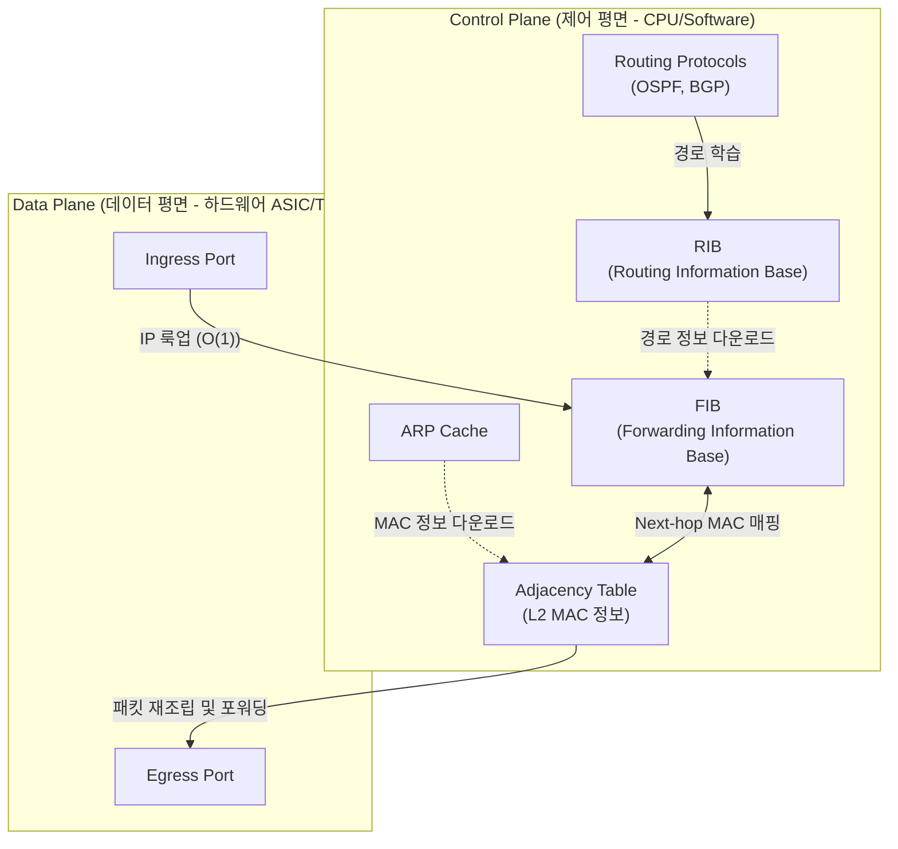

# L3 스위치 (Layer 3 Switch)

---

## I. 대역폭 병목 해소 및 고속 IP 라우팅을 위한, L3 스위치의 개요

* **정의**: [[MAC]] 주소 기반의 2계층 스위칭 기능과 IP 주소 기반의 3계층 네트워크 라우팅 기능을 통합하여, 하드웨어(ASIC, TCAM) 기반으로 패킷을 고속(Wire-Speed) 처리하는 네트워크 통신 장비
* **필요성 및 등장배경**:
* **L2 한계 극복**: 네트워크 규모 확장에 따른 브로드캐스트 스톰(Broadcast Storm) 제어 및 도메인 분할 필요성 증대
* **[[라우터]] 병목 해소**: 기존 소프트웨어 방식 라우터의 패킷 처리 지연(Latency) 한계 극복 및 Inter-VLAN 간 고속 통신 요구

* **특징**: 컨트롤 플레인(제어)과 데이터 플레인(전달)의 논리적 분리, FIB/Adjacency Table 기반의 하드웨어 스위칭, 풍부한 이더넷 포트 지원

---

## II. L3 스위치의 아키텍처 및 핵심 구성요소

### 가. L3 스위치의 아키텍처 및 동작 원리

* [[CPU]]가 제어하는 Control Plane의 라우팅 정보(RIB)를 Data Plane의 하드웨어 테이블(FIB)로 실시간 다운로드(캐싱)함
* 패킷 유입 시 CPU의 개입 없이 ASIC과 TCAM 메모리를 활용하여 목적지 IP 룩업 및 L2 헤더 재작성을 Wire-Speed로 수행함

### 나. L3 스위치의 핵심 기술 요소

| 구분 | 핵심 기술 (키워드) | 세부 설명 |
| --- | --- | --- |
| **하드웨어 구조** | **TCAM (Ternary CAM)** | 0, 1, X(Don't Care)의 세 가지 상태를 인식하여 라우팅 테이블(IP)을 1클럭 룩업으로 고속 검색하는 특수 메모리 |
| **하드웨어 칩셋** | **ASIC** | 패킷 파싱, 헤더 변환, 포워딩 등의 스위칭/라우팅 로직을 하드웨어로 구현한 주문형 반도체 |
| **고속 라우팅** | **FIB (Forwarding Info Base)** | RIB(라우팅 테이블)를 기반으로 하드웨어 캐시에 최적화된 목적지 네트워크 포워딩 테이블 |
| **L2/L3 매핑** | **Adjacency Table** | 목적지 IP(Next-Hop)로 가기 위해 필요한 상대방의 MAC 주소 정보를 저장하는 인접 테이블 |
| **네트워크 [[가상화]]** | **VRF (Virtual Routing & Forwarding)** | 한 대의 L3 스위치 내에서 라우팅 테이블을 논리적으로 분할하여, 서로 다른 네트워크(테넌트)를 격리하는 기술 |
| **내부망 연동** | **SVI (Switch Virtual Interface)** | 물리적 포트가 아닌 VLAN 자체에 IP를 할당하여 논리적인 [[게이트웨이]] 역할을 수행하는 가상 인터페이스 |
| **루팅 기법** | **CEF (Cisco Express Forwarding)** | 첫 번째 패킷부터 CPU 개입 없이 하드웨어 기반으로 토폴로지 맵을 활용해 고속 스위칭하는 기술 |
| **[[프로토콜]]** | **동적 라우팅 프로토콜** | OSPF, EIGRP, [[BGP]] 등 엔터프라이즈 및 데이터센터 내외부 경로 자동 학습 기술 지원 |

---

## III. L3 스위치와 라우터 비교 및 최신 동향

### 가. L3 스위치와 기존 라우터(Router) 비교

| 비교 항목 | L3 스위치 | 라우터 (Traditional Router) |
| --- | --- | --- |
| **주요 목적 및 환경** | LAN 내부 연동, 데이터센터 내부 (Inter-VLAN) | WAN 외부 연동, 브랜치 연결, 인터넷 게이트웨이 |
| **패킷 처리 방식** | **하드웨어 중심** (ASIC, TCAM 탑재로 초고속 처리) | **소프트웨어 중심** (CPU, [[NPU]] 기반 유연한 처리) |
| **라우팅 테이블 크기** | 상대적으로 작음 (TCAM 메모리 용량 및 단가의 한계) | 매우 큼 (인터넷 Full Routing Table 수용 가능) |
| **지원 인터페이스** | 다수의 고속 이더넷(Ethernet) 포트 (RJ45, SFP+ 등) | 이더넷 외에도 시리얼(Serial), 광역망(WAN) 등 다양한 포트 지원 |
| **보안 및 부가기능** | 기본적인 ACL, [[QoS]] 제공 | 복잡한 NAT, [[VPN]], [[방화벽]] 등 고급 기능 지원 |

### 나. L3 스위치의 기술 전망 및 최신 동향

* **Spine-Leaf 아키텍처 확산**: 클라우드 환경에서 가상머신 간 트래픽(East-West) 증가로 인해, 기존 3계층(Access-Agg-Core) 구조를 탈피하고 Leaf 스위치 단까지 L3 라우팅을 내리는 구조 도입
* **개방형 생태계(Whitebox) 전환**: 벤더 종속적인(Lock-in) 장비에서 벗어나, 상용 하드웨어(Whitebox)에 개방형 네트워크 [[OS(운영체제)|운영체제]](NOS, 예: SONiC)를 설치하여 운영 효율성 및 확장성 극대화
* **VXLAN 기반 오버레이 네트워크**: L3 스위치의 라우팅망(Underlay) 위에서 L2 브로드캐스트 도메인을 터널링(MAC-in-UDP)하여, 물리적 한계 없이 대규모 테넌트 망분리 및 클라우드 인프라 확장
* **P4 기반 데이터 플레인 프로그래밍**: 스위치의 패킷 처리 파이프라인(Match-Action)을 소프트웨어로 직접 정의(P4 언어)하여, 새로운 프로토콜 추가 및 심층 텔레메트리(INT) 실현 가속화

---

### 🔗 연관 토픽

- **소속 도메인**: [[00_네트워크_MOC|🌐 네트워크]]
- **세부 분류**: `1. OSI 7계층 & 데이터링크 계층 (L1/L2)`
- **핵심 연관 토픽**:
  - [[게이트웨이]]
  - [[가상화]]
  - [[라우터]]
  - [[BGP|BGP(Border Gateway Protocol)]]
  - [[네트워크 계층|네트워크 계층 (Network Layer)]]
