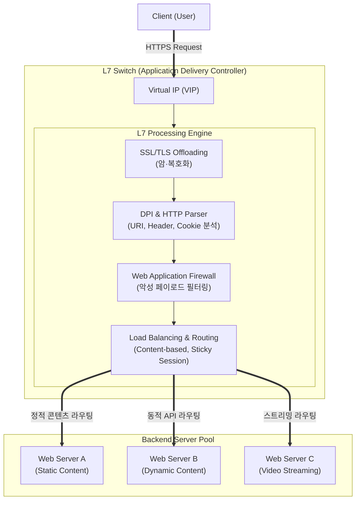

# L7 스위치 (Layer 7 Switch)

---

## I. 지능형 트래픽 분산 및 애플리케이션 전송 제어, L7 스위치의 개요

* **정의**: 네트워크 트래픽의 OSI 7계층(응용 계층) 페이로드(HTTP 헤더, URI, [[쿠키]] 등)를 심층 분석(DPI)하여 트래픽을 지능적으로 라우팅하고 부하 분산(Load Balancing)을 수행하는 네트워크 장비(ADC, Application Delivery Controller)
* **필요성 및 등장배경**:
* **L4 스위치의 한계 극복**: IP 및 포트 기반 분산의 한계를 넘어 콘텐츠 종류(비디오, 이미지, 텍스트)에 따른 정밀한 서버 할당 필요
* **서버 부하 감소**: SSL 암/복호화, 데이터 압축 등 애플리케이션 서버의 부하를 네트워크 단에서 오프로딩(Offloading)하여 성능 최적화 요구

* **특징**: 콘텐츠 기반 라우팅, 애플리케이션 가속(Caching, Compression), 웹 애플리케이션 보안(WAF) 통합 지원

---

## II. L7 스위치의 아키텍처 및 핵심 구성요소

### 가. L7 스위치의 아키텍처 및 동작 원리

* 클라이언트의 요청(HTTPS)이 VIP로 인입되면, L7 스위치가 SSL 터미네이션을 수행하여 페이로드를 복호화함
* 복호화된 데이터(URI, HTTP 헤더 등)를 파싱 및 검사(WAF)한 후, 설정된 정책(콘텐츠 유형, [[세션]] 유지 등)에 따라 최적의 백엔드 서버로 세션을 연결(Proxy 동작)함

### 나. L7 스위치의 핵심 기술 요소

| 구분 | 핵심 기술 (키워드) | 세부 설명 |
| --- | --- | --- |
| **페이로드 분석** | **DPI (Deep Packet Inspection)** | 패킷의 데이터 영역(Payload)까지 심층 검사하여 HTTP 헤더, URL, 쿠키 등 애플리케이션 정보 식별 |
| **트래픽 분산** | **콘텐츠 기반 라우팅** | URL, 확장자(e.g., .jpg, .jsp) 등을 분석하여 정적/동적 서버 등 목적에 맞는 서버로 트래픽 전달 |
| **세션 관리** | **세션 지속성 (Sticky [[Session Layer|Session]])** | 클라이언트의 쿠키(Cookie)나 세션 ID를 식별하여, 지속적인 연결이 필요한 경우 동일한 서버로 지속 할당 |
| **성능 최적화** | **SSL 오프로딩 (SSL Offloading)** | 애플리케이션 서버를 대신하여 SSL/TLS [[암호화]] 및 복호화 연산을 수행하여 서버 [[CPU]] 부하 감소 |
| **성능 최적화** | **캐싱 및 압축 (Caching/Compression)** | 빈번하게 요청되는 정적 콘텐츠를 [[스위치 (Layer 3 Switch)|스위치]] 메모리에 캐싱하고, 데이터를 압축 전송하여 응답 속도 향상 |
| **보안 강화** | **WAF (Web Application Firewall)** | [[SQL(Structured Query Language)|SQL]] 인젝션, [[XSS]] 등 애플리케이션 계층을 겨냥한 웹 공격(OWASP Top 10) 탐지 및 차단 |
| **[[HA(High Availability)|가용성]] 보장** | **L7 헬스 체크 (Health Check)** | 단순 PING(L3)이 아닌, HTTP GET 요청에 대한 200 OK 응답 확인 등 실제 서비스 구동 여부 검증 |
| **트래픽 제어** | **Rate Limiting / [[QoS]]** | 과도한 API 호출이나 [[DDOS|DDoS]] 공격을 방어하기 위해 클라이언트별 초당 요청 수(TPS) 제한 |

---

## III. L7 스위치와 L4 스위치 비교 및 향후 전망

### 가. L4 스위치와 L7 스위치 상세 비교

| 비교 항목 | L4 스위치 | L7 스위치 (ADC) |
| --- | --- | --- |
| **기준 계층** | [[전송 계층]] (Transport Layer - Layer 4) | 응용 계층 (Application Layer - Layer 7) |
| **판단 기준 (식별자)** | IP 주소, [[TCP]]/UDP 포트 번호 | URI, HTTP 헤더, 쿠키, 페이로드(데이터) |
| **동작 방식** | 패킷 단위 포워딩 및 NAT(네트워크 주소 변환) | 리버스 프록시(Reverse Proxy) 기반 세션 연결 |
| **처리 속도 및 부하** | 하드웨어(ASIC) 기반 초고속 처리, 장비 부하 낮음 | 소프트웨어 연산 및 CPU 사용량 높음, 처리 속도 상대적 느림 |
| **주요 기능** | TCP/UDP 로드밸런싱, HA, L3/L4 필터링 | 콘텐츠 라우팅, SSL 오프로드, WAF, 캐싱 |
| **보안 수준** | SYN Flooding 등 L3/L4 기반 네트워크 공격 방어 | SQL 인젝션, XSS 등 애플리케이션 수준의 웹 해킹 방어 |

### 나. L7 스위치의 기술 전망 및 트렌드 동향

* **[[클라우드 네이티브]] ADC 및 Ingress Controller로의 진화**: 전통적인 어플라이언스(H/W) 형태에서 벗어나, [[쿠버네티스]](Kubernetes) 환경의 트래픽 라우팅을 전담하는 Ingress Controller (NGINX, HAProxy) 및 [[컨테이너]] 기반 소프트웨어 스위치로 완벽히 전환 중
* **서비스 메시(Service Mesh) 기반 마이크로서비스 제어**: Envoy 프록시 등을 활용하여 [[MSA (Micro Service Architecture)|MSA]] 환경 내 수많은 마이크로서비스 간의 통신(East-West 트래픽)을 제어하고, L7 텔레메트리, mTLS(상호 인증)를 제공하는 분산형 L7 라우팅 아키텍처 확산
* **eBPF 활용 [[커널]] 레벨 패킷 처리**: L7 스위칭의 고질적인 단점인 소프트웨어 처리 지연(Latency)을 극복하기 위해, 리눅스 커널 수준에서 네트워크 패킷을 우회(Bypass) 없이 즉시 처리하는 eBPF(extended BPF) 기술 도입 가속화 (예: Cilium)
* **AI 기반 지능형 WAF 및 트래픽 분석**: 시그니처 기반 필터링의 한계를 넘어, 머신러닝을 활용해 정상적인 API 호출 패턴을 학습하고 제로데이 공격 및 변조된 비정상 페이로드를 실시간으로 탐지하는 AI-ADC로 발전

---

### 🔗 연관 토픽

- **소속 도메인**: [[00_네트워크_MOC|🌐 네트워크]]
- **세부 분류**: `1. OSI 7계층 & 데이터링크 계층 (L1/L2)`
- **핵심 연관 토픽**:
  - [[세션]]
  - [[쿠키]]
  - [[Session Layer|Session]]
  - [[스위치 (Layer 3 Switch)]]
  - [[전송 계층|전송 계층 (Transport Layer)]]
