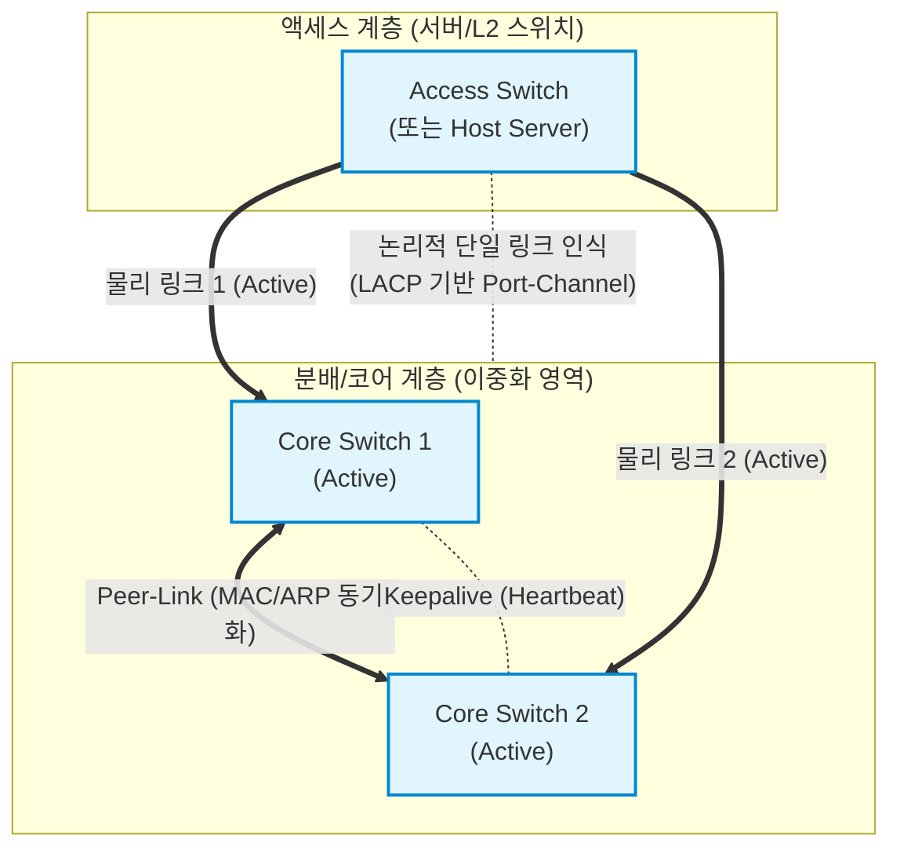

# 스위치 이중화 (Switch Redundancy)

---

## I. 무중단 네트워크 인프라 보장을 위한, 스위치 이중화의 개요

* **정의**: 네트워크의 단일 장애점(SPOF, Single Point of Failure)을 제거하고 [[HA(High Availability)|고가용성]](HA)을 확보하기 위해, 물리적/논리적으로 두 대 이상의 스위치와 링크를 구성하여 시스템의 연속성을 보장하는 네트워크 아키텍처
* **필요성 및 목적**:
* **고가용성(HA) 확보**: 하드웨어 고장, 링크 단선 시에도 우회 경로를 통한 서비스 무중단 제공
* **대역폭 확장 및 부하 분산**: 다중 링크를 활용한 트래픽 로드밸런싱으로 대규모 트래픽 병목 해소
* **장애 복구 시간(Convergence Time) 최소화**: 밀리초(ms) 단위의 신속한 장애 감지 및 경로 전환

---

## II. 스위치 이중화 아키텍처 및 핵심 기술 요소

### 가. 스위치 이중화 구성 개념도 (MLAG/vPC 중심)

* 하위 [[스위치 (Layer 3 Switch)|스위치]](또는 서버) 입장에서는 2대의 상위 스위치를 논리적인 1대의 스위치로 인식하여 LACP로 연결함
* 기존 STP(Spanning Tree Protocol)의 포트 차단(Blocking)으로 인한 대역폭 낭비 없이 모든 링크를 Active-Active 상태로 사용하여 성능과 안정성을 극대화

### 나. 스위치 이중화의 핵심 기술 요소

| 구분 | 요소 기술 (키워드) | 세부 설명 |
| --- | --- | --- |
| **L2 루프 방지** | **STP / RSTP** | 브로드캐스트 스톰 방지를 위해 논리적 루프 구조를 차단하고, 주 링크 장애 시 대체 경로를 개방하는 [[프로토콜]] (IEEE 802.1D/802.1w) |
| **링크 이중화** | **LACP** | 2개 이상의 물리적 포트를 논리적 단일 채널(EtherChannel)로 묶어 대역폭을 확장하고 링크 이중화를 제공 (IEEE 802.3ad) |
| **L3 [[게이트웨이]]** | **FHRP (VRRP/HSRP)** | 복수의 [[라우터]]/L3 스위치가 하나의 가상 IP/[[MAC]] 주소를 공유하여 디폴트 게이트웨이의 SPOF를 제거하는 프로토콜 |
| **섀시 통합** | **VSS / StackWise** | 물리적으로 분리된 2대 이상의 스위치를 하나의 가상 스위치(Single Control Plane)로 결합하여 관리 효율성 제공 |
| **멀티 섀시** | **MLAG (vPC 등)** | 컨트롤 플레인은 분리하되 데이터 플레인만 묶어 상호 독립성을 유지하면서 Active-Active 부하 분산을 지원하는 [[가상화]] 기술 |
| **데이터센터** | **Spine-Leaf 아키텍처** | 모든 Leaf 스위치가 모든 Spine 스위치와 연결되는 2-Tier 구조로, 대규모 수평 확장성 및 이중화 경로 제공 |
| **경로 분산** | **ECMP** | 목적지로 향하는 동일한 비용(Metric)을 가진 여러 경로로 트래픽을 동적으로 분산(Load Balancing)시키는 L3 라우팅 기술 |
| **오버레이 기술** | **EVPN-VXLAN** | L3 언더레이 망 위에서 L2 브로드캐스트 도메인을 터널링하여, 데이터센터 간 무중단 가상머신(VM) 마이그레이션 및 이중화 구현 |

---

## III. 전통적 이중화와 최신 이중화 방식 비교 및 발전 동향

### 가. 전통적 L2 이중화(STP)와 멀티 섀시 이중화(MLAG/vPC) 비교

| 비교 항목 | 전통적 스위치 이중화 (STP 기반) | 멀티 섀시 스위치 이중화 (MLAG / vPC) |
| --- | --- | --- |
| **동작 방식** | **Active - Standby** (대기 포트 발생) | **Active - Active** (전체 링크 사용) |
| **대역폭 활용** | 이중화된 링크 중 절반만 사용 (대역폭 낭비) | 구성된 모든 링크 대역폭을 100% 활용 |
| **장애 복구 시간** | 느림 (RSTP 기준 1~3초, STP 30~50초 소요) | 매우 빠름 (Sub-second, 보통 50ms 이내) |
| **루프 방지 메커니즘** | 논리적 포트 차단 (Blocking State 유지) | LACP 및 Peer-Link 룰 기반 브로드캐스트 제어 |
| **컨트롤 플레인** | 개별 스위치 독립 운영 (루프 연산 부하 존재) | 독립적 운영이나 테이블(MAC/[[ARP]]) 실시간 동기화 |

### 나. 스위치 이중화 기술의 트렌드 및 향후 전망

* **Active-Active 기반의 무손실 패브릭 전환**: 클라우드 및 AI 워크로드 확장에 따라 대역폭 낭비가 발생하는 기존 STP 기반 구조는 도태되고, 데이터센터는 ECMP와 MLAG를 결합한 완벽한 Active-Active 구조로 표준화됨
* **오버레이 네트워크 이중화([[SDN(Software Defined Network)|SDN]] 연동)**: 물리적 스위치의 이중화를 넘어, [[BGP]] EVPN 컨트롤 플레인과 VXLAN 데이터 플레인을 활용한 L2/L3 통합 가상화 이중화 구조(DCI, Data Center Interconnect)로 진화
* **인텐트 기반 자동 복구(IBN, [[IBN(Intent-Based Networking)|Intent-Based Networking]])**: 텔레메트리(Telemetry) 기술을 통해 스위치의 마이크로버스트(Microburst) 및 링크 저하를 AI가 사전 감지하고, 선제적으로 무중단 경로 우회를 수행하는 지능형 패브릭으로 발전 중

---

### 🔗 연관 토픽

- **소속 도메인**: [[00_네트워크_MOC|🌐 네트워크]]
- **세부 분류**: `1. OSI 7계층 & 데이터링크 계층 (L1/L2)`
- **핵심 연관 토픽**:
  - [[라우터]]
  - [[스위치 (Layer 3 Switch)]]
  - [[게이트웨이]]
  - [[BGP|BGP(Border Gateway Protocol)]]
  - [[ARP]]
