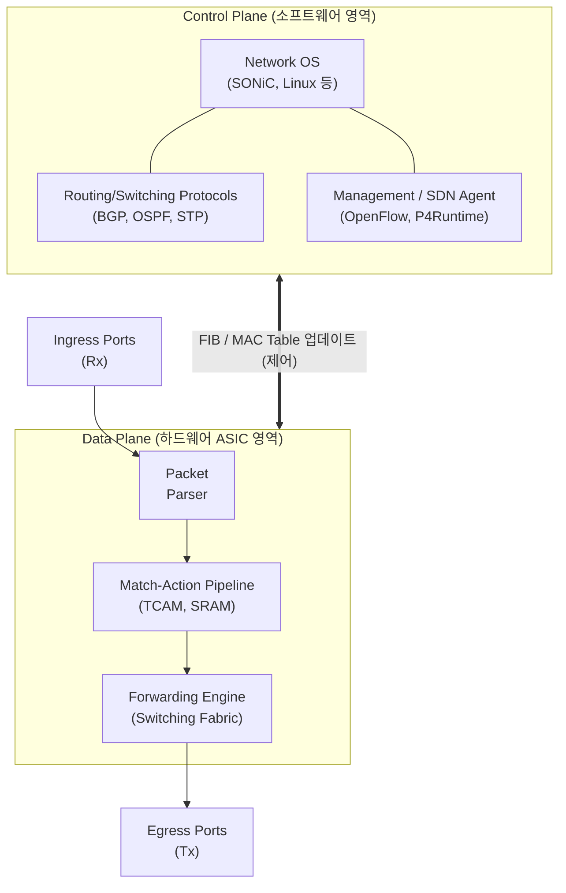

# 스위치 (Network Switch)

---

## I. 안전하고 신속한 패킷 전달을 위한, 네트워크 스위치의 개요

* **정의**: 네트워크에서 [[MAC]] 주소 또는 IP 주소를 기반으로 목적지를 식별하여, 입력된 패킷을 해당 목적지 포트로만 고속 전달(Forwarding)하는 네트워크 중계 장비
* **필요성 및 등장배경**:
* **충돌 도메인(Collision Domain) 분할**: 허브(Hub)의 브로드캐스트로 인한 패킷 충돌 문제 해결 및 대역폭 효율성 확보
* **고속 패킷 처리**: 하드웨어 기반(ASIC, TCAM)의 Wire-Speed 라우팅 및 스위칭 요구 증대

* **최신 트렌드 특징**: 클라우드/AI 워크로드 증가에 따른 엽맥(Spine-Leaf) 구조 도입, HW/SW 분리(Whitebox), 데이터 플레인 프로그래밍(P4) 진화

---

## II. 스위치의 아키텍처 및 핵심 기술 요소

### 가. 스위치의 아키텍처 및 동작 원리

* Control Plane(경로 학습 및 제어)과 Data Plane(패킷 실제 전달)의 구조적 분리를 통해 [[SDN(Software Defined Network)|SDN]] 및 화이트박스 생태계로 진화
* Ingress 포트로 패킷 유입 시, ASIC 및 TCAM 기반의 Match-Action 파이프라인을 거쳐 Egress 포트로 고속 스위칭 수행

### 나. 스위치의 핵심 기술 및 구성 요소

| 구분 | 요소 기술 (키워드) | 세부 설명 |
| --- | --- | --- |
| **하드웨어 요소** | **TCAM (Ternary CAM)** | 0, 1, X(Don't Care) 상태를 인식하여 MAC/IP 주소를 1클럭 룩업(O(1))으로 고속 검색하는 특수 메모리 |
| **하드웨어 요소** | **Switching Fabric** | 포트 간 데이터를 논리적/물리적으로 묶어 병목 없이 전송하는 고속 상호 연결망 (Crossbar 구조 등) |
| **논리적 분할** | **VLAN / VXLAN** | 물리적 스위치를 논리적 브로드캐스트 도메인으로 분할 (VLAN: 802.1Q, VXLAN: 클라우드용 MAC-in-UDP 확방) |
| **루프 방지** | **STP / RSTP** | 브로드캐스트 스톰(Broadcast Storm) 방지를 위한 루프 차단 [[알고리즘]] (IEEE 802.1D / 802.1w) |
| **아키텍처** | **Spine-Leaf 구조** | 클라우드 데이터센터의 East-West 트래픽 처리에 최적화된 2계층(Spine-Leaf) 논블로킹 네트워크 토폴로지 |
| **개방형 생태계** | **Whitebox Switch** | 특정 벤더에 종속되지 않고 범용 하드웨어(ONIE)에 개방형 Network OS(SONiC 등)를 탑재하는 [[스위치 (Layer 3 Switch)|스위치]] |
| **프로그래밍** | **P4 (Programming Protocol)** | 데이터 플레인의 패킷 처리 방식(파싱, 매칭, 액션)을 사용자가 직접 프로그래밍할 수 있는 오픈소스 언어 |
| **AI/초고속 통신** | **RoCEv2** | AI 워크로드([[GPU]] 클러스터)의 RDMA 통신을 지원하기 위해 패킷 손실을 방지하는 무손실 이더넷 기술 |

---

## III. OSI 계층별 스위치 분류 및 향후 전망

### 가. OSI 7계층 기반 스위치 비교

| 비교 항목 | L2 스위치 (Data Link) | L3 스위치 (Network) | L4 스위치 (Transport) | L7 스위치 (Application) |
| --- | --- | --- | --- | --- |
| **주요 식별자** | MAC 주소 | IP 주소 | [[TCP]]/UDP Port | URI, Payload, Cookie |
| **주요 기능** | MAC Learning, Forwarding | 패킷 라우팅(Routing) | 서버 로드밸런싱 (SLB) | 콘텐츠 기반 스위칭, WAF |
| **동작 방식** | 동일 네트워크 내 패킷 전달 | 이기종 네트워크 간 연결 | [[세션]] 기반 트래픽 분산 | 패킷 심층 분석 (DPI) |
| **특징** | 플러딩(Flooding) 동작 | H/W 기반 고속 라우팅 | L4 페이로드 변조(NAT) | 가장 높은 보안성 및 부하 |

### 나. 스위치 기술의 향후 전망 및 동향

* **초고대역폭 전환 가속**: AI 연산 및 클라우드 트래픽 폭증으로 인해 400G 이더넷을 넘어 800G 및 1.6T 광학 트랜시버(CPO: Co-Packaged Optics)를 결합한 초고속 스위치 도입 본격화
* **SmartNIC 및 DPU 통합**: 스위치 레벨에서 처리하던 보안, 텔레메트리, 라우팅 기능을 서버 단의 DPU(Data Processing Unit)로 오프로드(Offload)하여 마이크로 [[세그멘테이션]] 및 제로트러스트 네트워크 아키텍처(ZTNA) 구현
* **AI 맞춤형 무손실 네트워크**: 인퍼런스/학습 지연 최소화를 위해 인피니밴드(InfiniBand)를 대체하는 초저지연·무손실 이더넷(Lossless Ethernet, UEC 표준) 스위치 생태계로의 패러다임 전환

---

### 🔗 연관 토픽

- **소속 도메인**: [[00_네트워크_MOC|🌐 네트워크]]
- **세부 분류**: `1. OSI 7계층 & 데이터링크 계층 (L1/L2)`
- **핵심 연관 토픽**:
  - [[TCP]]
  - [[스위치 (Layer 3 Switch)]]
  - [[세션]]
  - [[SDN(Software Defined Network)]]
  - [[Point-to-Point]]
