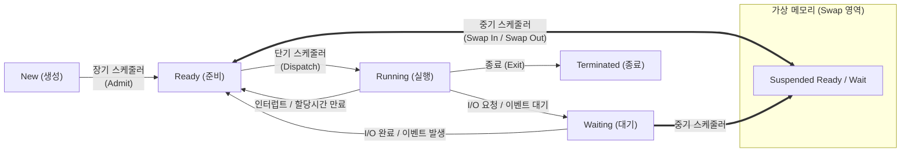

# 스케줄러 (Scheduler)

---

## I. 한정된 시스템 자원의 효율적 분배를 위한, 스케줄러의 개요

* **정의**: 다중 프로그래밍 환경에서 제한된 시스템 자원([[CPU]], 메모리, 디스크 등)을 다수의 [[프로세스]] 및 스레드에 공평하고 효율적으로 할당하기 위해 실행 순서와 시간을 결정하는 [[OS(운영체제)|운영체제]] 핵심 모듈
* **필요성 및 목적**:
* **자원 활용성 극대화**: CPU 유휴 시간(Idle Time) 최소화 및 [[처리량]](Throughput) 극대화
* **응답성 및 공평성 보장**: 대화형 시스템의 [[응답시간]](Response Time) 최소화 및 기아 현상(Starvation) 방지

* **최신 특징**: 멀티코어/NUMA 아키텍처 대응, 에너지 효율성(EAS) 고려, [[컨테이너]] 오케스트레이션(K8s) 기반의 분산 스케줄링으로 진화

---

## II. 운영체제 스케줄러의 아키텍처 및 핵심 기술 요소

### 가. 프로세스 상태 전이 및 계층별 스케줄러 동작 원리

* 메모리에 올라갈 프로세스를 결정(장기)하고, 부족한 메모리 확보를 위해 스왑 영역으로 방출(중기)하며, 실제 CPU를 할당(단기)하는 3단계 계층 구조로 동작함
* 타이머 [[인터럽트]] 및 I/O 이벤트에 의해 프로세스 상태가 전이되며, [[문맥 교환]](Context Switching) 발생

### 나. 스케줄러의 핵심 기술 및 구성 요소

| 분류 | 요소기술 (키워드) | 세부 설명 |
| --- | --- | --- |
| **운영 계층** | **단기 스케줄러 (CPU Scheduler)** | 준비 큐(Ready [[Queue]])에 있는 프로세스 중 다음에 실행할 프로세스를 선택하여 CPU를 할당 (빈번한 호출) |
| **운영 계층** | **디스패처 (Dispatcher)** | 단기 스케줄러가 선택한 프로세스에 실제 CPU 제어권을 넘겨주며 문맥 교환을 수행하는 [[커널]] 모듈 |
| **비선점 방식** | **SJF / HRRN [[알고리즘]]** | 실행 시간이 가장 짧은 작업을 우선 수행(SJF)하며, 기아 현상 방지를 위해 대기 시간을 고려(HRRN=대기시간+실행시간/실행시간) |
| **선점 방식** | **RR (Round Robin)** | 각 프로세스에 동일한 시간 할당량(Time Quantum)을 부여하고 만료 시 준비 큐 끝으로 이동시키는 시분할 방식 |
| **선점 방식** | **MLFQ (Multi-Level Feedback Queue)** | 다중 큐를 구성하고 프로세스 특성(I/O 바운드 vs CPU 바운드)에 따라 큐 간 이동을 허용하는 적응형 알고리즘 |
| **리눅스 환경** | **CFS (Completely Fair Scheduler)** | 레드-블랙 트리를 사용하여 가상 실행 시간(vruntime)이 가장 작은 프로세스에 우선순위를 부여하는 공정 스케줄러 |
| **하드웨어 최적화** | **NUMA 인지 [[스케줄링]]** | 멀티 코어 환경에서 로컬 메모리 접근 지연을 최소화하기 위해 프로세스를 데이터가 위치한 특정 노드(CPU)에 할당 |
| **전력 제어** | **EAS (Energy Aware Scheduling)** | ARM의 big.LITTLE 아키텍처 등에서 시스템 부하에 따라 고성능 코어와 고효율 코어를 동적으로 할당하여 전력 소모 최소화 |

---

## III. 스케줄링 방식 비교 및 최신 기술 동향

### 가. 선점형(Preemptive) vs 비선점형(Non-preemptive) 스케줄링 비교

| 비교 항목 | 선점형 스케줄링 (Preemptive) | 비선점형 스케줄링 (Non-preemptive) |
| --- | --- | --- |
| **동작 방식** | OS가 실행 중인 프로세스의 CPU를 강제로 회수 가능 | 프로세스가 자발적으로 종료/대기 상태가 될 때까지 점유 |
| **문맥 교환** | 잦은 문맥 교환 발생 (오버헤드 큼) | 문맥 교환 적음 (오버헤드 작음) |
| **응답성** | 실시간 시스템, 시분할 시스템에 적합 (응답시간 빠름) | 일괄 처리(Batch) 시스템에 적합 (응답시간 예측 어려움) |
| **대표 알고리즘** | RR, SRT, MLFQ, CFS | FCFS, SJF, HRRN |

### 나. 스케줄러 분야의 최신 트렌드 및 향후 전망

* **리눅스 스케줄러의 세대 교체 (EEVDF)**: 리눅스 커널 6.6부터 기존 CFS의 한계(지연 시간 일관성 부족)를 극복하기 위해 가상 데드라인을 도입한 EEVDF(Earliest Eligible Virtual Deadline First) 알고리즘으로 표준 스케줄러 전환 중
* **eBPF 기반 확장형 스케줄러 (sched_ext)**: 리눅스 6.11 커널부터 도입된 기능으로, 커널 소스 수정 없이 eBPF를 이용해 사용자 공간(User Space)에서 애플리케이션 특화 커스텀 스케줄링 정책을 안전하고 동적으로 주입 가능
* **[[클라우드 네이티브]] 분산 스케줄링**: 쿠버네티스의 `Kube-scheduler`를 통해 단일 OS를 넘어 클러스터 단위의 노드 리소스(CPU/Mem/[[GPU]]) [[HA(High Availability)|가용성]], Affinity/Anti-Affinity, Taint/Toleration을 계산하여 파드(Pod)를 최적 배치하는 구조로 발전
* **AI/ML 워크로드 인지 스케줄링**: 대규모 GPU 클러스터 환경에서 학습 및 추론 파이프라인의 특성을 분석하여, [[스위치 (Layer 3 Switch)|스위치]] 토폴로지와 VRAM 가용성을 동시 고려하는 텐서(Tensor) 스케줄링 체계 구축 확산

---

### 🔗 연관 토픽

- **소속 도메인**: [[00_운영체제_MOC|⚙️ 운영체제]]
- **세부 분류**: `1. 프로세스 & 스레드 관리`
- **핵심 연관 토픽**:
  - [[OS(운영체제)]]
  - [[스케줄링]]
  - [[문맥 교환|문맥 교환 (Context Switching)]]
  - [[프로세스]]
  - [[커널|커널(Kernel)]]
