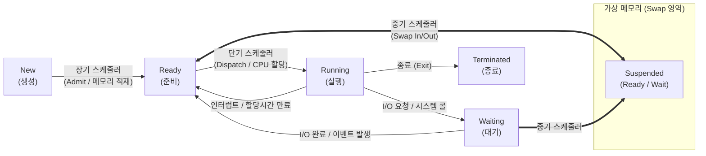

# 스케줄링 (Scheduling)

---

## I. 시스템 자원의 효율적 할당을 위한, 스케줄링의 개요

* **정의**: 다중 프로그래밍 환경에서 한정된 시스템 자원([[CPU]], 메모리, 디스크 등)을 여러 [[프로세스]] 및 스레드에 공평하고 효율적으로 배분하기 위해 실행 순서와 할당 시간을 결정하는 [[OS(운영체제)|운영체제]] 핵심 관리 기법
* **필요성 및 목적**:
* **자원 활용 극대화**: CPU 유휴시간(Idle Time) 최소화 및 단위 시간당 [[처리량]](Throughput) 극대화
* **응답성 및 공평성**: 무한 대기(Starvation) 현상 방지 및 대화형 시스템의 응답 지연(Latency) 최소화

* **최신 동향 특징**: 단일 OS를 넘어선 [[클라우드 네이티브]] 분산 스케줄링(K8s), AI 워크로드용 [[GPU]] 스케줄링, eBPF 기반 [[커널]] 동적 스케줄링 주입(sched_ext)으로 패러다임 진화

---

## II. 스케줄링의 동작 메커니즘 및 핵심 기술 요소

### 가. 스케줄링 계층적 상태 전이 및 동작 원리

* 메모리에 올라갈 프로세스를 결정(장기), 부족한 메모리 확보를 위해 스왑 영역으로 방출/복귀(중기), 실제 CPU를 할당(단기)하는 계층적 구조
* 타이머 [[인터럽트]](Time Quantum 만료) 및 I/O 이벤트 발생 시 디스패처(Dispatcher)에 의해 [[문맥 교환]](Context Switching) 수행

### 나. 스케줄링 핵심 기술 및 주요 알고리즘

| 구분 | 요소 기술 (키워드) | 세부 설명 |
| --- | --- | --- |
| **운영 계층** | **디스패처 (Dispatcher)** | 단기 스케줄러가 선택한 프로세스에 실제 CPU 제어권을 넘겨주며 레지스터 복원 및 문맥 교환 수행 |
| **비선점 방식** | **SJF (Shortest [[작업|Job]] First)** | CPU 버스트(실행 시간)가 가장 짧은 프로세스를 우선 할당 (긴 작업의 기아 현상 발생 위험) |
| **비선점 방식** | **HRRN (Highest Response Ratio)** | 에이징(Aging) 기법을 적용하여 대기시간과 서비스시간을 동시 고려, SJF의 기아 현상 극복 |
| **선점 방식** | **RR (Round Robin)** | 각 프로세스에 동일한 시간 할당량(Time Quantum)을 부여하고 만료 시 준비 큐 끝으로 이동시키는 시분할 기법 |
| **선점 방식** | **MLFQ (Multi-Level Feedback)** | 다중 큐 간 프로세스 이동을 허용하여, 우선순위 동적 변경을 통해 I/O 바운드와 CPU 바운드 동시 최적화 |
| **리눅스 환경** | **CFS (Completely Fair Scheduler)** | 레드-블랙 트리 자료구조를 활용, 가상 실행 시간(vruntime)이 가장 작은 프로세스에 우선 할당하는 공정 [[스케줄러]] |
| **하드웨어 최적화** | **NUMA-Aware 스케줄링** | 멀티 코어 환경에서 로컬 메모리 접근 지연을 최소화하기 위해 데이터가 위치한 특정 노드에 프로세스 매핑 |
| **전력 제어** | **EAS (Energy Aware)** | ARM big.LITTLE 아키텍처 등에서 시스템 부하에 따라 고성능/고효율 코어를 동적 할당하여 전력 소모 최소화 |

---

## III. 선점형/비선점형 비교 및 최신 기술 동향

### 가. 선점형(Preemptive) vs 비선점형(Non-preemptive) 스케줄링 비교

| 비교 항목 | 선점형 스케줄링 (Preemptive) | 비선점형 스케줄링 (Non-preemptive) |
| --- | --- | --- |
| **개념 및 제어권** | OS가 실행 중인 프로세스의 CPU를 강제 회수 가능 | 프로세스가 자발적 종료/대기 상태가 될 때까지 점유 |
| **문맥 교환 발생** | 타이머 인터럽트 등으로 잦은 문맥 교환 발생 (오버헤드 큼) | 작업 완료 시에만 발생하여 문맥 교환 적음 (오버헤드 작음) |
| **주요 적용 환경** | 실시간 시스템, 대화형 시분할 시스템 (응답성 높음) | 일괄 처리(Batch) 시스템, 렌더링 작업 ([[응답시간]] 예측 어려움) |
| **대표 [[알고리즘]]** | RR, SRT, MLFQ, CFS, EEVDF | FCFS ([[FIFO]]), SJF, HRRN |

### 나. 스케줄링 분야 향후 전망 및 최신 기술 동향

* **차세대 리눅스 스케줄러(EEVDF) 도입**: 리눅스 커널 6.6부터 기존 CFS의 지연 시간 일관성 부족 문제를 해결하기 위해, 가상 데드라인(Virtual Deadline) 기반의 **EEVDF(Earliest Eligible Virtual Deadline First)** 알고리즘으로 표준 스케줄러 세대 교체 중
* **eBPF 기반 확장형 스케줄러 (sched_ext)**: 리눅스 커널 6.11에 정식 통합되어, 커널 소스 재컴파일 없이 사용자 공간(User Space)에서 BPF 프로그램을 통해 특정 워크로드(게임, AI 등)에 최적화된 커스텀 스케줄링 정책을 동적으로 안전하게 주입 가능
* **클라우드 네이티브 분산 스케줄링 (K8s)**: 쿠버네티스의 `Kube-scheduler`를 활용해 단일 노드를 넘어 클러스터 전체의 가용 리소스, Affinity/Anti-Affinity, Taint/Toleration 정책을 Scoring하여 [[컨테이너]] 파드(Pod)를 최적 배치
* **AI/ML 워크로드 인지형 (Topology-Aware) 스케줄링**: 대규모 멀티 GPU 클러스터 환경에서 모델 학습 효율을 높이기 위해, PCIe/NVLink 대역폭과 [[스위치 (Layer 3 Switch)|스위치]] 토폴로지 병목을 최소화하는 Job 스케줄링 고도화 (예: NVIDIA Slurm, K8s Volcano)

---

### 🔗 연관 토픽

- **소속 도메인**: [[00_운영체제_MOC|⚙️ 운영체제]]
- **세부 분류**: `1. 프로세스 & 스레드 관리`
- **핵심 연관 토픽**:
  - [[커널|커널(Kernel)]]
  - [[OS(운영체제)]]
  - [[문맥 교환|문맥 교환 (Context Switching)]]
  - [[FIFO]]
  - [[스케줄러|스케줄러 (Scheduler)]]
