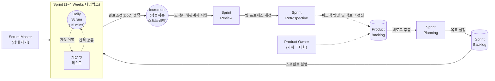

# 스크럼 (SCRUM)

---

## I. 불확실성 극복과 가치 중심의 애자일 프레임워크, 스크럼의 개요

* **정의**: 복잡한 환경에서 경험주의(Empiricism)를 바탕으로, 짧은 타임박스(Time-box) 단위의 반복적(Iterative)이고 점진적(Incremental)인 개발을 통해 제품 가치를 극대화하는 대표적인 애자일 [[프레임워크]]
* **필요성 및 특징**:
* **경험주의적 [[프로세스]] 제어**: 투명성(Transparency), 검사(Inspection), 적응(Adaptation)의 3가지 기둥 기반
* **변화 대응력 강화**: 요구사항의 지속적 변경 수용 및 우선순위 기반의 핵심 가치 조기 인도(Early Delivery)
* **자기 관리형 팀(Self-Managing)**: 교차 기능(Cross-functional)을 갖춘 팀 중심의 수평적 협업 구조

---

## II. 스크럼의 프로세스 개념도 및 핵심 구성 요소

### 가. 스크럼의 전체 프로세스 동작 개념도

* 제품 백로그에서 우선순위가 높은 항목을 추출하여 스프린트를 계획하고, 일일 스크럼을 통해 진척을 점검함
* 타임박스 종료 후 작동하는 산출물(Increment)을 리뷰하고, 회고(Retrospective)를 통해 지속적 개선(CI) 수행

### 나. 스크럼의 3-3-3 핵심 구성 요소 (역할, 산출물, 이벤트)

| 분류 (구분) | 요소 기술 (키워드) | 세부 설명 |
| --- | --- | --- |
| **역할 (Roles)** | **Product Owner (PO)** | 제품의 비전 제시, 비즈니스 가치 극대화 및 제품 백로그(Product Backlog)의 우선순위 최종 결정권자 |
| **역할 (Roles)** | **[[SCRUM|Scrum]] Master (SM)** | 스크럼 프레임워크의 이해와 안착을 돕는 서번트 리더(Servant Leader), 팀의 장애 요소(Impediments) 제거 |
| **역할 (Roles)** | **개발자 (Developers)** | 스프린트 단위의 실행을 책임지며, 기획/개발/테스트 등의 교차 기능을 갖춘 자기 관리형(Self-Managing) 조직 |
| **산출물 (Artifacts)** | **제품 백로그 (Product Backlog)** | 제품 개발에 필요한 모든 요구사항(User Story 등)의 동적 목록, 약속(Commitment)으로 **'제품 목표(Product Goal)'** 가짐 |
| **산출물 (Artifacts)** | **스프린트 백로그 (Sprint Backlog)** | 이번 스프린트에서 수행할 작업 목록, 약속(Commitment)으로 **'스프린트 목표(Sprint Goal)'** 가짐 |
| **산출물 (Artifacts)** | **증분 (Increment)** | 스프린트 종료 시 완성된 작동 가능한 소프트웨어, 약속(Commitment)으로 **'완료의 의미(Definition of Done)'** 충족 필수 |
| **이벤트 (Events)** | **일일 스크럼 (Daily Scrum)** | 매일 15분 타임박스로 진행, 스프린트 목표 달성을 위한 진척 상황 공유 및 당일 작업 계획 동기화 |
| **이벤트 (Events)** | **스프린트 회고 (Retrospective)** | 스프린트 종료 후, 팀의 프로세스, 도구, 상호작용 방식 등을 검사하고 다음 스프린트를 위한 개선 조치 도출 |

---

## III. 스크럼과 칸반(Kanban) 비교 및 최신 확장 동향

### 가. 애자일 방법론: 스크럼(Scrum) vs 칸반(Kanban) 비교

| 비교 항목 | 스크럼 (Scrum) | 칸반 (Kanban) |
| --- | --- | --- |
| **작업 주기** | **타임박스 (Time-boxed)** (보통 1~4주) | **연속적 흐름 (Continuous Flow)** (정해진 주기 없음) |
| **핵심 제어 방식** | 스프린트 내 **백로그 변경 불가** (목표 고정) | **WIP(Work In Progress) 제한**을 통한 병목 현상 통제 |
| **주요 역할** | PO, SM, Developers 명확한 역할 정의 필수 | 기존 역할 유지, 엄격한 역할 강제 없음 |
| **성과 측정 지표** | **벨로시티 (Velocity, 속도)** (스프린트 당 [[처리량]]) | **리드 타임(Lead Time)**, **사이클 타임(Cycle Time)** |
| **적합한 환경** | 신규 서비스 개발, 기능 단위의 명확한 배포 환경 | 운영/[[유지보수]](SM), 지속적이고 예측 불가능한 요구사항 환경 |

### 나. 스크럼의 기업 단위 확장(Scaled Agile) 및 최신 트렌드

* **엔터프라이즈 스크럼 확장 모델 적용**: 단일 팀 수준을 넘어 대규모 조직 전체로 애자일을 확장하는 **SAFe (Scaled [[Agile]] Framework)**, **LeSS (Large-Scale Scrum)**, **Scrum@Scale** 도입 가속화
* **하이브리드 애자일(Scrumban) 확산**: 스크럼의 체계적인 이벤트(계획, 회고 등) 구조와 칸반의 연속적인 흐름(WIP 제한) 메커니즘을 결합하여 유연성을 극대화한 스크럼반(Scrumban) 활용 증대
* **AI 기반 애자일 관리 도구 진화**: Jira Intelligence, GitHub Copilot 등을 활용하여 제품 백로그 자동 정제(Grooming), 스토리 포인트 예측, 스프린트 위험 요소 조기 탐지 등 스크럼 프로세스의 지능화 및 자동화 도입

---

### 🔗 연관 토픽

- **소속 도메인**: [[00_프로젝트관리_MOC|📋 프로젝트관리]]
- **세부 분류**: `5. 애자일 프로젝트 관리 & 개발 운영 (Agile PM)`
- **핵심 연관 토픽**:
  - [[SCRUM]]
  - [[린 방법론|린 (Lean) 방법론]]
  - [[Kanban (development) 프로세스]]
  - [[터크만 팀 개발 5단계]]
  - [[번다운차트|번다운차트 (Burn Down Chart)]]
