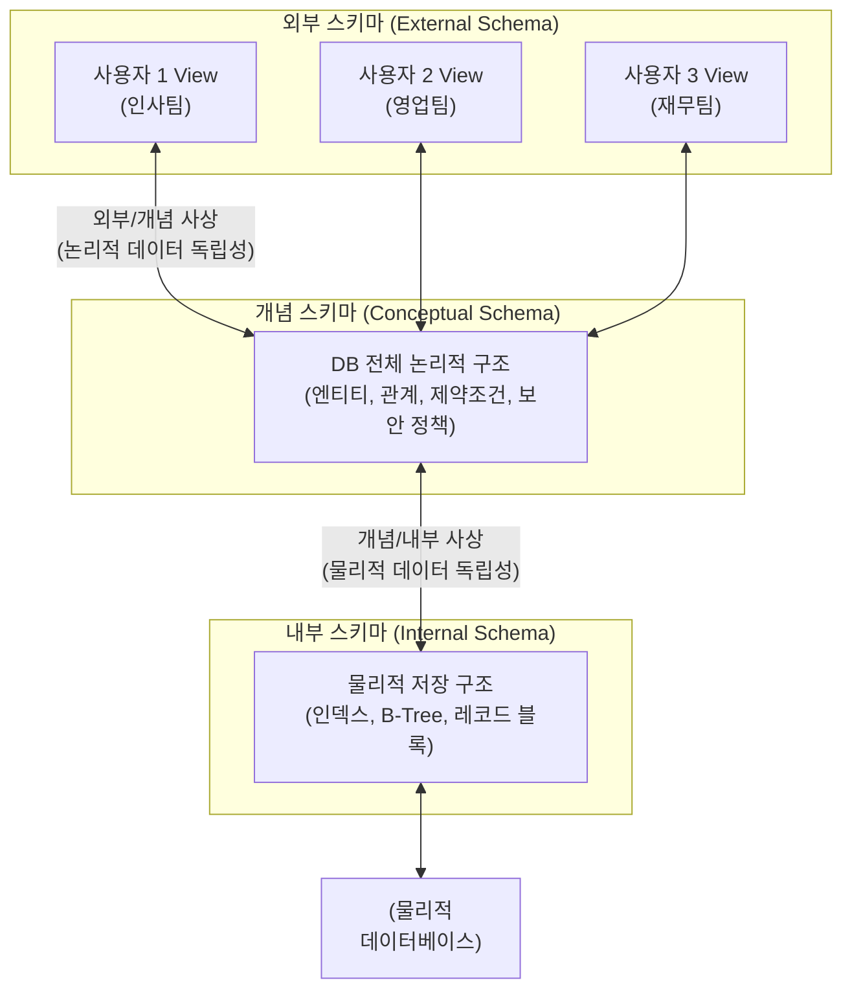

# 스키마 (Schema)

---

## I. 데이터 독립성 보장 및 일관성 유지를 위한, 데이터베이스 스키마의 개요

* **정의**: [[데이터베이스]] 내의 데이터 구조, 데이터 [[엔티티|엔티티(Entity)]], 속성(Attribute), 관계(Relationship) 및 [[무결성]] 제약조건(Constraints)에 대한 전반적인 명세(Specification)와 논리적 설계 도면
* **필요성 및 등장배경**:
* **데이터 독립성 확보**: 응용 프로그램과 물리적 데이터 구조 간의 결합도를 낮추어 유지보수성 향상
* **무결성 및 보안 유지**: 정해진 규칙(제약조건, 도메인)에 어긋나는 데이터 입력 방지 및 접근 권한 통제

* **특징**: 메타데이터(Metadata) 형태로 데이터 사전(Data Dictionary)에 저장되며, 데이터베이스 관리 시스템([[DBMS]])에 의해 컴파일 및 관리됨

---

## II. 데이터베이스 스키마의 3단계 구조 및 핵심 기술 요소

### 가. ANSI/SPARC 3단계 스키마 아키텍처 개념도

* 사용자 관점(외부), 조직 전체 관점(개념), 물리적 저장 관점(내부)으로 스키마를 분리한 ANSI/SPARC 아키텍처 적용
* 각 계층 간 사상(Mapping)을 통해 특정 계층의 구조 변경이 다른 계층의 응용 프로그램에 영향을 주지 않도록 데이터 독립성 완벽 보장

### 나. 스키마 아키텍처의 핵심 구성 요소 및 데이터 독립성

| 분류 (구분) | 구성 요소 (키워드) | 세부 설명 |
| --- | --- | --- |
| **3단계 구조** | **외부 스키마 (External)** | 개별 사용자나 응용 프로그래머 관점에서 필요로 하는 데이터베이스의 논리적 부분 구조 (View 역할) |
| **3단계 구조** | **개념 스키마 (Conceptual)** | 조직 전체의 관점에서 모든 엔티티, 속성, 관계, 제약조건을 통합한 논리적 구조 (DBA가 관리) |
| **3단계 구조** | **내부 스키마 (Internal)** | 물리적 저장장치 관점에서 데이터가 실제 저장되는 방식, 인덱스, 레코드 포인터 등을 명세 |
| **사상 (Mapping)** | **외부-개념 사상** | 특정 외부 스키마와 개념 스키마 간의 대응 관계를 정의하여 **논리적 데이터 독립성** 제공 |
| **사상 (Mapping)** | **개념-내부 사상** | 통합된 개념 스키마와 내부 스키마 간의 대응 관계를 정의하여 **물리적 데이터 독립성** 제공 |
| **데이터 독립성** | **논리적 독립성** | 개념 스키마(전체 논리 구조)가 변경되더라도 외부 스키마(응용 프로그램)에는 영향을 주지 않는 특성 |
| **데이터 독립성** | **물리적 독립성** | 내부 스키마(저장 장치, 성능 개선용 인덱스 등)가 변경되어도 개념 스키마에 영향을 주지 않는 특성 |
| **명세 및 저장** | **데이터 사전 (Data Dictionary)** | 스키마 명세, 매핑 정보, 권한 등 데이터베이스가 자체적으로 관리하는 메타데이터(System Catalog) 저장소 |

---

## III. 최신 데이터 환경에서의 스키마 패러다임 변화 (RDBMS vs Big Data)

### 가. 전통적 스키마(Schema-on-Write)와 빅데이터 스키마(Schema-on-Read) 비교

| 비교 항목 | Schema-on-Write (전통적 스키마) | Schema-on-Read (지연 스키마) |
| --- | --- | --- |
| **적용 환경 및 플랫폼** | 정통 RDBMS, 데이터 웨어하우스(DW) | [[NoSQL (CAP 이론 BASE 속성)|NoSQL]], Hadoop, 데이터 레이크(Data Lake) |
| **스키마 적용(검증) 시점** | 데이터를 **저장(Write)할 때** 스키마 구조 검증 | 데이터를 **조회(Read)할 때** 스키마를 부여하여 해석 |
| **수용 가능한 데이터 형태** | 정해진 포맷의 정형 데이터 (Structured) | 정형, 반정형, 비정형 등 모든 원시 데이터 |
| **유연성 및 변경 비용** | 낮음 (스키마 변경 시 Alter Table에 막대한 비용 발생) | 높음 (사전 정의 없이 다양한 포맷의 원시 데이터 수용 가능) |
| **주요 처리 성능 강점** | 조회(Read) 성능 및 [[트랜잭션]] 정합성(ACID) 우수 | 변환(ETL) 과정 생략으로 인한 적재(Write) 속도 극대화 |

### 나. 데이터 스키마의 최신 관리 트렌드 및 향후 전망

* **마이크로서비스([[MSA (Micro Service Architecture)|MSA]]) 기반 데이터 분산 및 스키마 진화**: 서비스별로 독립된 DB를 가지는 Database-per-service 패턴 확산에 따라, 이벤트 소싱(Event Sourcing) 및 CQRS를 활용한 분산 스키마 정합성 유지 기술 필수화
* **API 계약 주도 스키마 검증**: GraphQL이나 [[JSON]] Schema(REST API용)를 활용하여 클라이언트와 서버 간 통신 구간에서 동적으로 스키마 유효성(Validation)을 검증하는 Contract-First(계약 주도) 개발 체계로 진화
* **데이터 메시(Data Mesh)와 폴리글랏 퍼시스턴스**: 다양한 스키마 엔진을 복합적으로 사용하는 폴리글랏 환경에서, 중앙 집중형 관리를 탈피하고 도메인 중심의 분산형 스키마 거버넌스를 구축하는 방향으로 발전

---

### 🔗 연관 토픽

- **소속 도메인**: [[00_데이터베이스_MOC|🗄️ 데이터베이스]]
- **세부 분류**: `1. 데이터 모델링 & 관계형 DB 설계`
- **핵심 연관 토픽**:
  - [[데이터베이스]]
  - [[NoSQL (CAP 이론 BASE 속성)]]
  - [[무결성]]
  - [[JSON]]
  - [[DBMS]]
