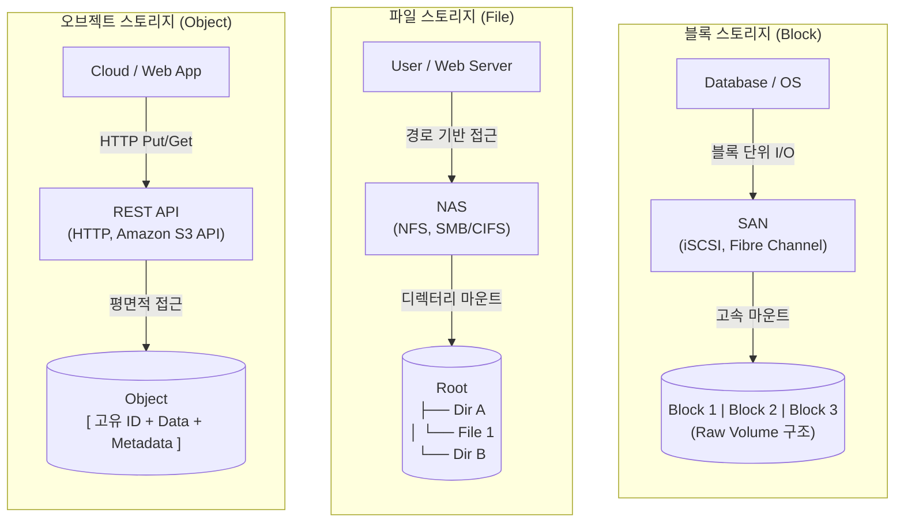

# 스토리지 유형 (블록, 파일, 오브젝트 스토리지)

---

## I. 워크로드 최적화를 위한 데이터 저장 아키텍처, 스토리지 유형의 개요

* **정의**: 다양한 비즈니스 요구사항과 데이터 특성(정형/비정형)에 맞춰 데이터를 효율적으로 저장, 관리, 접근하기 위해 블록(Block), 파일(File), 오브젝트(Object) 형태로 분류한 데이터 저장 아키텍처
* **필요성 및 등장배경**:
* **데이터 폭증 및 다양화**: 동영상, 이미지 등 비정형 데이터의 급증으로 기존 계층형 스토리지의 확장성 한계 도달 (오브젝트 부상)
* **접근 방식의 최적화**: 성능(DB), 공유(문서), 무한 확장성(클라우드) 등 워크로드 목적에 따른 맞춤형 인프라 구성 필요
* **[[클라우드 네이티브]] 진화**: [[컨테이너]](CSI) 및 분산 컴퓨팅 환경에 유연하게 대응하기 위한 할당 및 관리 체계 요구

---

## II. 스토리지 유형별 개념도 및 핵심 기술 요소

### 가. 블록, 파일, 오브젝트 스토리지 구성 개념도

* 블록 스토리지는 원시 볼륨을 직접 마운트하여 고성능을 제공하며, 파일 스토리지는 계층형 폴더 구조로 공유에 유리함
* 오브젝트 스토리지는 평면(Flat) 구조에 메타데이터와 고유 ID를 부여하여 API 기반의 무한 확장이 가능함

### 나. 스토리지 유형별 핵심 기술 및 구성 요소

| 구분 | 핵심 기술 (키워드) | 세부 설명 |
| --- | --- | --- |
| **블록** | **SAN (Storage Area Network)** | 파이버 채널(FC) 또는 IP(iSCSI)망을 이용한 전용 고속 스토리지 연결 네트워크 |
| **블록** | **NVMe-oF (NVMe over Fabrics)** | 네트워크 구간에서도 NVMe 프로토콜을 사용하여 스토리지 접근 지연시간을 획기적으로 최소화 |
| **파일** | **[[NAS]] (Network Attached Storage)** | 이기종 클라이언트 간의 데이터 공유를 목적으로 LAN 네트워크에 직접 연결된 파일 서버 형태 |
| **파일** | **NFS / SMB [[프로토콜]]** | 유닉스/리눅스 환경(NFS) 및 윈도우 환경(SMB/CIFS)의 [[OS(운영체제)|운영체제]] 종속적 파일 공유 표준 프로토콜 |
| **파일** | **계층적 메타데이터 구조** | 파일명, 확장자, 트리 형태의 디렉터리 경로를 기반으로 데이터를 탐색하는 인덱싱 체계 |
| **오브젝트** | **Flat Address Space** | 폴더 계층 구조로 인한 성능 병목을 제거한 고유 식별자(Object ID) 기반의 평면적 데이터 접근 구조 |
| **오브젝트** | **확장 메타데이터 (Metadata)** | 데이터 속성, 보존 정책, 생성자 등 사용자 정의 정보를 포함하여 데이터 검색/분석 효율성 극대화 |
| **오브젝트** | **RESTful API (S3 호환)** | 웹 표준인 HTTP(S) 기반의 Put, Get, Delete 메서드를 제공하여 클라우드 애플리케이션 통합에 최적화 |

---

## III. 3대 스토리지 유형 상세 비교 및 최신 동향

### 가. 블록, 파일, 오브젝트 스토리지 상세 비교

| 비교 항목 | 블록 스토리지 (Block) | 파일 스토리지 (File) | 오브젝트 스토리지 (Object) |
| --- | --- | --- | --- |
| **데이터 구조** | 일정 크기의 조각 (원시 블록) | 트리 기반 디렉터리 및 파일 | 데이터 + 메타데이터 + 고유 ID |
| **접근 프로토콜** | FC, iSCSI, FCoE, NVMe-oF | NFS, SMB/CIFS, AFP | HTTP, HTTPS, REST API (S3) |
| **장점 (특징)** | 초고속 입출력(IOPS), 최저 지연시간 | 직관적 관리, 손쉬운 다중 사용자 공유 | 무한한 확장성(Scale-out), 메타데이터 활용 |
| **단점 (한계)** | 높은 구축 비용, 데이터 공유 불가능 | 대규모 확장 시 계층 구조로 인한 병목 | 부분 수정 불가(전체 덮어쓰기), 응답 지연 높음 |
| **최적 워크로드** | RDBMS, ERP 시스템, OS 부팅 볼륨 | 사내 파일 공유 서버, 문서 중앙화 | 클라우드 백업/아카이빙, 미디어/빅데이터 저장 |

### 나. 스토리지 기술의 최신 트렌드 및 전망

* **유니파이드(Unified) 스토리지 확산**: 단일 스토리지 플랫폼에서 블록, 파일, 오브젝트 프로토콜을 모두 지원하는 소프트웨어 정의 스토리지(SDS) 도입 가속화 (예: Ceph)
* **AI/ML을 위한 고성능 스토리지 진화**: 대규모 병렬 학습 데이터를 처리하기 위해, 병렬 파일 시스템(Lustre 등)과 All-Flash 기반의 초고속 오브젝트 스토리지(MinIO 등) 도입 증가
* **클라우드 네이티브 CSI 표준화**: [[쿠버네티스]] 환경에서 스토리지 벤더에 종속되지 않고 영구 볼륨(PV/PVC)을 동적으로 할당하기 위한 CSI(Container Storage Interface) 연동 필수화

---

### 🔗 연관 토픽

- **소속 도메인**: [[00_컴퓨터구조_MOC|💻 컴퓨터구조]]
- **세부 분류**: `2. 캐시 & 메모리 계층 구조 · 스토리지`
- **핵심 연관 토픽**:
  - [[NAS]]
  - [[클라우드 네이티브]]
  - [[컨테이너|컨테이너 (Container)]]
  - [[쿠버네티스|쿠버네티스(Kubernates)]]
  - [[OS(운영체제)]]
