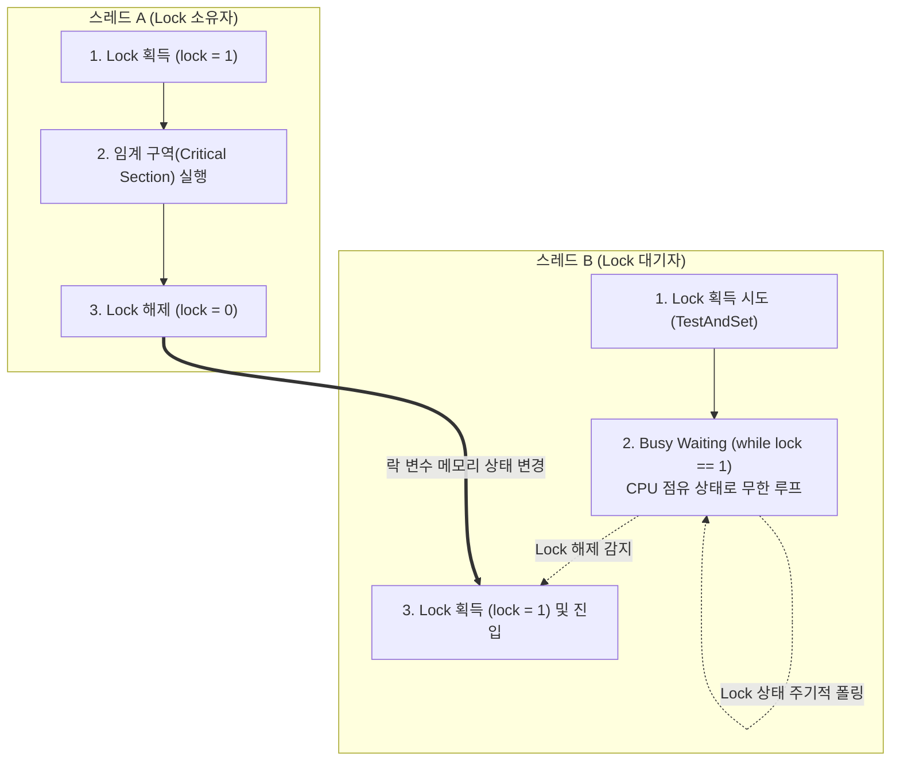

# 스핀락 (Spin Lock)

---

## I. 문맥 교환 오버헤드 최소화를 위한 다중 코어 동기화 기법, 스핀락의 개요

* **정의**: 다중 스레드 환경에서 임계 구역(Critical Section) 진입이 불가능할 때, 스레드가 [[CPU]]를 반환하지 않고 무한 루프를 돌며(Busy Waiting) 락(Lock) 획득을 지속적으로 시도하는 동기화 기법
* **필요성 및 특징**:
* **[[문맥 교환]](Context Switching) 오버헤드 제거**: 상태 전이(Running $\rightarrow$ Waiting)에 드는 비용보다 락 대기 시간이 짧을 때 성능 극대화
* **Busy Waiting 메커니즘**: 대기 중에도 CPU 코어를 계속 점유하므로 임계 구역이 매우 짧은 작업에 특화됨
* **SMP(Symmetric Multiprocessing) 환경 필수**: 단일 코어 환경에서는 데드락(Deadlock) 위험이 있어 주로 다중 코어 [[커널]] 프로그래밍에 활용

---

## II. 스핀락의 동작 메커니즘 및 핵심 기술 요소

### 가. 스핀락의 동작 메커니즘 개념도

* 스레드 B는 스레드 A가 락을 해제할 때까지 Sleep(대기 상태)으로 빠지지 않고 원자적 연산을 통해 지속적으로 락 상태를 확인(Polling)함
* 락 반환 시 즉각적인 획득이 가능하여 문맥 교환 및 [[스케줄링]] 부하를 원천 차단함

### 나. 스핀락의 핵심 기술 및 발전 요소

| 구분 | 요소 기술 (키워드) | 세부 설명 |
| --- | --- | --- |
| **원자적 연산** | **TAS (Test And Set)** | 하드웨어의 지원을 받아 메모리 값을 읽고 1로 세팅하는 과정을 하나의 원자적(Atomic) 명령으로 처리 |
| **원자적 연산** | **CAS (Compare And Swap)** | 락 변수의 현재 값이 기대값과 일치할 경우에만 새로운 값으로 갱신하는 비동기 락프리(Lock-free) 기법 |
| **대기 메커니즘** | **Busy Waiting** | 락을 얻을 때까지 제어권을 OS에 반환하지 않고, 빈 반복문(while)을 돌며 대기하는 핵심 동작 |
| **하드웨어 지원** | **CPU PAUSE 명령어** | Spin 루프 시 불필요한 메모리 접근을 줄이고 파이프라인 플러시(Flush)를 방지하여 전력 소모를 최소화 |
| **공평성 보장** | **Ticket Spinlock** | 락 요청 스레드에 순서대로 티켓 번호를 부여하여, 무작위 획득에 의한 기아 현상(Starvation)을 방지 |
| **NUMA 최적화** | **MCS Spinlock** | 락 대기자를 큐([[Queue]]) 형태로 관리하여, 멀티 코어 간 캐시 라인 무효화 트래픽(Cache Bouncing) 최소화 |
| **커널 최적화** | **qspinlock (Queue Spinlock)** | MCS를 개선하여 메모리 공간 오버헤드를 줄이고 성능을 극대화한 최신 리눅스 커널의 기본 동기화 기법 |
| **적용 환경** | **SMP 최적화** | 단일 코어에서는 스레드 선점 비활성화 시 데드락이 발생하므로 멀티 프로세서(SMP) 환경에 특화됨 |

---

## III. 스핀락과 뮤텍스(Mutex) 비교 및 최신 동향

### 가. 동기화 기법: 스핀락(Spin Lock) vs 뮤텍스(Mutex) 비교

| 비교 항목 | 스핀락 (Spin Lock) | 뮤텍스 (Mutex) |
| --- | --- | --- |
| **대기 방식** | **Busy Waiting** (루프를 돌며 지속 확인) | **Sleep / Block** (대기 큐로 이동하여 휴면) |
| **문맥 교환(Context Switch)** | **발생하지 않음** (CPU 지속 점유) | **발생함** (오버헤드 큼) |
| **CPU 자원 소모** | 대기 시간 동안 CPU 100% 소모 (낭비 발생) | 대기 시간 동안 CPU 점유하지 않음 |
| **임계 구역 (Critical Section)** | **매우 짧은 경우 유리** (수 밀리초 이내) | **상대적으로 긴 경우 유리** |
| **주요 적용 사례** | OS 커널의 [[인터럽트]] 핸들러, 디바이스 드라이버 | 사용자 모드 애플리케이션(DB, 웹 서버 등) |

### 나. 스핀락의 최신 기술 활용 동향 (하이브리드 락)

* **적응형 뮤텍스(Adaptive Mutex) 확산**: 최신 OS 및 병렬 프로그래밍 [[프레임워크]](Java, Solaris 등)에서는 두 기법을 결합하여, 락 획득 시도 초기에는 **Spinlock 방식**으로 대기하다가 임계 시간(Threshold) 초과 시 Sleep 상태(Mutex 방식)로 전환하는 하이브리드 동기화 기법을 기본 채택함
* **캐시 동기화 지연 해결**: 멀티 코어 확장에 따른 [[캐시 일관성]] 유지 오버헤드(Cache Ping-pong)를 해결하기 위해, 로컬 캐시 변수만 Spin하며 기다리는 큐 기반 스핀락(qspinlock)이 최신 서버 인프라의 병목 현상을 해소하고 있음

---

### 🔗 연관 토픽

- **소속 도메인**: [[00_운영체제_MOC|⚙️ 운영체제]]
- **세부 분류**: `1. 프로세스 & 스레드 관리`
- **핵심 연관 토픽**:
  - [[커널|커널(Kernel)]]
  - [[스케줄링]]
  - [[인터럽트|인터럽트 (Interrupt)]]
  - [[문맥 교환|문맥 교환 (Context Switching)]]
  - [[교착상태|교착상태 (Deadlock)]]
