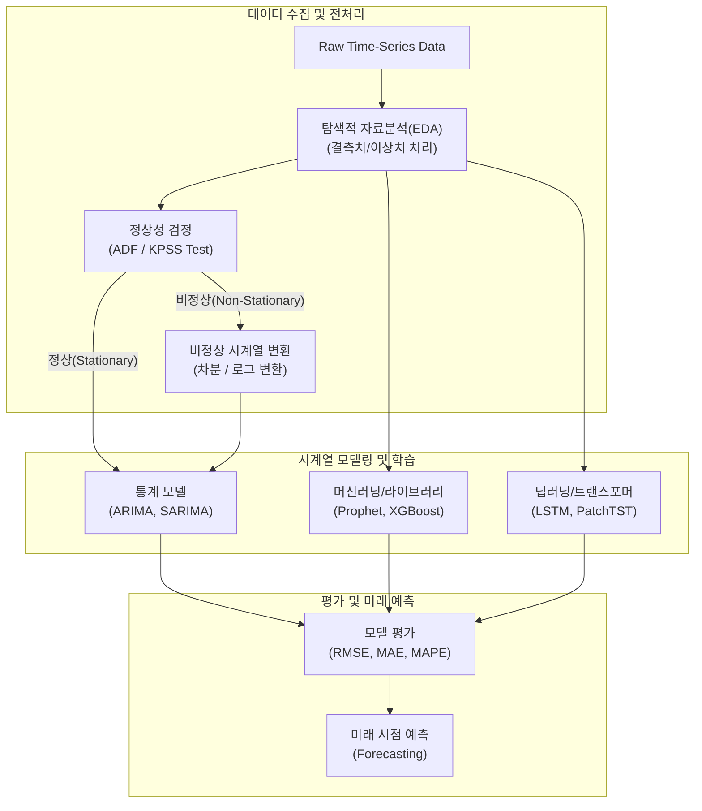

# 시계열분석 (Time Series Analysis)

---

## I. 과거 데이터의 패턴 파악 및 미래 예측을 위한, 시계열분석의 개요

* **정의**: 시간의 흐름에 따라 일정한 간격으로 관측된 데이터를 분석하여, 데이터에 내재된 패턴(추세, 계절성 등)을 식별하고 이를 바탕으로 미래의 값을 예측하는 통계 및 기계학습 기반 분석 기법
* **필요성 및 핵심 특징**:
* **구성 요소 분해**: 추세(Trend), 계절성(Seasonality), 순환성(Cyclical), 불규칙(Irregular/Noise) 요인으로 분해하여 패턴 파악
* **정상성(Stationarity) 기반 모델링**: 과거의 평균과 분산이 시간 흐름에 따라 일정하다는 가정하에 예측 (전통적 모델)
* **패러다임의 진화**: 통계 기반(ARIMA) $\rightarrow$ [[딥러닝]]([[LSTM (Long Short-Term Memory)|LSTM]]/GRU) $\rightarrow$ [[트랜스포머]] 기반 대형 시계열 [[파운데이션 모델]](TSFM)로 발전

---

## II. 시계열분석의 프로세스 및 핵심 기술 요소

### 가. 시계열분석 파이프라인 및 모델링 동작 원리

* 정상성 검정(ADF Test 등)을 통해 차분(Differencing) 여부를 결정하여 데이터를 전처리함
* 데이터 특성 및 장단기 의존성에 따라 통계적 모델(ARIMA), 최적화 라이브러리(Prophet), 딥러닝(Transformer) 모델을 선택 적용하여 예측(Forecasting) 수행

### 나. 시계열분석의 핵심 기술 및 구성 요소

| 구분 | 요소 기술 (키워드) | 세부 설명 |
| --- | --- | --- |
| **정상성 검증** | **ADF Test (단위근 검정)** | 데이터에 단위근(Unit Root)이 존재하는지 검정하여 시계열 데이터의 정상성(Stationarity) 여부 판별 |
| **상관성 분석** | **ACF / PACF** | 자기상관함수(ACF) 및 편자기상관함수(PACF)를 통해 ARIMA 모델의 p(AR), q(MA) 차수 결정 지표 제공 |
| **전처리** | **차분 (Differencing)** | 비정상 시계열을 정상 시계열로 변환하기 위해 현시점 데이터와 이전 시점 데이터 간의 차이를 구하는 기법 |
| **[[유사도]] 측정** | **DTW (Dynamic Time Warping)** | 두 시계열 데이터 간의 시간 축(Time-axis)이나 위상이 어긋나더라도 패턴 유사도를 측정하는 매칭 [[알고리즘]] |
| **전통적 통계** | **ARIMA (자기회귀누적이동평균)** | 자기회귀(AR)와 이동평균(MA)을 결합하고 누적(I, 차분)을 포함하여 단기 예측에 강력한 대표적 선형 통계 모델 |
| **오픈소스** | **Prophet (프로펫)** | Meta(Facebook)에서 개발, 추세/계절성/휴일 효과를 직관적으로 튜닝하고 결측치에 강건한 시계열 예측 라이브러리 |
| **딥러닝** | **LSTM / GRU** | [[RNN (Recurrent Neural Network)|RNN]]의 기울기 소실 문제를 극복, 셀 상태(Cell State)와 게이트(Gate)를 통해 장기 의존성(Long-Term Dependency) 학습 |
| **최신 아키텍처** | **PatchTST (시계열 트랜스포머)** | 시계열 데이터를 패치(Patch) 단위로 분할하여 Transformer에 입력, 의미적 맥락 보존 및 연산 복잡도를 개선한 모델 |

---

## III. 시계열 예측 모델의 진화 및 최신 트렌드 동향

### 가. 시계열 분석 및 예측 모델 발전 단계 비교

| 비교 항목 | 1세대: 통계적 시계열 모델 | 2세대: 기계학습/딥러닝 모델 | 3세대: 파운데이션 모델 (최신) |
| --- | --- | --- | --- |
| **대표 알고리즘** | ARIMA, SARIMA, VAR | XGBoost, LSTM, Prophet | Chronos, TimeGPT, PatchTST |
| **주요 특징** | 선형적 관계, 정상성 가정 필수 | 비선형적 관계 학습, 다변량(Multivariate) 분석 강력 | 대규모 사전학습(Pre-trained) 기반 제로샷(Zero-shot) 예측 |
| **장점** | 명확한 수식과 높은 설명력([[XAI]]) | 복잡한 장기 의존성 패턴 및 복합 변수 포착 우수 | 개별 데이터 학습([[Fine-Tuning|Fine-tuning]]) 없이 즉각적인 고성능 예측 |
| **한계점** | 장기 예측 불가, 결측치에 취약함 | 하이퍼파라미터 튜닝 비용, 막대한 컴퓨팅 자원 요구 | 특정 도메인(금융 등)의 미세한 노이즈 편향성 제어 한계 |

### 나. 시계열분석의 향후 전망 및 활용 동향

* **Time-Series Foundation Model (TSFM)의 부상**: 자연어 처리의 [[초거대 언어 모델|LLM]]처럼, Amazon의 Chronos나 Nixtla의 TimeGPT 등 수십억 개의 다도메인 시계열 시퀀스로 사전 학습된 파운데이션 모델이 등장하여 별도 학습 없이 제로샷 예측(Zero-shot Forecasting) 수행
* **Spatio-Temporal GNN (시공간 그래프 신경망) 활용 확대**: 교통 흐름 예측, 풍력 발전량 예측 등에서 변수 간의 '공간적(Spatial)' 상관관계와 '시간적(Temporal)' 의존성을 동시에 모델링하는 ST-GCN 아키텍처 도입 가속화
* **LLM-for-Time-Series (크로스 모달리티 적용)**: 텍스트로 사전 학습된 대형 언어 모델(LLM)의 임베딩 공간을 미세조정(Prompting, Reprogramming)하여, 자연어의 추론 능력을 시계열 패턴 분석과 이상 탐지([[Anomaly(이상현상)|Anomaly]] Detection)에 직접 활용하는 융합 연구 본격화

---

### 🔗 연관 토픽

- **소속 도메인**: [[00_인공지능_MOC|🤖 인공지능]]
- **세부 분류**: `1. 수학 · 통계학 & 데이터 전처리`
- **핵심 연관 토픽**:
  - [[유사도|유사도(Similarity)]]
  - [[초거대 언어 모델|초거대 언어 모델(Large Language Model)]]
  - [[딥러닝]]
  - [[XAI]]
  - [[RNN (Recurrent Neural Network)]]
