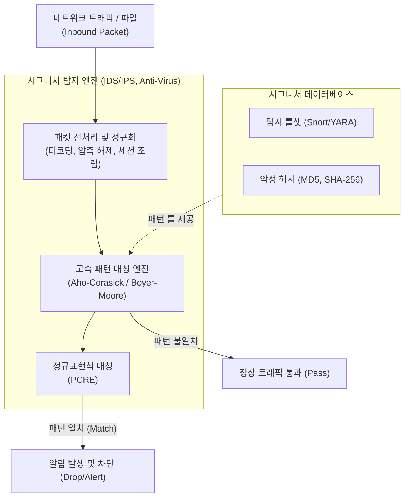

# 시그니처 탐지기법 (Signature-based Detection)

---

## I. 기지(Known)의 위협에 대한 고속 식별 기술, 시그니처 탐지기법의 개요

* **정의**: 기지(Known)의 악성코드나 사이버 공격이 가지는 고유한 패턴(문자열, 해시값, 바이트 배열 등)을 사전에 [[데이터베이스]](DB)화하고, 이를 입력된 트래픽 및 파일과 대조하여 위협을 탐지하는 보안 기법
* **필요성 및 특징**:
* **낮은 오탐률(False Positive)**: 정확히 일치하는 패턴만 탐지하므로 정상 트래픽을 차단할 확률이 매우 낮음
* **고속 처리**: Aho-Corasick 등 다중 패턴 매칭 알고리즘을 활용하여 실시간 네트워크 환경에서 고속 차단 가능
* **한계점 (제로데이 취약)**: DB에 존재하지 않는 신종/변종(Polymorphic) 악성코드 및 제로데이 공격은 원천적으로 탐지 불가

---

## II. 시그니처 탐지의 동작 아키텍처 및 핵심 기술 요소

### 가. 시그니처 탐지기법의 동작 메커니즘 개념도

* 수집된 트래픽의 페이로드를 인코딩 해제(정규화)한 후, 다중 문자열 매칭 알고리즘을 통해 시그니처 DB와 고속 대조함
* 단순 해시/문자열 매칭뿐만 아니라, 복잡한 공격 패턴은 정규표현식(PCRE)을 통해 정밀 검사하여 위협 여부를 판별함

### 나. 시그니처 탐지기법의 핵심 기술 및 구성 요소

| 구분 | 요소 기술 (키워드) | 세부 설명 |
| --- | --- | --- |
| **탐지 [[알고리즘]]** | **Aho-Corasick** | 트라이(Trie) 자료구조를 활용하여 입력 스트림에서 여러 개의 시그니처 패턴을 동시에 고속으로 검색하는 알고리즘 (Snort 기본) |
| **탐지 알고리즘** | **Boyer-Moore** | 문자열의 끝에서부터 비교를 시작하여 불일치 시 패턴을 건너뛰는(Skip) 방식으로 단일 패턴 고속 검색에 유리 |
| **패턴 표현식** | **정규표현식 (PCRE)** | 펄(Perl) 호환 정규식을 사용하여, 단순 문자열로 표현하기 힘든 유연하고 복잡한 공격 페이로드를 정의 |
| **식별 기술** | **Hash 매칭** | 파일 전체나 특정 섹션의 [[무결성]] 해시값(SHA-256 등)을 산출하여 기존 악성코드 원본과 1:1로 비교 식별 |
| **표준 룰셋** | **YARA Rule** | 악성코드가 포함한 텍스트나 바이너리 패턴을 기반으로 악성코드를 분류하고 식별하는 오픈소스 룰 언어 |
| **전처리** | **정규화 (Normalization)** | 공격자가 탐지를 우회하기 위해 적용한 [[난독화]](Obfuscation), URI 인코딩, Base64 등을 원본 형태로 해독 |
| **심층 분석** | **DPI (Deep Packet Inspection)** | 패킷의 L3/L4 헤더뿐만 아니라 L7 애플리케이션 페이로드 영역까지 깊숙이 검사하여 시그니처 존재 여부 확인 |
| **인프라 연동** | **[[CTI]] (Cyber Threat Intelligence)** | STIX/TAXII 표준을 활용해 전 세계 침해대응센터(CERT) 등으로부터 최신 위협 시그니처를 실시간 수집 및 반영 |

---

## III. 시그니처 탐지와 이상 탐지 비교 및 향후 전망

### 가. 시그니처 탐지(Signature) vs 이상 탐지(Anomaly) 비교

| 비교 항목 | 시그니처 탐지 (Signature-based) | 이상/행위 탐지 ([[Anomaly(이상현상)|Anomaly]]/Behavior-based) |
| --- | --- | --- |
| **탐지 기준** | 사전에 정의된 악성 패턴 및 해시값 | 정상 행위 베이스라인(Baseline) 이탈 여부 |
| **주요 방어 대상** | **기지(Known)의 공격** ([[랜섬웨어]], SQLi 등) | **미지(Unknown)의 공격**, 제로데이 공격 |
| **오탐률 (FP)** | **낮음** (명확한 근거 기반 차단) | **높음** (정상적인 이상 접근도 악성으로 오인) |
| **미탐률 (FN)** | **높음** (신종/변종 악성코드는 통과됨) | **낮음** (패턴이 없어도 비정상 행위로 차단 가능) |
| **리소스 소모** | 낮음 ([[CPU]] 연산량 적음, 고속 스위칭 가능) | 높음 (AI/ML 모델 추론, 통계 프로파일링 부하) |

### 나. 시그니처 탐지의 한계 극복 및 최신 동향

* **하이브리드 탐지(Hybrid Detection) 체계 확산**: 시그니처 탐지의 한계(제로데이 취약)와 이상 탐지의 한계(높은 오탐률)를 상호 보완하기 위해, [[EDR(Endpoint Detection and Response)|EDR]] 및 [[XDR]] 솔루션에서 두 기법을 결합한 다중 계층 방어(Multi-layered Defense) 채택
* **클라우드 샌드박싱 연동 기반 동적 시그니처 생성**: 미확인 파일(Unknown)을 클라우드 가상 환경에서 격리 실행(행위 분석)한 후, 악성으로 판명되면 즉시 해당 파일의 해시와 YARA 룰(시그니처)을 생성하여 전사 엔드포인트에 실시간 배포
* **[[초거대 언어 모델|LLM]] 기반 시그니처 룰 자동 생성**: 생성형 AI(GenAI)를 도입하여, 신규 취약점([[CVE]]) 보고서 및 악성 패킷 덤프를 분석하고 IDS(Snort)나 WAF 방어 룰셋을 자동으로 작성·검증하는 AIOps(AI for IT Operations) 보안 플랫폼으로 진화 중

---

### 🔗 연관 토픽

- **소속 도메인**: [[00_보안_MOC|🛡️ 보안]]
- **세부 분류**: `2. 현대 암호학 & 키 관리 · 전자서명`
- **핵심 연관 토픽**:
  - [[랜섬웨어]]
  - [[XDR|XDR(eXtended Detection Response)]]
  - [[데이터베이스]]
  - [[EDR(Endpoint Detection and Response)]]
  - [[CVE]]
