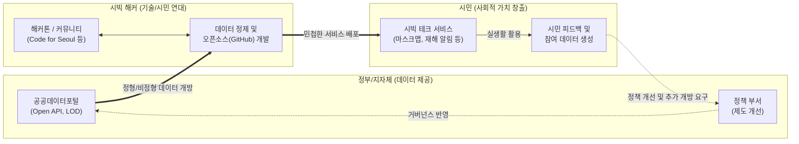

# 시빅 해킹 (Civic Hacking)

---

## I. 시민 주도의 사회문제 해결을 위한, 시빅 해킹의 개요

* **정의**: 시민, 개발자, 디자이너 등이 자발적으로 모여 정부가 개방한 공공데이터와 오픈소스 기술을 활용해 다양한 사회적·공공적 문제를 해결하는 앱, 서비스, 솔루션을 개발하는 활동
* **필요성 및 등장배경**:
* **공공데이터 개방([[공공데이터|Open Data]]) 확대**: 정부 주도의 하향식(Top-down) 정책 한계를 극복하고, 데이터의 민간 활용 가치 증대 필요성 대두
* **참여형 민주주의 실현**: 시민이 단순한 서비스 수혜자에서 벗어나 ICT 기술을 매개로 정책 구현 및 문제 해결의 주체(Living Lab)로 변화

* **특징**: 바텀업(Bottom-up) 방식, 민관 협력 거버넌스(PPP), 집단지성, 신속한 프로토타이핑([[Agile]])

---

## II. 시빅 해킹의 생태계 개념도 및 핵심 기술 요소

### 가. 시빅 해킹의 선순환 생태계 및 동작 원리

* 정부가 표준화된 API 형태로 데이터를 개방하면, 시민/개발자 커뮤니티가 자발적으로 결합하여 신속하게 서비스를 개발·배포하는 구조
* 서비스 운영을 통해 축적된 피드백은 다시 공공 정책 개선과 새로운 데이터 개방을 유도하는 선순환(Feedback Loop) 생태계를 형성함

### 나. 시빅 해킹의 핵심 구성요소 및 기반 기술

| 구분 | 요소 기술 (키워드) | 세부 설명 |
| --- | --- | --- |
| **기반 데이터** | **Open Data (공공데이터)** | 누구나 자유롭게 [[재사용]] 및 배포할 수 있는 기계 판독형(Machine-Readable) 개방 데이터 |
| **기반 데이터** | **Open API / LOD** | 실시간 데이터 연동을 위한 RESTful API 및 데이터 간의 의미적 연결을 제공하는 Linked Open Data |
| **협업/개발 기술** | **오픈소스 (Open Source)** | GitHub 등을 활용한 코드 공유, 집단지성 기반의 이슈 트래킹 및 분산 버전 관리 체계 |
| **협업/개발 기술** | **클라우드 / [[MSA (Micro Service Architecture)|MSA]]** | 급증하는 트래픽(예: 마스크 재고 조회)에 유연하게 대응하기 위한 [[클라우드 네이티브]] 아키텍처 |
| **활동 방법론** | **해커톤 (Hackathon)** | 한정된 시간 내에 기획자, 개발자, 디자이너가 협업하여 프로토타입 형태의 결과물을 도출하는 행사 |
| **활동 방법론** | **리빙랩 (Living Lab)** | 시민이 실제 생활 공간을 실험실로 삼아 사회 문제의 해법을 주도적으로 탐색하는 사용자 참여형 혁신 공간 |
| **거버넌스** | **민관 협력 (PPP)** | 정부, 시민, 기업이 상호 수평적으로 협력하는 Public-Private Partnership 구조 (디지털플랫폼정부의 핵심) |
| **네트워크** | **Code for All** | 각국의 시빅 해커들이 솔루션과 지식을 공유하는 글로벌 시빅 테크 네트워크 (국내: Code for Seoul 등) |

---

## III. 기존 공공 서비스와 시빅 해킹의 비교 및 향후 전망

### 가. 전통적 공공 서비스 개발 vs 시빅 해킹 기반 서비스 비교

| 비교 항목 | 전통적 공공/전자정부 서비스 | 시빅 해킹 (Civic Hacking) 기반 서비스 |
| --- | --- | --- |
| **주도 주체 및 방향** | 정부/지자체 주도 (Top-down) | 시민, 개발자 커뮤니티 주도 (Bottom-up) |
| **개발 [[프로세스]]** | [[워터폴]](Waterfall), 장기 발주 프로젝트 | 애자일(Agile), 해커톤 기반 단기 프로토타이핑 |
| **데이터 활용성** | 폐쇄적, 내부 데이터망 중심 연계 | 개방형(Open API), 다양한 민간 데이터와의 매시업(Mash-up) |
| **대응 속도** | 예산 편성 및 규정으로 인해 다소 느림 | 위기 상황(재난, 감염병 등)에 즉각적이고 유연한 대응 가능 |

### 나. 시빅 해킹의 최신 동향 및 향후 발전 과제

* **생성형 AI(GenAI) 기반 시빅 테크 진화**: 공공데이터 분석 및 서비스 구현에 [[초거대 언어 모델|LLM]](거대언어모델)을 접목하여, 시각장애인이나 디지털 소외계층을 위한 음성 기반 공공 서비스 접근성(Accessibility) 향상 시도 증가
* **디지털플랫폼정부(DPG)와의 연계**: 민간의 클라우드와 혁신 역량을 수용하는 DPG 정책 기조에 따라, 공공데이터 포털의 '초거대 AI 학습용 데이터 개방' 등 시빅 해커들의 활동 반경이 인프라 영역까지 대폭 확대됨
* **지속가능성 확보 과제(Funding & Maintenance)**: 자발적 봉사에 의존하는 한계를 극복하기 위해, 비영리 재단 설립, 크라우드 펀딩, 정부의 시범 사업화 연계 등 유지보수와 인프라 비용 문제를 해결하기 위한 자생적 비즈니스 모델 발굴 필요

---

### 🔗 연관 토픽

- **소속 도메인**: [[00_경영전략_MOC|📈 경영전략]]
- **세부 분류**: `5. IT 투자 성과 평가 & 비즈니스 연속성 계획 (BCP)`
- **핵심 연관 토픽**:
  - [[클라우드 네이티브]]
  - [[Agile]]
  - [[재사용]]
  - [[워터폴]]
  - [[프로세스]]
