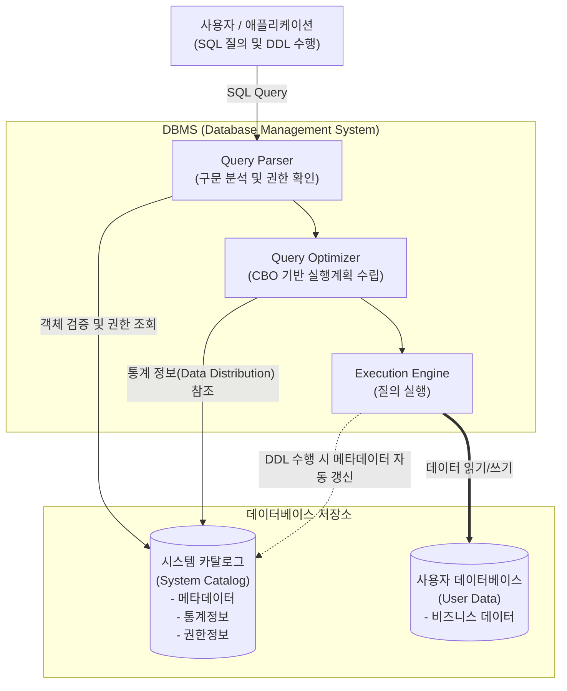

최신 [[데이터베이스]] 관리 시스템([[DBMS]])의 메타데이터 관리 원리와 분산/클라우드 환경에서의 카탈로그 아키텍처 진화, 그리고 엔터프라이즈 데이터 카탈로그(EDC)로의 확장 동향에 대한 사전 조사 및 사실관계 검증을 완료하였습니다. 이를 바탕으로 정보관리기술사 1교시형 모범답안 양식에 맞추어 작성된 답안입니다.

---

# 시스템 카탈로그 (System Catalog)

---

## I. DB 메타데이터 통합 관리 저장소, 시스템 카탈로그의 개요

* **정의**: DBMS 내에 존재하는 모든 객체(테이블, 뷰, 인덱스, 사용자 권한 등)에 대한 정의와 명세(메타데이터)를 저장하여 관리하는 시스템 전용 데이터베이스
* **필요성 및 특징**:
* **메타데이터 집중 관리**: 데이터에 대한 데이터(Data about Data)를 통합 관리하여 데이터 독립성 제공
* **질의 최적화(Optimization) 기반**: 비용 기반 최적화기(CBO)가 최적의 실행 계획을 수립하기 위한 통계 정보 제공
* **DBMS 자율 갱신**: [[DDL]](Data Definition Language) 실행 시 DBMS가 스스로 갱신하며, 사용자는 [[DML]](SELECT)을 통한 읽기 전용 접근만 가능

---

## II. 시스템 카탈로그의 아키텍처 및 핵심 구성 요소

### 가. 시스템 카탈로그 참조 및 동작 메커니즘

* 사용자의 질의 요청 시 DBMS 내부의 파서 및 옵티마이저가 시스템 카탈로그의 객체 정보와 통계 정보를 필수적으로 참조하여 최적의 실행 계획(Execution Plan)을 수립함
* 테이블 생성(CREATE) 등 객체 구조 변경(DDL) 발생 시, DBMS가 시스템 카탈로그를 자동 갱신함

### 나. 시스템 카탈로그의 핵심 구성 요소 및 기술

| 구분 | 요소 기술 (키워드) | 세부 설명 |
| --- | --- | --- |
| **핵심 개념** | **메타데이터 (Metadata)** | 테이블의 구조, 컬럼 타입, 길이 등 사용자 데이터의 특성을 정의하는 데이터의 데이터 |
| **핵심 개념** | **데이터 사전 (Data Dictionary)** | 시스템 카탈로그와 동일한 의미로 혼용되며, 데이터베이스 객체의 모든 명세를 수록한 저장소 |
| **저장 정보** | **객체 정보 (Object Info)** | 테이블, 인덱스, 뷰, 트리거, 시퀀스 등 [[스키마]] 내 객체의 물리적/논리적 정의 정보 |
| **저장 정보** | **통계 정보 (Statistics)** | 테이블 행 수, 인덱스 분포도(Selectivity), 데이터 블록 수 등 질의 최적화에 필요한 통계치 |
| **보안 및 제어** | **권한 정보 (Privileges)** | 데이터베이스 사용자 계정, 롤(Role), 객체별 접근 권한(Grant/Revoke) 등 접근 통제 정보 |
| **보안 및 제어** | **[[무결성]] 제약조건 (Constraints)** | PK(기본키), FK(외래키), UNIQUE, CHECK 등 데이터 무결성을 유지하기 위한 규칙 정보 |
| **표준 인터페이스** | **Information Schema** | ANSI [[SQL(Structured Query Language)|SQL]] 표준으로 정의된 시스템 카탈로그 뷰의 집합으로, 이기종 DBMS 간 일관된 메타데이터 조회 지원 |
| **사용자 접근** | **시스템 뷰 (System Views)** | 카탈로그 기본 테이블은 DBMS만 접근 가능하므로, 사용자가 조회할 수 있도록 제공되는 가상 테이블 (예: DBA_TABLES) |

---

## III. 시스템 카탈로그와 일반 데이터베이스 비교 및 최신 동향

### 가. 시스템 카탈로그 vs 사용자 데이터베이스 비교

| 비교 항목 | 시스템 카탈로그 (System Catalog) | 사용자 데이터베이스 (User Database) |
| --- | --- | --- |
| **저장 내용** | 데이터베이스 메타데이터 (스키마, 통계, 권한 등) | 실제 비즈니스 [[트랜잭션]] 및 마스터 데이터 |
| **갱신 주체** | **DBMS (자동 갱신)** | **일반 사용자 및 애플리케이션 (수동 갱신)** |
| **갱신 트리거** | DDL (CREATE, ALTER, DROP) 명령어 수행 시 | DML (INSERT, UPDATE, DELETE) 명령어 수행 시 |
| **접근 권한** | 시스템 관리자(DBA) 및 DBMS 내부 [[프로세스]] 중심 (일반 사용자는 Read-Only) | 접근 권한을 부여받은 일반 사용자 및 애플리케이션 (Read/Write) |
| **[[HA(High Availability)|가용성]] 영향** | 카탈로그 장애 시 DBMS 전체 기능 정지 및 질의 불가 | 해당 테이블 및 데이터에 한정된 서비스 장애 |

### 나. 시스템 카탈로그의 최신 관리 트렌드 및 향후 전망

* **분산 환경의 메타데이터 분리 (Decoupled Catalog)**: [[클라우드 네이티브]] 분산 DBMS(예: Snowflake, [[CockroachDB]])에서는 컴퓨팅/스토리지 분리 아키텍처와 함께 뗏목 [[합의 알고리즘]](Raft) 등을 적용한 독립적인 글로벌 분산 카탈로그 노드를 두어 락 커텐션(Lock Contention) 최소화 및 확장성 확보
* **엔터프라이즈 데이터 카탈로그(EDC)로의 진화**: 단일 DBMS의 카탈로그를 넘어, 조직 내 모든 사일로(Silo)화된 데이터 저장소의 메타데이터를 수집·통합하는 데이터 패브릭(Data Fabric) 및 [[데이터 거버넌스]] 핵심 플랫폼(예: Collibra, Apache Atlas)으로 발전
* **AI 기반 액티브 메타데이터 (Active Metadata)**: 수집된 시스템 카탈로그 및 사용 이력(Log)에 머신러닝을 적용하여, 민감 정보(PII) 자동 태깅, 데이터 리니지(Data Lineage) 자동 추적, 데이터 품질 이상 탐지를 수행하는 지능형 카탈로그 관리 체계 확산

---

### 🔗 연관 토픽

- **소속 도메인**: [[00_데이터베이스_MOC|🗄️ 데이터베이스]]
- **세부 분류**: `1. 데이터 모델링 & 관계형 DB 설계`
- **핵심 연관 토픽**:
  - [[데이터베이스]]
  - [[DBMS]]
  - [[DDL]]
  - [[스키마]]
  - [[자료 사전]]
