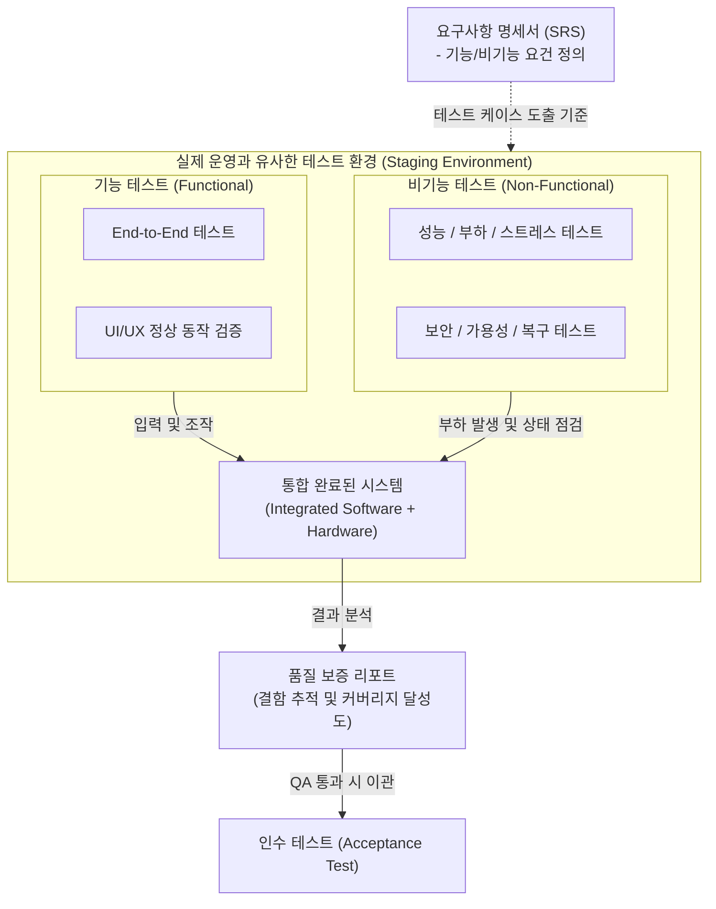

# 시스템 테스트 (System Testing)

---

## I. 완벽한 요구사항 검증과 시스템 품질 보증을 위한, 시스템 테스트의 개요

* **정의**: 단위 및 통합 테스트가 완료된 전체 시스템이 소프트웨어 [[요구사항 명세서]](SRS)를 완벽히 충족하는지 평가하기 위해, 실제 운영 환경과 유사한 환경에서 수행하는 블랙박스 기반의 종합 테스트
* **필요성 및 특징**:
* **[[End-to-End]] 검증**: 단일 모듈의 정상 동작을 넘어 기능적/비기능적 요건 전체를 포괄적으로 검증
* **환경 유사성**: 실제 운영 환경(Production)과 동일한 조건(Staging) 설정을 통한 운영 리스크 사전 차단
* **결함 유출 방지**: 최종 사용자 대상의 [[인수 테스트]](Acceptance Test) 진입 전, 개발 조직 차원의 최종 품질 보증(QA) 단계

---

## II. 시스템 테스트의 개념도 및 핵심 구성 요소

### 가. 시스템 테스트 수행 환경 및 검증 개념도

* 통합 테스트를 마친 시스템을 대상으로, 요구사항 명세서(SRS)를 기준으로 기능적 요건과 비기능적 요건을 분리하여 종합 검증함
* 내부 소스코드를 보지 않는 블랙박스(Black-box) 접근법을 취하며, QA 전담 조직에 의해 독립적으로 수행됨

### 나. 시스템 테스트의 핵심 검증 기술 및 구성 요소

| 구분 | 요소 기술 (키워드) | 세부 설명 |
| --- | --- | --- |
| **기본 원칙** | **[[블랙박스 테스트]]** | 시스템의 내부 논리 구조를 배제하고, 입력값에 대한 출력 결과가 명세와 일치하는지 검증 |
| **기능 검증** | **기능 테스트 (Functional)** | 비즈니스 로직, 데이터 조작, End-to-End 업무 흐름 등 시스템이 수행해야 할 기능적 요건 정상 동작 검증 |
| **비기능 검증** | **성능/부하 테스트 (Performance)** | [[응답시간]](Response Time), [[처리량]](Throughput), 동시 접속자 수 등 목표 성능지표(KPI) 달성 여부 검증 |
| **비기능 검증** | **스트레스 테스트 (Stress)** | 시스템의 임계치 이상의 과도한 부하를 인가하여, 시스템이 파괴되는 시점과 점진적 성능 저하 양상 확인 |
| **비기능 검증** | **보안 테스트 (Security)** | 비인가자 접근 통제, 데이터 [[암호화]], 웹 취약점(OWASP Top 10) 및 침투 테스트(Penetration Test) 수행 |
| **비기능 검증** | **복구 테스트 (Recovery)** | S/W 또는 H/W의 고의적 장애 발생 시, 시스템이 규정된 시간(RTO) 내에 정상 상태로 복구되는지 검증 |
| **품질 유지** | **[[리그레션 테스트|회귀 테스트]] (Regression)** | 테스트 중 발견된 오류를 수정한 후, 변경된 코드가 기존의 정상적인 기능에 부작용(Side Effect)을 주지 않았는지 재검증 |
| **인프라 구성** | **스테이징 환경 (Staging)** | 운영 환경과 동일한 H/W 사양, 네트워크 토폴로지, DB 데이터를 복제하여 테스트의 신뢰성을 극대화한 환경 |

---

## III. 시스템 테스트의 단계별 비교 및 최신 동향

### 가. 소프트웨어 개발 생명주기(V-모델) 기반 테스트 단계별 비교

| 비교 항목 | [[단위 테스트]] (Unit) | [[통합 테스트]] (Integration) | **시스템 테스트 (System)** | 인수 테스트 (Acceptance) |
| --- | --- | --- | --- | --- |
| **검증 기준 문서** | 상세 설계서 | 기본(아키텍처) 설계서 | **요구사항 명세서 (SRS)** | 인수 조건 (사용자 요구사항) |
| **수행 주체** | 개발자 (Developer) | 개발자, 아키텍트 | **독립된 테스터 (QA 조직)** | 최종 사용자, 고객 |
| **주요 테스트 기법** | [[화이트박스 테스트]] | 블랙박스 / 화이트박스 혼용 | **블랙박스 테스트** | 블랙박스 테스트 (알파/베타) |
| **수행 목적** | 모듈 내 논리적 오류 발견 | 모듈 간 인터페이스 연동 검증 | **전체 시스템의 요건 충족 검증** | 실제 업무 적용 가능성 판단 |

### 나. 시스템 테스트의 최신 트렌드 및 향후 전망

* **AI 기반 테스트 자동화 진화**: [[초거대 언어 모델|LLM]](거대언어모델) 및 생성형 AI를 활용하여 요구사항 명세서에서 테스트 케이스(TC)와 테스트 스크립트를 자동 생성하고, 결함 발생 시 근본 원인(Root Cause)을 자동 분석하는 지능형 QA 도입 가속화
* **[[MSA (Micro Service Architecture)|MSA]] 환경의 [[카오스 엔지니어링]](Chaos Engineering)**: [[클라우드 네이티브]] 시스템의 복잡성 증가에 따라, 프로덕션이나 스테이징 환경에 고의로 장애([[인스턴스]] 종료, 네트워크 지연 등)를 주입하여 시스템의 회복탄력성(Resilience)을 검증하는 방식 정착
* **지속적 테스트(Continuous Testing) 체계 내재화**: CI/CD 파이프라인 내에 성능 및 보안 테스트를 자동화된 형태로 통합하여, 릴리스 주기를 단축하고 피드백 루프를 가속화하는 Shift-Left 및 Shift-Right 테스팅 전략 확산

---

### 🔗 연관 토픽

- **소속 도메인**: [[00_소프트웨어공학_MOC|🏗️ 소프트웨어공학]]
- **세부 분류**: `3. 요구사항 공학 & UML 객체지향 분석/설계`
- **핵심 연관 토픽**:
  - [[인수 테스트]]
  - [[통합 테스트]]
  - [[블랙박스 테스트]]
  - [[유즈케이스 다이어그램]]
  - [[단위 테스트]]
