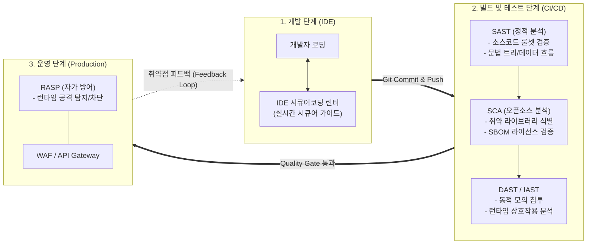

# 시큐어코딩 (Secure Coding)

---

## I. 개발 단계의 보안 내재화를 위한, 시큐어코딩의 개요

* **정의**: 소프트웨어 개발 생명주기([[SDLC]])의 구현 단계에서 잠재적인 보안 취약점(Vulnerability)과 보안 약점(Weakness)을 사전에 제거하여 안전한 소프트웨어를 개발하는 코딩 기법
* **필요성 및 등장배경**:
* **비용 절감 및 효율성 (Shift-Left)**: 배포/운영 단계 대비 개발 초기 결함 수정 비용을 최대 30~100배 절감
* **공격 표면(Attack Surface) 원천 차단**: 시스템 침해 사고의 70% 이상을 유발하는 애플리케이션 계층 결함 최소화
* **컴플라이언스 법제화**: 전자정부법 및 전자금융감독규정에 따른 공공·금융 SW 개발보안 적용 의무화

---

## II. 시큐어코딩의 메커니즘 및 핵심 기술 요소

### 가. DevSecOps 파이프라인 기반 시큐어코딩 검증 아키텍처

* 개발 환경(IDE)부터 빌드([[SAST]]/SCA), 테스트([[DAST]]/IAST), 운영(RASP) 전 단계에 보안 게이트(Quality Gate)를 결합하여 실시간 취약점 제거
* 정적 검증을 통과하지 못한 코드는 파이프라인에서 자동으로 빌드를 중단(Fail)시켜 결함 유입을 원천 차단함

### 나. 시큐어코딩 핵심 기술 및 7대 보안약점 대응 요소

| 구분 | 요소 기술 (키워드) | 세부 설명 |
| --- | --- | --- |
| **정적 분석** | **SAST (Static Analysis)** | 소스코드를 실행하지 않고 구문 분석(AST), 데이터 흐름, 제어 흐름을 추적하여 잠재적 약점 탐지 |
| **오픈소스 분석** | **SCA (Software Composition)** | 서드파티 및 오픈소스 종속성을 분석하고 취약점([[CVE]]) 및 [[SBOM]](소프트웨어 자재명세서) 검증 |
| **동적 분석** | **IAST (Interactive Analysis)** | SAST와 DAST의 장점을 결합하여 애플리케이션 내부에 에이전트를 삽입, 런타임 취약점 정밀 식별 |
| **입력 데이터 검증** | **Parameterized Query** | 동적 쿼리 생성을 배제하고 PreparedStatement를 사용하여 [[SQL(Structured Query Language)|SQL]] 인젝션(Injection) 공격 원천 방어 |
| **보안 기능** | **솔트(Salt) 기반 일방향 [[암호화]]** | 패스워드 저장 시 무작위 솔트값과 안전한 해시 함수(SHA-512, PBKDF2, Argon2)를 결합하여 유출 방어 |
| **시간 및 상태** | **동시성 제어 (Race Condition)** | 멀티스레드 환경에서 공유 자원 접근 시 동기화(Synchronization) 블록을 적용하여 상태 변경 레이스 방지 |
| **에러 처리** | **정보 노출 방지** | 예외 발생 시 시스템 내부 스택 트레이스([[Stack]] Trace)나 DB 정보 노출을 차단하고 사용자 정의 에러 반환 |
| **코드 오류/[[캡슐화]]** | **Null Pointer 역참조 방지** | 객체 사용 전 명시적 널 체크(Null Check) 및 [[클래스]] 내부 변수의 접근 제어자(Private) 캡슐화 준수 |

---

## III. SAST와 DAST 비교 및 최신 동향

### 가. 분석 도구 비교: SAST(정적 분석) vs DAST(동적 분석)

| 비교 항목 | SAST (Static Application Security Testing) | DAST (Dynamic Application Security Testing) |
| --- | --- | --- |
| **분석 대상 및 시점** | 소스코드, 바이트코드 (컴파일 전/빌드 시점) | 실행 중인 웹 애플리케이션 (런타임/테스트 시점) |
| **동작 방식** | 화이트박스(White-box) 테스트 | 블랙박스(Black-box) 모의 침투 테스트 |
| **취약점 위치 파악** | 정확한 소스코드 파일 및 코드 라인 식별 가능 | 취약점이 발생하는 URI 및 파라미터만 식별 |
| **주요 한계점** | 높은 오탐률(False Positive), 런타임 환경 결함 미탐 | 배포 후 수행으로 수정 비용 증가, 소스 위치 직접 추적 불가 |

### 나. 시큐어코딩의 최신 트렌드 및 향후 전망

* **AI 생성 코드(GenAI) 보안 검증 체계 확립**: GitHub Copilot, ChatGPT 등 코딩 보조 AI가 생성한 코드 내 취약점(약 40% 이상 취약점 내포 보고) 유입을 방지하기 위해 PR(Pull Request) 단계 자동 시큐어코딩 검증 의무화
* **공급망 보안(Software Supply Chain Security)과 통합**: 독자 개발 코드뿐만 아니라 오픈소스 라이브러리의 악성 패키지 유입 방지를 위해 SLSA(Supply-chain Levels for Software Artifacts) [[프레임워크]] 기반 [[무결성]] 검증 결합
* **Shift-Left에서 Shift-Everywhere(전주기 내재화)로 발전**: 개발 단계의 SAST/SCA뿐만 아니라 운영 환경의 RASP(Runtime Application Self-Protection)와 실시간 연계하여 제로데이 공격에 자율 대응하는 체계로 진화

---

### 🔗 연관 토픽

- **소속 도메인**: [[00_보안_MOC|🛡️ 보안]]
- **세부 분류**: `4. 웹 & 애플리케이션 보안 · 취약점 점검`
- **핵심 연관 토픽**:
  - [[DAST]]
  - [[SDLC]]
  - [[SAST]]
  - [[CVE]]
  - [[암호화|암호화 (Encryption)]]
