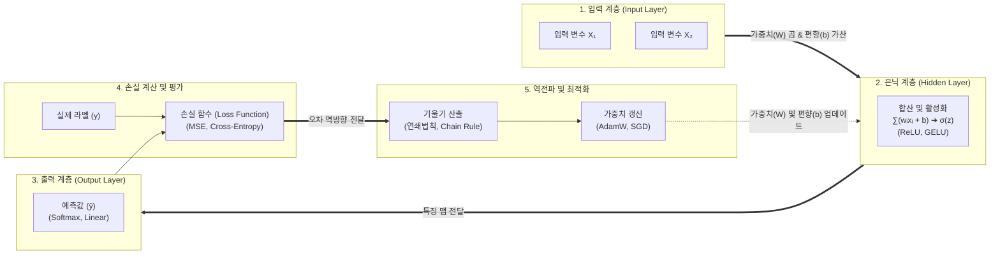

# 신경망분석 (Neural Network Analysis)

---

## I. 인간 뇌 신경계 모방을 통한 비선형 패턴 학습, 신경망분석의 개요

* **정의**: 인간 뇌의 신경세포(Neuron)와 시냅스(Synapse)의 신호 전달 과정을 수학적으로 모델링하여, 입력 데이터 간의 복잡한 비선형 관계를 스스로 학습하고 분류(Classification) 및 회귀(Regression)를 수행하는 데이터 분석 기법
* **필요성 및 핵심 특징**:
* **비선형 패턴 학습**: 전통 통계 모델로 해결하기 어려운 고차원 데이터의 비선형(Non-linear) 관계 해결
* **범용 근사 정리(Universal Approximation)**: 적절한 은닉층과 활성화 함수 조합으로 임의의 연속 함수를 임의의 정밀도로 근사 가능
* **특징 자동 추출(Feature Learning)**: 사람의 수작업 특징 공학(Feature Engineering) 의존성을 탈피하고 잠재 특징을 계층적으로 자율 추출

---

## II. 신경망분석의 아키텍처 및 핵심 기술 요소

### 가. 신경망분석의 학습 메커니즘 및 동작 원리

* 순전파(Forward Propagation)를 통해 입력 데이터의 가중합과 활성화 함수 연산을 거쳐 최종 예측값 도출 및 오차(Loss) 계산
* 계산된 손실을 [[역전파]](Backpropagation)의 연쇄 법칙(Chain Rule)을 활용해 각 계층의 가중치로 역방향 미분하고, 옵티마이저로 파라미터를 갱신하는 반복 루프 수행

### 나. 신경망분석의 핵심 기술 및 구성 요소

| 구분 | 요소 기술 (키워드) | 세부 설명 |
| --- | --- | --- |
| **기본 모델** | **MLP (다층 퍼셉트론)** | 입력층, 하나 이상의 은닉층, 출력층으로 구성되어 단층 퍼셉트론의 XOR 문제를 해결한 피드포워드 신경망 |
| **비선형 변환** | **활성화 함수 (Activation)** | 선형 결합 결과에 비선형성을 부여하는 함수로, 기울기 소실(Vanishing Gradient)을 완화하는 ReLU, GELU, Swish 등 활용 |
| **오차 측정** | **손실 함수 (Loss Function)** | 모델의 예측값과 실제 정답 간의 괴리를 수치화하며, 회귀는 MSE/MAE, 분류는 교차 엔트로피(Cross-Entropy) 적용 |
| **기울기 연산** | **역전파 (Backpropagation)** | 미분의 연쇄 법칙(Chain Rule)을 적용하여 출력 오차를 은닉층 방향으로 전달하며 각 가중치에 대한 편미분값(Gradient) 계산 |
| **최적화 기법** | **[[옵티마이저|옵티마이저 (Optimizer)]]** | 계산된 기울기를 바탕으로 가중치 갱신 크기와 방향을 결정하는 [[알고리즘]] (SGD, Momentum, Adam, 최신 AdamW) |
| **과적합 제어** | **드롭아웃 ([[Dropout]])** | 학습 과정에서 은닉층의 뉴런을 무작위로 비활성화하여 특정 뉴런에 과도하게 의존하는 공적응(Co-adaptation) 현상 방지 |
| **분포 안정화** | **정규화 (Normalization)** | 내부 공변량 변화(Internal Covariate Shift)를 억제하여 학습 안정성을 높이는 [[배치 정규화]](BatchNorm), 레이어 정규화(LayerNorm) |
| **해석력 확보** | **[[XAI]] 기법 (설명 가능성)** | 신경망의 블랙박스 문제를 완화하기 위해 입력 변수 기여도를 수치화하는 SHAP, [[LIME]] 및 시각화 기법 Grad-CAM |

---

## III. 전통 통계분석과 신경망분석 비교 및 최신 동향

### 가. 전통 통계분석(회귀분석) vs 신경망분석(ANN/DNN) 비교

| 비교 항목 | 전통 통계분석 ([[회귀분석]]) | 신경망분석 (ANN / Deep Learning) |
| --- | --- | --- |
| **모델링 기본 가정** | 선형성, 정규성, [[등분산성]], 독립성 등 엄격한 가정 요구 | 데이터 분포에 대한 사전 가정이 거의 없음 (비모수적 접근) |
| **특징 추출 방식** | 도메인 지식 기반의 수동 변수 선택(Feature Selection) | 모델 스스로 잠재 표현(Latent Representation) 자동 학습 |
| **데이터 요구량** | 표본의 크기가 작아도 통계적 유의성([[유의확률|p-value]]) 검증 가능 | 과적합 방지 및 일반화를 위해 대규모 데이터셋 필수 |
| **해석 가능성 (설명력)** | 회귀 계수(Beta)를 통해 직관적인 인과관계 해석 가능 | 다층 구조와 비선형 연산으로 인한 블랙박스(Black-box) 특성 |
| **적합한 데이터 형태** | 정형 데이터(Structured Data), 수치형 지표 분석 | 이미지, 음성, 텍스트 등 비정형 데이터 및 복잡한 고차원 데이터 |

### 나. 신경망분석의 최신 발전 트렌드 및 향후 전망

* **설명 가능한 [[인공지능]](XAI)과의 결합 가속화**: 금융, 의료, 국방 등 신뢰성이 필수적인 도메인에서 신경망의 블랙박스 특성을 극복하기 위해 어텐션(Attention) 맵 시각화 및 피처 중요도 분석을 파이프라인에 필수 통합
* **물리 정보 기반 신경망(PINN)의 부상**: 데이터 기반 학습의 한계(데이터 부족, 물리 법칙 위배)를 극복하기 위해 편미분방정식(PDE) 등 물리적 법칙을 손실 함수에 페널티로 부여하는 과학 연산(AI for Science) 융합 확산
* **[[파운데이션 모델]] 및 상태공간모델(SSM)로의 진화**: 전통적인 [[CNN]], [[RNN (Recurrent Neural Network)|RNN]]을 넘어 [[트랜스포머]](Self-Attention) 구조와 장기 문맥 처리에 최적화된 Mamba(SSM) 아키텍처가 결합된 초거대 다중 모달(Multi-modal) 신경망으로 진화

---

### 🔗 연관 토픽

- **소속 도메인**: [[00_경영전략_MOC|📈 경영전략]]
- **세부 분류**: `3. 비즈니스 프로세스 혁신 & 디지털 전환 (DX)`
- **핵심 연관 토픽**:
  - [[인공지능]]
  - [[XAI]]
  - [[트랜스포머|트랜스포머(Transformer)]]
  - [[Dropout]]
  - [[등분산성|등분산성 (Homoscedasticity)]]
