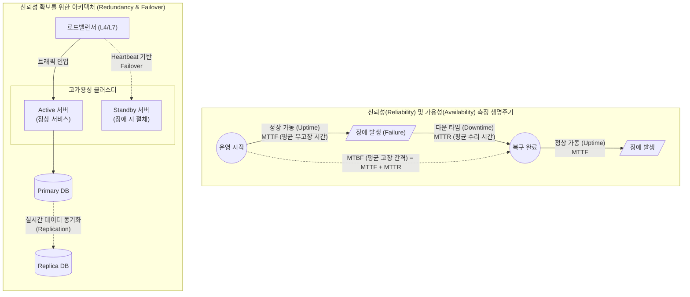

# 신뢰성 (Reliability)

---

## I. 무중단 시스템 운영 및 비즈니스 연속성 보장의 핵심, 신뢰성의 개요

* **정의**: 소프트웨어나 시스템이 명시된 조건 하에서 지정된 기간 동안 요구되는 기능과 성능 수준을 오작동 없이 안정적으로 유지하고 수행하는 능력 (ISO/IEC 25010 핵심 품질 속성)
* **필요성 및 등장배경**:
* **비즈니스 연속성([[BCP]]) 확보**: IT 인프라 장애로 인한 막대한 경제적 손실 및 기업 신뢰도 하락 방지
* **클라우드 복잡성 증대**: [[MSA (Micro Service Architecture)|MSA]] 및 분산 환경의 확산으로 인해 단일 노드 장애가 전체 시스템으로 전파되는 것을 차단할 필요성 증대
* **패러다임의 변화**: 전통적 '장애 예방(Prevention)'에서 '장애 수용 및 신속 복구(Resilience)'로 관점 이동

---

## II. 신뢰성 측정 메커니즘 및 핵심 기술 요소

### 가. 신뢰성 지표 측정 흐름 및 결함 허용(Fault Tolerance) 아키텍처

* 신뢰성은 장비가 고장 나기 전까지의 평균 시간(MTTF)을 극대화하고, 복구 시간(MTTR)을 최소화하여 평가함
* 단일 장애점(SPOF)을 제거하기 위해 이중화(Active-Standby, Active-Active) 및 데이터 복제(Replication) 아키텍처를 적용하여 결함 허용성 확보

### 나. 신뢰성의 세부 품질 속성 및 핵심 확보 기술

| 구분 | 요소 기술 (키워드) | 세부 설명 |
| --- | --- | --- |
| **품질 속성** | **성숙성 (Maturity)** | 시스템 내부에 존재하는 결함(Fault)이 장애(Failure)로 발현되지 않도록 내재적 결함을 최소화하는 능력 |
| **품질 속성** | **[[HA(High Availability)|가용성]] (Availability)** | 사용자가 시스템 사용을 원할 때 즉각적으로 접근 및 조작이 가능한 상태 (A = MTTF / MTBF) |
| **품질 속성** | **결함 허용성 (Fault Tolerance)** | 소프트웨어 및 하드웨어 결함이 발생하더라도 시스템 전체가 마비되지 않고 지정된 수준의 기능을 유지하는 능력 |
| **품질 속성** | **복구 가능성 (Recoverability)** | 장애 발생 시 영향을 받은 데이터를 복구하고, 요구되는 시스템 상태 및 성능으로 신속하게 되돌리는 능력 |
| **측정 지표** | **MTBF (평균 고장 간격)** | 시스템이 복구된 후 다음 고장이 발생할 때까지의 평균 시간 (신뢰성 평가의 가장 핵심적인 정량 지표) |
| **설계 기법** | **리질리언스 (Resilience)** | 서킷 브레이커(Circuit Breaker), 타임아웃([[Timeout]]), 재시도(Retry) 패턴을 적용하여 분산 환경의 연쇄 장애 차단 |
| **검증 기법** | **[[카오스 엔지니어링]] (Chaos)** | 프로덕션 환경에 무작위로 장애(서버 다운, 지연 등)를 주입하여 시스템의 복원력을 선제적으로 검증하는 테스트 |
| **운영 기법** | **[[SRE (Site Reliability Engineering)|SRE]] (Site Reliability Eng.)** | 구글이 제창한 운영 철학으로, SLI/SLO 지표 기반의 에러 버짓(Error Budget)을 활용해 신뢰성과 기능 릴리스 속도의 균형 유지 |

---

## III. 신뢰성과 가용성 비교 및 최신 동향

### 가. 시스템의 안정성을 나타내는 신뢰성(Reliability)과 가용성(Availability) 비교

| 비교 항목 | 신뢰성 (Reliability) | 가용성 (Availability) |
| --- | --- | --- |
| **핵심 개념** | 주어진 시간 동안 **고장 없이 연속적으로 작동**할 확률 | 특정 시점에 사용자가 **서비스를 이용할 수 있는** 확률 |
| **산출 공식** | $R(t) = e^{-\lambda t}$ (고장률 $\lambda$), MTBF 지표 활용 | $A = \frac{MTTF}{MTTF + MTTR} = \frac{MTTF}{MTBF}$ |
| **관리 목표** | 고장 횟수 축소 및 고장 간격(MTTF)의 극대화 | 다운타임(MTTR) 단축을 통한 서비스 업타임 극대화 |
| **관점(Focus)** | 시스템의 물리적/논리적 **내구성 및 무결점 상태** | 사용자 관점의 **서비스 접근 및 사용 가능 상태** |

### 나. 신뢰성 확보 기술의 최신 트렌드 및 향후 전망

* **AIOps 기반 사전 장애 예측**: 머신러닝과 AI를 활용하여 시스템 로그 및 텔레메트리 데이터를 실시간으로 분석, 장애 발생 징후를 사전에 탐지하여 선제적으로 노드를 교체하는 지능형 운영 확산
* **오버레이 네트워크 기반 이중화 고도화**: [[클라우드 네이티브]] 아키텍처 환경에서 [[BGP]] EVPN-VXLAN을 활용한 멀티 데이터센터(Active-Active) 이중화를 통해 재해 발생 시 RTO(목표 복구 시간) 제로화 추진
* **공급망 및 서드파티 신뢰성 검증**: 오픈소스 및 외부 API 호출에 대한 의존성이 높아짐에 따라, 외부 서비스 장애 시에도 자사 서비스가 영향을 받지 않도록 Fallback(대체) 로직 및 Graceful Degradation(우아한 저하) 설계 필수화

---

### 🔗 연관 토픽

- **소속 도메인**: [[00_소프트웨어공학_MOC|🏗️ 소프트웨어공학]]
- **세부 분류**: `3. 요구사항 공학 & UML 객체지향 분석/설계`
- **핵심 연관 토픽**:
  - [[SRE (Site Reliability Engineering)]]
  - [[BGP|BGP(Border Gateway Protocol)]]
  - [[SW 아키텍처 평가|SW 아키텍처 평가 (Software Architecture Evaluation)]]
  - [[Test 일반]]
  - [[릴리즈 엔지니어링]]
