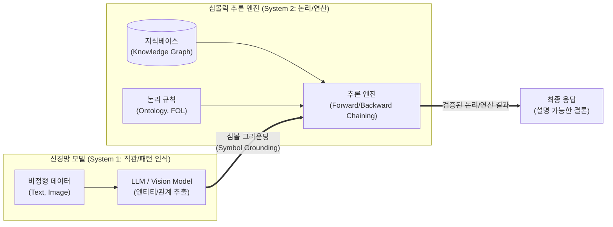

최신 [[인공지능]] 트렌드([[초거대 언어 모델|LLM]] 환각 극복을 위한 뉴로-심볼릭 AI, 지식 그래프 융합, AlphaGeometry 등)에 대한 사전 조사 및 사실관계 검증을 완료하였습니다. 이를 바탕으로 지시하신 1교시형 모범답안 양식에 맞추어 작성된 답안입니다.

---

# 심볼릭 추론 (Symbolic Reasoning)

---

## I. 설명 가능하고 논리적인 AI 구현을 위한, 심볼릭 추론의 개요

* **정의**: 인간의 지식과 논리를 명시적인 기호(Symbol)와 규칙(Rule)으로 표현하고, 연역적/귀납적 추론 엔진을 통해 새로운 결론을 논리적으로 도출하는 지능형 처리 기법
* **필요성 및 특징**:
* **환각(Hallucination) 현상 극복**: 통계적 확률에 의존하는 [[딥러닝]](LLM)의 오답 발생 문제를 명확한 논리 규칙으로 통제 및 보완
* **설명 가능성(Explainability)**: 결론 도출 과정이 화이트박스(White-box) 형태로 추적 가능하여 의료, 금융 등 신뢰성이 중요한 도메인에 필수적
* **패러다임 진화**: 기호주의(GOFAI)의 한계를 극복하기 위해 최근 딥러닝과 결합한 **뉴로-심볼릭(Neuro-Symbolic) AI** 형태로 급부상

---

## II. 심볼릭 추론의 아키텍처 및 핵심 기술 요소

### 가. 심볼릭 추론 기반 뉴로-심볼릭 AI 동작 개념도

* 신경망(System 1)이 비정형 데이터에서 기호([[엔티티]], 관계)를 추출하여 심볼릭 엔진(System 2)으로 전달함
* 심볼릭 엔진은 지식베이스와 명시적 논리 규칙을 바탕으로 연역적 추론을 수행하여 사실에 기반한 결론을 도출함

### 나. 심볼릭 추론의 핵심 기술 요소

| 구분 | 요소 기술 (키워드) | 세부 설명 |
| --- | --- | --- |
| **지식 표현** | **지식 그래프 (Knowledge Graph)** | 실세계의 엔티티(Node)와 그들 간의 관계([[EDGE|Edge]])를 그래프 형태로 구조화한 지식 베이스 |
| **지식 표현** | **온톨로지 (Ontology)** | 특정 도메인의 개념, 속성, 관계를 컴퓨터가 처리할 수 있도록 명시적으로 정의한 규격 (RDF, OWL) |
| **논리 체계** | **1차 술어 논리 (FOL)** | '모든(∀)', '어떤(∃)' 등의 양화사(Quantifier)를 사용하여 객체 간의 관계와 명제의 참/거짓을 표현 |
| **추론 메커니즘** | **전향 추론 (Forward Chaining)** | 알려진 초기 사실(Fact)들에서 출발하여, IF-THEN 규칙을 반복 적용해 새로운 결론을 도출하는 방식 |
| **추론 메커니즘** | **후향 추론 (Backward Chaining)** | 증명하고자 하는 목표(Goal) 결론에서 출발하여, 이를 만족하기 위한 전제 조건을 역추적하는 방식 |
| **데이터 연결** | **심볼 그라운딩 (Symbol Grounding)** | 비정형 데이터(픽셀, 텍스트)의 패턴을 명시적이고 논리적인 의미를 가진 기호(Symbol)로 매핑하는 기술 |
| **신경망 융합** | **뉴로-심볼릭 (Neuro-Symbolic)** | 딥러닝의 강력한 패턴 인식(Perception) 능력과 심볼릭 AI의 정밀한 논리(Reasoning) 능력을 결합한 구조 |
| **도구 확장** | **외부 논리 툴 연동 (Tool API)** | LLM이 복잡한 수학식이나 [[알고리즘]] 처리 시 자체 연산 대신 Wolfram Alpha 등 기호 연산 엔진을 호출하여 해결 |

---

## III. 심볼릭 추론과 인공신경망 비교 및 향후 전망

### 가. 인공지능 패러다임: 기호주의(심볼릭 추론) vs 연결주의(인공신경망) 비교

| 비교 항목 | 기호주의 (Symbolic AI / 추론) | 연결주의 (Connectionist AI / 신경망) |
| --- | --- | --- |
| **핵심 동작 원리** | 규칙(Rule)과 논리 기호(Symbol) 연산 | 인공 뉴런 간의 가중치(Weight) 갱신 |
| **학습 및 판단 방식** | **연역적 추론** (정해진 공리와 규칙 기반) | **귀납적 추론** (대규모 데이터 기반 확률적 추정) |
| **설명 가능성 ([[XAI]])** | **화이트박스 (높음)**, 논리적 인과관계 추적 가능 | **블랙박스 (낮음)**, 내부 판단 근거 파악 곤란 |
| **주요 한계점** | 지식 획득 병목(전문가 의존), 예외 상황 대처 취약 | 데이터 의존성 극심, [[할루시네이션|환각 현상]], 복잡한 다단계 수학 연산 불가 |
| **최적 활용 분야** | 수학 증명, 전문가 시스템, 의미론적 웹(Semantic Web) | 자연어 처리(LLM), 이미지/음성 인식 및 생성 |

### 나. 심볼릭 추론의 최신 트렌드 및 산업 적용 전망

* **수학 및 기하학 난제 해결 가속화**: 구글 딥마인드의 '알파지오메트리(AlphaGeometry)'처럼, 언어 모델이 직관적 아이디어를 내고 기호 연역 엔진(Symbolic Deduction Engine)이 이를 증명하는 시스템이 국제수학올림피아드(IMO) 수준의 난제를 해결함
* **LLM과 [[지식그래프]](KG)의 결합([[GraphRAG (Graph Retrieval-Augmented Generation)|GraphRAG]])**: 일반적인 벡터 DB 기반 RAG(검색 증강 생성)의 한계를 극복하기 위해, 기업의 내부 지식을 온톨로지 기반 지식 그래프로 구축하고 이를 통해 LLM에 정확한 컨텍스트와 논리를 주입하는 GraphRAG 확산
* **System 1과 System 2의 완전한 융합**: 즉각적인 패턴 인식(System 1)과 심사숙고하는 논리적 추론(System 2)을 단일 아키텍처 내에서 동적으로 전환하여 사용하는 [[범용 인공지능]]([[AGI]])의 핵심 기반 기술로 발전 중

---

### 🔗 연관 토픽

- **소속 도메인**: [[00_인공지능_MOC|🤖 인공지능]]
- **세부 분류**: `4. 거대언어모델 (LLM) & 생성형 AI`
- **핵심 연관 토픽**:
  - [[AGI|AGI (Artificial General Intelligence)]]
  - [[GraphRAG (Graph Retrieval-Augmented Generation)]]
  - [[딥러닝]]
  - [[인공지능]]
  - [[XAI]]
