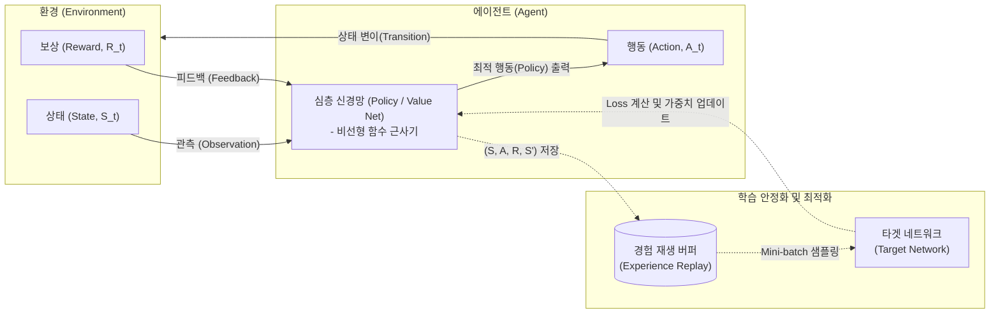

# 심화강화학습 (Deep Reinforcement Learning)

---

## I. 고차원 환경의 자율 의사결정 인공지능, 심화강화학습의 개요

* **정의**: 에이전트(Agent)가 환경과 상호작용하며 누적 보상을 최대화하는 정책을 찾는 [[강화학습]](RL)에, 고차원 상태 공간 처리를 위한 심층 신경망(DNN)을 결합한 [[인공지능]] 기법
* **필요성 및 등장배경**:
* **차원의 저주 극복**: 이미지, 음성 등 복잡하고 연속적인 고차원 상태(State) 공간을 딥러닝의 함수 근사(Function Approximation)로 해결
* **엔드투엔드([[End-to-End]]) 학습**: 별도의 수작업 특징 추출 없이 원시 데이터(Raw data)에서 직접 최적 행동(Action) 매핑 도출
* **자율 시스템 고도화**: 알파고(AlphaGo), [[Smart Car(자율주행)|자율주행]], 생성형 AI([[초거대 언어 모델|LLM]])의 인간 의도 정렬(RLHF) 등 복잡한 제어 문제 해결 요구 증대

---

## II. 심화강화학습의 아키텍처 및 핵심 기술 요소

### 가. 심화강화학습의 아키텍처 및 동작 원리

* 에이전트는 환경으로부터 상태(S)와 보상(R)을 관측하여, 심층 신경망을 통해 기대 보상을 최대화하는 행동(A)을 결정함
* DQN 기반 구조에서는 학습의 불안정성을 해소하기 위해 경험 재생(Experience Replay)과 타겟 네트워크(Target Network)를 활용하여 가중치를 최적화함

### 나. 심화강화학습의 핵심 구성 요소 및 알고리즘

| 구분 | 요소 기술 (키워드) | 세부 설명 |
| --- | --- | --- |
| **기반 이론** | **MDP (마르코프 결정 과정)** | 상태(S), 행동(A), 보상(R), 상태변이 확률(P), 할인율($\gamma$)로 환경을 수학적으로 모델링 |
| **핵심 함수** | **가치 / 정책망 (Value/Policy Net)** | 상태의 가치를 평가하는 가치 함수(V, Q)와 행동 확률을 결정하는 정책 함수($\pi$)를 신경망으로 근사 |
| **학습 기법** | **탐험과 활용 (Exploration & Exploitation)** | 미지의 상태를 탐색(입실론-그리디 등)하는 것과 현재까지의 최적 해를 활용하는 것 간의 균형 유지 |
| **안정화 기법** | **경험 재생 (Experience Replay)** | 에피소드(S, A, R, S')를 버퍼에 저장 후 무작위 샘플링하여 데이터 간 시간적 상관관계(Correlation) 제거 |
| **대표 [[알고리즘]]** | **DQN (Deep Q-Network)** | Q-Learning에 [[CNN]]을 결합한 가치(Value) 기반 알고리즘 (이산적 행동 공간에 적합) |
| **하이브리드** | **액터-크리틱 (Actor-Critic)** | 정책을 학습하는 Actor와 행동의 가치를 평가하는 Critic 신경망을 동시 학습하여 분산(Variance) 축소 |
| **최신 알고리즘** | **PPO (Proximal Policy Optimization)** | 신뢰 영역(Trust Region) 내에서만 정책을 업데이트하여 학습 안정성과 샘플 효율성을 극대화 (RLHF의 핵심) |
| **최신 알고리즘** | **SAC (Soft Actor-Critic)** | 보상 극대화와 동시에 정책의 엔트로피(무작위성)를 최대화하여 안정적인 탐험을 유도하는 Off-policy 기법 |

---

## III. 심화강화학습의 분류 및 최신 산업 적용 동향

### 가. 심화강화학습 주요 알고리즘 분류

| 구분 | Value-Based (가치 기반) | Policy-Based (정책 기반) | Actor-Critic (혼합형) |
| --- | --- | --- | --- |
| **학습 대상** | Q-Value (상태-행동 가치) | 정책(Policy, $\pi$) 그 자체 | 정책(Actor) + 가치(Critic) |
| **행동 공간** | 이산적(Discrete) 행동 특화 | 연속적(Continuous) 행동 가능 | 이산 및 연속적 행동 모두 적합 |
| **대표 알고리즘** | DQN, Double DQN, Dueling DQN | REINFORCE, Policy Gradient | A3C, DDPG, **PPO**, SAC |

### 나. 심화강화학습의 최신 트렌드 및 산업 적용 전망

* **생성형 AI의 가치 정렬 (RLHF/RLAIF)**: ChatGPT 등 대규모 언어 모델(LLM)이 인간의 선호도와 윤리적 기준에 부합하는 답변을 생성하도록 훈련하기 위해 보상 모델(Reward Model)과 **PPO 알고리즘**을 적극 활용
* **오프라인 강화학습 (Offline RL)**: 환경과의 실시간 상호작용 없이, 과거에 수집된 고정된 대규모 데이터셋(정적 데이터)만으로 최적의 정책을 학습하여 로보틱스 및 헬스케어 등 실패 비용이 큰 산업에 적용 확산
* **Sim-to-Real 전이 학습**: 현실 세계에서 직접 학습 시 발생하는 안전 문제와 물리적 한계를 극복하기 위해, [[디지털 트윈]] 등 정밀한 물리 시뮬레이터에서 DRL 모델을 사전 학습한 후 현실 장비(로봇, 자율주행차)에 전이(Transfer)하는 기술 고도화

---

### 🔗 연관 토픽

- **소속 도메인**: [[00_인공지능_MOC|🤖 인공지능]]
- **세부 분류**: `1. 수학 · 통계학 & 데이터 전처리`
- **핵심 연관 토픽**:
  - [[CNN|CNN (Convolutional Neural Network)]]
  - [[인공지능]]
  - [[강화학습]]
  - [[초거대 언어 모델|초거대 언어 모델(Large Language Model)]]
  - [[Smart Car(자율주행)]]
