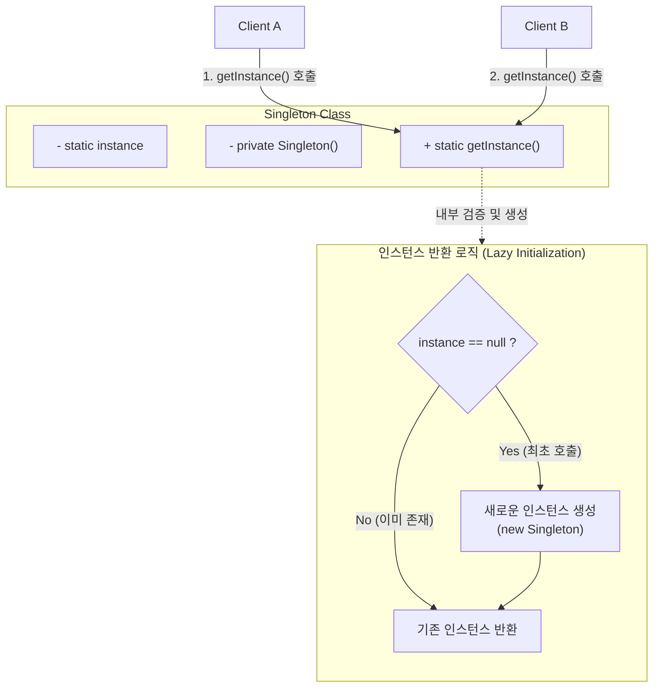

# 싱글턴 패턴 (Singleton Pattern)

---

## I. 자원의 효율적 사용 및 전역 상태 관리를 위한, 싱글턴 패턴의 개요

* **정의**: 애플리케이션 전체에서 특정 클래스의 인스턴스가 오직 하나만 생성되도록 보장하고, 이에 대한 전역적인 접근점(Global Access Point)을 제공하는 생성 주기(Creational) [[디자인 패턴]]
* **필요성 및 특징**:
* **메모리 낭비 방지**: 객체 생성 비용이 큰 자원(DB 커넥션 풀, 로거, 스레드 풀 등)의 중복 생성 방지
* **전역 상태 공유**: 애플리케이션 내의 여러 모듈이 동일한 객체 상태와 데이터를 일관되게 공유
* **동시성 제어 필요**: 멀티스레드 환경에서 인스턴스가 여러 개 생성되지 않도록 Thread-Safe한 구현 필수

---

## II. 싱글턴 패턴의 개념도 및 핵심 구성 요소

### 가. 싱글턴 패턴의 동작 개념도

* 외부에서 `new` 키워드로 인스턴스를 생성할 수 없도록 생성자를 `private`으로 캡슐화함
* `getInstance()` 정적 메서드를 통해서만 접근 가능하며, 최초 호출 시에만 객체를 생성하여 반환함

### 나. 싱글턴 패턴의 핵심 구현 기법 및 구성 요소

| 분류 | 요소 기술 (키워드) | 세부 설명 |
| --- | --- | --- |
| **구조 요소** | **Private 생성자** | 외부 클래스에서의 무분별한 객체 인스턴스화(new)를 원천 차단 |
| **구조 요소** | **Static 변수 / 메서드** | 유일한 객체 상태를 저장(변수)하고, 전역적으로 접근 가능한 인터페이스(메서드) 제공 |
| **생성 시점** | **Eager Initialization** | [[클래스]] 로드 시점에 인스턴스를 즉시 생성하는 방식 (자원 낭비 가능성 존재) |
| **생성 시점** | **Lazy Initialization** | 객체가 실제 필요한 시점(`getInstance()` 호출)에 인스턴스를 생성하여 메모리 최적화 |
| **동시성 제어** | **Synchronized 메서드** | `getInstance()` 메서드에 동기화 락을 걸어 멀티스레드 환경의 안전성 보장 (성능 저하) |
| **동시성 제어** | **Double-Checked [[Locking]]** | 인스턴스가 생성되지 않은 경우에만 동기화 블록을 실행하여([[DCL]]) 락 오버헤드 최소화 |
| **권장 기법** | **LazyHolder (Bill Pugh)** | JVM의 정적 내부 클래스(Static Inner Class) 로딩 메커니즘을 활용한 완벽한 Thread-Safe 구현 |
| **권장 기법** | **Enum [[Singleton (전역 인스턴스)|Singleton]]** | `enum`을 활용하여 자바의 리플렉션(Reflection) 및 직렬화/역직렬화 공격을 원천 방어 (Effective Java 권장) |

---

## III. 전통적 싱글턴 패턴의 문제점 및 현대적 대안 (DI 컨테이너)

### 가. 전통적 싱글턴 패턴의 한계 및 안티패턴(Anti-Pattern) 요소

* **객체 지향 원칙(SOLID) 위배**: `getInstance()` 정적 메서드 호출로 인해 구체 클래스에 의존하게 되어 DIP(의존성 역전 원칙) 및 OCP(개방-폐쇄 원칙) 위배
* **[[단위 테스트]]([[TDD]])의 어려움**: 전역 상태를 공유하므로 매 테스트마다 상태 초기화가 필요하며, Mock 객체(가짜 객체)로 대체하기 어려움

### 나. 현대적 해결 방안 (Spring 프레임워크의 빈 관리)

| 비교 항목 | 전통적 Singleton 패턴 (GoF) | Spring DI [[컨테이너]] (IoC) 기반 Singleton |
| --- | --- | --- |
| **생성 주체** | 클래스 내부 로직 (`getInstance()`) | **Spring IoC 컨테이너** (ApplicationContext) |
| **구현 방식** | `private` 생성자, `static` 메서드 강제 | 일반적인 POJO 클래스로 작성 (구조 제약 없음) |
| **라이프사이클** | JVM의 클래스 로더(Class Loader)에 종속 | 스프린 컨테이너의 생명주기(Bean Lifecycle)에 종속 |
| **테스트 용이성** | 테스트 객체(Mock) 주입이 어려움 ([[결합도]] 높음) | **인터페이스 기반 의존성 주입(DI)**으로 테스트 용이 |

* 현대의 엔터프라이즈 환경에서는 개발자가 직접 싱글턴을 구현하기보다, **Spring과 같은 [[프레임워크]](DI 컨테이너)에 객체(Bean)의 생명주기를 위임**하여 구조적 한계와 결합도 문제를 해결함

---

### 🔗 연관 토픽

- **소속 도메인**: [[00_소프트웨어공학_MOC|🏗️ 소프트웨어공학]]
- **세부 분류**: `4. 아키텍처 스타일 & 객체지향 설계 원리`
- **핵심 연관 토픽**:
  - [[프레임워크]]
  - [[Singleton (전역 인스턴스)]]
  - [[디자인 패턴|디자인 패턴 (Design Pattern)]]
  - [[결합도]]
  - [[단위 테스트]]
