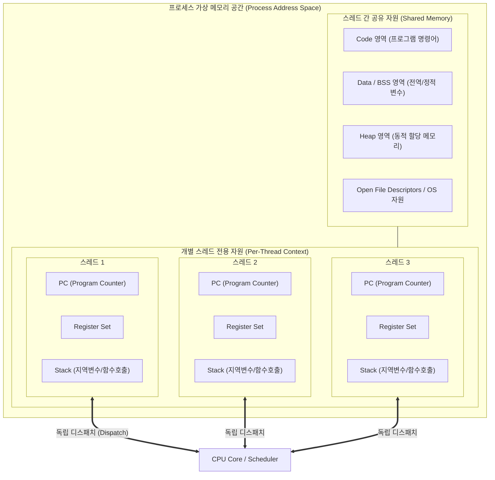

# 스레드 (Thread)

---

## I. 경량화된 프로세스 실행 단위, 스레드의 개요

* **정의**: [[프로세스]](Process) 내에서 자원을 공유하며 독립적으로 실행되는 작업의 흐름 단위이자, [[OS(운영체제)|운영체제]] [[CPU]] 스케줄러가 CPU 시간을 할당하는 최소 단위(LWP, Light-Weight Process)
* **필요성 및 특징**:
* **자원 활용 및 [[문맥 교환]](Context Switching) 비용 최소화**: 프로세스 생성/전환 대비 메모리 오버헤드와 캐시 미스(Cache Miss) 대폭 감소
* **멀티코어 병렬성(Parallelism) 극대화**: 다중 코어 하드웨어 환경에서 단일 애플리케이션의 동시 처리 능력 향상
* **응답성(Responsiveness) 유지**: 긴 I/O 작업 중에도 다른 스레드가 실행 상태를 유지하여 사용자 인터랙션 지속

---

## II. 스레드의 메모리 구조 및 핵심 기술 요소

### 가. 스레드의 프로세스 자원 공유 아키텍처 및 동작 원리

* 동일 프로세스 내 스레드들은 Code, Data, Heap, OS 파일 핸들을 공유하여 통신 비용(IPC 불필요)을 절감함
* 각 스레드는 독립적인 함수 호출 및 명령어 수행을 위해 고유한 스택([[Stack]]) 메모리, 프로그램 카운터(PC), 레지스터 세트만 분리 보유함

### 나. 스레드의 핵심 기술 및 구성 요소

| 구분 | 요소 기술 (키워드) | 세부 설명 |
| --- | --- | --- |
| **독립 자원** | **PC (Program Counter)** | 스레드가 다음에 실행할 독립적인 명령어의 메모리 주소를 저장하는 레지스터 |
| **독립 자원** | **스택 (Stack Area)** | 각 스레드의 함수 호출 이력, 반환 주소, 지역 변수를 격리 저장하는 전용 메모리 공간 |
| **자원 공유** | **힙/데이터 공유** | 동적 생성 객체 및 전역 변수를 공유하되, 경쟁 상태(Race Condition) 제어 필요 |
| **스레드 격리** | **TLS (Thread Local Storage)** | 전역 변수 형태이나 각 스레드마다 독립적인 메모리 복사본을 할당하는 스레드 로컬 영역 |
| **동기화 기법** | **Mutex / Semaphore** | 공유 메모리 동시 접근에 따른 임계 구역(Critical Section) 보호 및 상호 배제 기술 |
| **스레드 모델** | **[[커널]] 레벨 스레드 (1:1)** | OS 커널이 스레드를 직접 인식하고 관리하며 멀티프로세싱 지원 (POSIX pthread, Java Thread) |
| **스레드 모델** | **유저 레벨 스레드 (N:1)** | 사용자 라이브러리에서 스케줄링하여 전환 속도가 빠르나, 1개 스레드 블로킹 시 전체 블로킹 |
| **경량화 모델** | **가상 스레드 (M:N)** | 수백만 개의 유저 모드 경량 스레드를 소수의 커널 스레드에 동적 매핑 (Java 21+ Project Loom) |

---

## III. 프로세스 vs 스레드 비교 및 최신 기술 동향

### 가. 프로세스(Process)와 스레드(Thread) 비교

| 비교 항목 | 프로세스 (Process) | 스레드 (Thread) |
| --- | --- | --- |
| **기본 개념** | 운영체제로부터 자원을 할당받는 작업의 단위 | 할당받은 자원을 바탕으로 실행되는 흐름의 단위 |
| **메모리 공유** | 독립된 가상 주소 공간 할당 (공유 불가) | 프로세스의 Code, Data, Heap 영역을 상호 공유 |
| **통신 메커니즘** | 고비용의 IPC (파이프, 소켓, 공유메모리) 필요 | 프로세스 내부 힙 메모리를 통한 직접 공유 (저비용) |
| **문맥 교환 비용** | **높음** ([[MMU(Memory Management Unit)|MMU]] 페이지 테이블, TLB 플러시 수반) | **낮음** (스택 및 레지스터만 교체, 캐시 유지) |
| **장애 격리성** | 한 프로세스의 장애가 타 프로세스에 미영향 | 한 스레드의 비정상 종료(메모리 오염)가 프로세스 전체 마비 |
| **생성 오버헤드** | 무거움 (`fork()` 시스템 콜, 전체 구조체 복제) | 가벼움 (`clone()` 시스템 콜, 스택 공간만 초기화) |

### 나. 스레드 관련 최신 트렌드 및 향후 전망

* **유저 스페이스 경량 가상 스레드(Virtual Thread) 표준화**:
* 기존 1:1 커널 스레드 매핑 방식의 메모리 소모(스택당 1MB 내외) 및 I/O 블로킹 한계를 극복
* Java 21+ Virtual Threads, Go의 Goroutine, Rust의 Tokio와 같이 수 킬로바이트(KB) 수준의 런타임 [[스케줄러]] 기반 **M:N 코루틴 모델**이 백엔드 고동시성(High-Concurrency) 처리의 주류로 확립
* **하드웨어 SMT(Simultaneous Multithreading) 최적화**:
* Intel Hyper-Threading, AMD SMT 등 물리 코어당 2개 이상의 아키텍처 상태를 유지하는 하드웨어 스레드 기술과 OS 스케줄러 간 토폴로지 인지(Topology-Aware) [[스케줄링]] 심화
* **컴파일 타임 동시성 안전성(Memory Safety) 확보**:
* 동기화 실패로 인한 [[교착상태]](Deadlock) 및 데이터 레이스 문제를 런타임 락(Lock)에만 의존하지 않고, Rust의 소유권(Ownership) 및 빌림(Borrowing) 모델처럼 컴파일 시점에 검증하는 언어 레벨의 패러다임 확산

---

### 🔗 연관 토픽

- **소속 도메인**: [[00_운영체제_MOC|⚙️ 운영체제]]
- **세부 분류**: `1. 프로세스 & 스레드 관리`
- **핵심 연관 토픽**:
  - [[프로세스]]
  - [[커널|커널(Kernel)]]
  - [[OS(운영체제)]]
  - [[스케줄링]]
  - [[문맥 교환|문맥 교환 (Context Switching)]]
