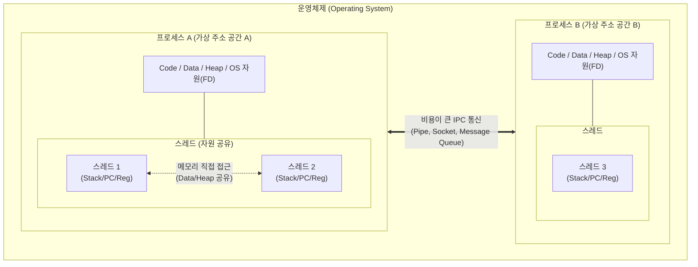

# 프로세스(Process)와 쓰레드(Thread) 비교

---

## I. 멀티태스킹과 병렬 처리의 핵심, 프로세스와 스레드의 개요

* **정의**:
* **[[프로세스]](Process)**: 디스크에 저장된 프로그램이 메모리에 적재되어 운영체제로부터 고유한 가상 주소 공간과 자원을 할당받아 실행 중인 작업의 단위
* **스레드(Thread)**: 프로세스 내에서 할당된 자원을 공유하며 실행되는 제어 및 명령어 처리의 최소 단위(Light-Weight Process)

* **필요성 및 특징**:
* **자원 활용 및 [[문맥 교환]] 비용**: 프로세스 전환 시 발생하는 오버헤드(TLB Flush 등)를 스레드 단위 스케줄링으로 최소화
* **동시성 및 병렬성 극대화**: 멀티코어 환경에서 다중 프로세스(안정성)와 다중 스레드(효율성) 아키텍처의 전략적 선택 요구

---

## II. 프로세스와 스레드의 메모리 아키텍처 및 핵심 구성 요소

### 가. 프로세스 간 격리와 스레드 간 자원 공유 동작 개념도

* **프로세스 간 격리**: 각 프로세스는 독립된 메모리 공간을 가지며 서로 접근할 수 없으므로, 통신을 위해 고비용의 IPC 메커니즘 필수
* **스레드 간 공유**: 동일 프로세스 내의 스레드들은 Code, Data, Heap 영역을 공유하여 통신 오버헤드가 없으나 동기화(Synchronization) 제어 필수

### 나. 프로세스와 스레드의 핵심 기술 및 구성 요소

| 구분 | 프로세스 (Process) | 스레드 (Thread) |
| --- | --- | --- |
| **제어 블록** | **PCB ([[PCB(Process Control Block)|Process Control Block]])** | **TCB (Thread Control Block)** |
| **자원 할당** | 독립된 [[가상 메모리]] 공간 (Code, Data, Heap, [[Stack]]) 할당 | 프로세스의 Code, Data, Heap 공유, 자신만의 Stack 할당 |
| **레지스터/PC** | 프로세스 상태 전이를 위한 레지스터 및 PC 보유 | 개별 명령어 실행 흐름 유지를 위한 고유 레지스터 및 PC 보유 |
| **문맥 교환** | **높은 오버헤드** (캐시 미스, TLB 무효화 발생) | **낮은 오버헤드** (캐시 유지, 상태 레지스터만 교환) |
| **통신 방식** | **IPC (Inter-Process Communication)** | **Shared Memory (공유 메모리)** 직접 접근 |
| **동기화 기법** | [[세마포어|세마포어(Semaphore)]], 공유 메모리 락 | 뮤텍스(Mutex), 세마포어, 모니터(Monitor) |
| **장애 영향도** | 한 프로세스의 장애(Crash)는 다른 프로세스에 무관함 | 한 스레드의 메모리 참조 오류 시 프로세스 전체 강제 종료 |
| **생성 함수** | `fork()`, `exec()` 등 시스템 콜 | `pthread_create()`, `clone()` 등 경량 복제 방식 |

---

## III. 멀티 프로세스와 멀티 스레드 비교 및 최신 동향

### 가. 아키텍처 선택 기준: 멀티 프로세스 vs 멀티 스레드

| 비교 항목 | 멀티 프로세스 (Multi-Process) | 멀티 스레드 (Multi-Thread) |
| --- | --- | --- |
| **주요 장점** | **독립성 및 안정성 우수** (하나가 죽어도 시스템 유지) | **자원 효율성 및 응답성 우수** (빠른 컨텍스트 스위칭) |
| **주요 단점** | 많은 메모리 공간 차지, 복잡한 통신(IPC) 비용 발생 | 동기화 오류로 인한 **[[교착상태]](Deadlock)** 및 데이터 오염 위험 |
| **웹 서버 예시** | Apache (Prefork 방식: 클라이언트당 프로세스 생성) | Nginx / Apache (Worker 방식: 클라이언트당 스레드 할당) |
| **적합한 환경** | Chrome 탭 분리, 크래시가 치명적인 독립 보안 워크로드 | 대규모 I/O 처리, 실시간 병렬 데이터 연산 환경 |

### 나. 런타임 환경의 진화 및 최신 스레드 기술 동향

* **경량 가상 스레드(Virtual Thread)의 부상**: 멀티 스레드의 스택 메모리 점유 문제와 I/O 블로킹 한계를 극복하기 위해, OS [[커널]] 스레드(1개)에 수천 개의 유저 레벨 스레드를 매핑하는 가상 스레드(Java 21 Project Loom) 및 코루틴(Goroutine) 기술이 백엔드 아키텍처의 주류로 안착
* **비동기 I/O (Asynchronous I/O) 결합**: 멀티 스레드의 동기화 제어 복잡성을 회피하기 위해, Event Loop 기반의 싱글 스레드와 Non-blocking I/O(Node.js, Netty)를 결합하여 대규모 동시성(High-Concurrency)을 처리하는 패턴이 확산
* **안전한 동시성 제어 언어 확산**: 멀티 스레드 환경의 고질적인 데이터 레이스(Data Race) 문제를 컴파일 타임에 차단하기 위해, 소유권(Ownership) 모델을 채택한 Rust 언어가 시스템 커널 및 클라우드 인프라 개발에 적극 도입됨

---

### 🔗 연관 토픽

- **소속 도메인**: [[00_운영체제_MOC|⚙️ 운영체제]]
- **세부 분류**: `1. 프로세스 & 스레드 관리`
- **핵심 연관 토픽**:
  - [[프로세스]]
  - [[커널|커널(Kernel)]]
  - [[문맥 교환|문맥 교환 (Context Switching)]]
  - [[PCB(Process Control Block)]]
  - [[교착상태|교착상태 (Deadlock)]]
