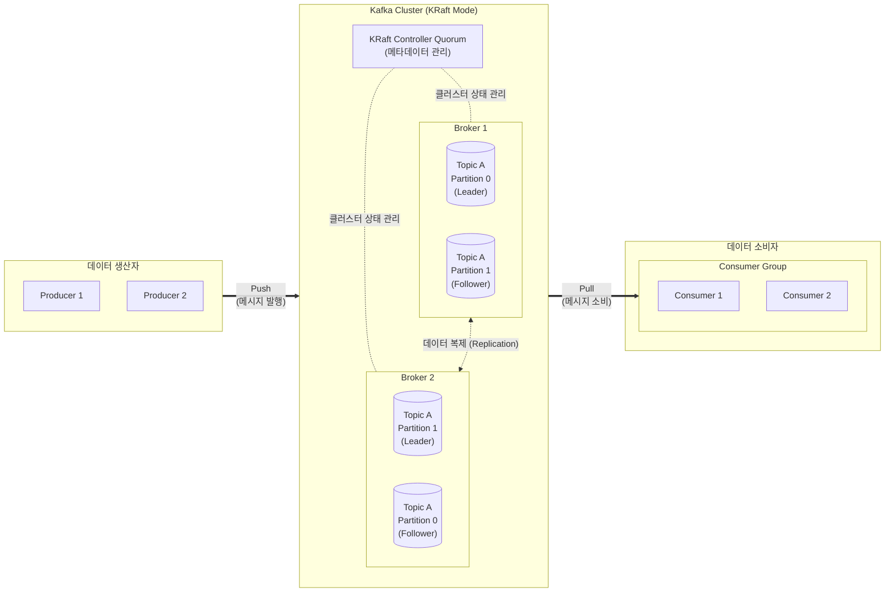

# 아파치 카프카 (Apache Kafka)

---

## I. 대규모 실시간 데이터 스트리밍 플랫폼, 아파치 카프카의 개요

* **정의**: 대용량의 실시간 데이터 스트림을 안정적으로 분산 처리하기 위해, 발행-구독(Publish-Subscribe) 모델을 기반으로 고성능, 고가용성을 제공하는 분산 메시징 플랫폼
* **필요성 및 등장배경**:
* **데이터 파이프라인 복잡성 해소**: N:N [[Point-to-Point]] 데이터 연동 아키텍처의 복잡도를 중앙 집중형 데이터 허브로 단순화
* **데이터 영속성(Durability) 요구**: 장애 발생 시 데이터 유실 방지 및 과거 데이터의 재처리(Replay) 기능 필요

* **주요 특징**: [[파티셔닝|파티션]] 분산을 통한 병렬 처리 극대화, 디스크 순차 기록(Sequential I/O), 제로 카피(Zero-Copy) 네트워크 전송

---

## II. 아파치 카프카의 아키텍처 및 핵심 구성요소

### 가. 아파치 카프카의 데이터 파이프라인 아키텍처

* 프로듀서는 토픽(Topic)으로 메시지를 Push하며, 컨슈머 그룹은 각 파티션(Partition)에 매핑되어 메시지를 Pull 방식으로 처리함
* 단일 장애점(SPOF) 방지를 위해 파티션 리더/팔로워 간 실시간 복제(Replication)를 수행하여 [[HA(High Availability)|고가용성]] 보장

### 나. 아파치 카프카의 핵심 구성요소 및 요소 기술

| 분류 | 요소 기술 (키워드) | 세부 설명 |
| --- | --- | --- |
| **논리적 구조** | **토픽 (Topic)** | 메시지가 저장되고 분류되는 논리적인 카테고리 이름 (RDBMS의 테이블과 유사) |
| **물리적 분산** | **파티션 (Partition)** | 하나의 토픽을 여러 개로 분할한 물리적 단위로, 병렬 처리와 확장성(Scale-out)의 핵심 요소 |
| **데이터 추적** | **오프셋 (Offset)** | 각 파티션 내에서 메시지가 저장되는 고유한 순차 번호로, 컨슈머의 메시지 소비 위치를 식별 |
| **물리적 노드** | **브로커 (Broker)** | 카프카 클러스터를 구성하는 개별 서버 노드로, 메시지의 디스크 저장 및 트래픽 분산 수행 |
| **확장성/병렬성** | **컨슈머 그룹 (Consumer Group)** | 동일한 토픽을 소비하는 컨슈머들의 논리적 그룹 (파티션과 컨슈머는 1:N 매핑 불가, 분산 처리 보장) |
| **고성능 전송** | **제로 카피 (Zero-Copy)** | [[커널]] 공간(Read Buffer)에서 유저 공간을 거치지 않고 바로 NIC(네트워크 인터페이스)로 데이터를 전송 |
| **클러스터 관리** | **KRaft (Kafka Raft)** | 과거 ZooKeeper를 대체하여, Raft [[합의 알고리즘]] 기반으로 카프카 내부에서 직접 메타데이터를 관리하는 최신 합의 [[프로토콜]] |
| **데이터 [[신뢰성]]** | **ISR (In-Sync Replicas)** | 리더 파티션과 지속적으로 데이터 동기화를 유지하고 있는 팔로워 파티션들의 논리적 집합 |

---

## III. 카프카와 메시지 큐 비교 및 최신 기술 동향

### 가. Apache Kafka와 RabbitMQ (전통적 메시지 큐) 비교

| 비교 항목 | Apache Kafka | RabbitMQ |
| --- | --- | --- |
| **아키텍처 모델** | 분산형 **이벤트 스트리밍 / Pub-Sub** | 범용 **메시지 브로커 / AMQP** 표준 |
| **메시지 소비 방식** | **Pull 방식** (컨슈머가 자신의 처리 속도에 맞춰 가져감) | **Push 방식** (브로커가 컨슈머에게 메시지를 밀어냄) |
| **메시지 보존** | **디스크 영구 저장** (기간/용량 설정, Replay 가능) | 소비 확인(Ack) 후 **메모리에서 삭제** (Replay 불가) |
| **주요 활용 분야** | 실시간 로그 수집, 빅데이터 파이프라인, 이벤트 소싱 | 마이크로서비스 간 비동기 API 통신, 백그라운드 태스크 |

### 나. 아파치 카프카의 최신 기술 동향 및 전망

* **ZooKeeper 의존성 완전 제거 (KRaft 모드 전환)**: KIP-500을 통해 분산 메타데이터 관리를 외부(Zookeeper)에서 내부(KRaft)로 내재화하여, 수백만 개의 파티션 스케일 아웃 및 클러스터 메타데이터 처리 속도를 비약적으로 향상 (Kafka 3.x 기본 채택)
* **계층형 스토리지 (Tiered Storage) 도입**: 빠른 접근이 필요한 최신 데이터는 브로커의 로컬 디스크에 저장하고, 오래된 데이터는 AWS S3 등의 저렴한 클라우드 오브젝트 스토리지로 자동 계층화하여 무한한 데이터 보존과 스토리지 비용 최적화 동시 실현
* **KSQL 및 Kafka Streams 고도화**: 별도의 외부 연산 [[프레임워크]](Spark, Flink 등) 없이 카프카 내부에서 실시간 스트림 [[조인]], 필터링, 집계 연산을 수행하는 스트림 프로세싱 에코시스템으로 진화

---

### 🔗 연관 토픽

- **소속 도메인**: [[00_데이터베이스_MOC|🗄️ 데이터베이스]]
- **세부 분류**: `5. 분산 데이터베이스 & NoSQL & 대용량`
- **핵심 연관 토픽**:
  - [[파티셔닝|파티션]]
  - [[조인|조인(Join)]]
  - [[신뢰성]]
  - [[프로토콜]]
  - [[커널|커널(Kernel)]]
