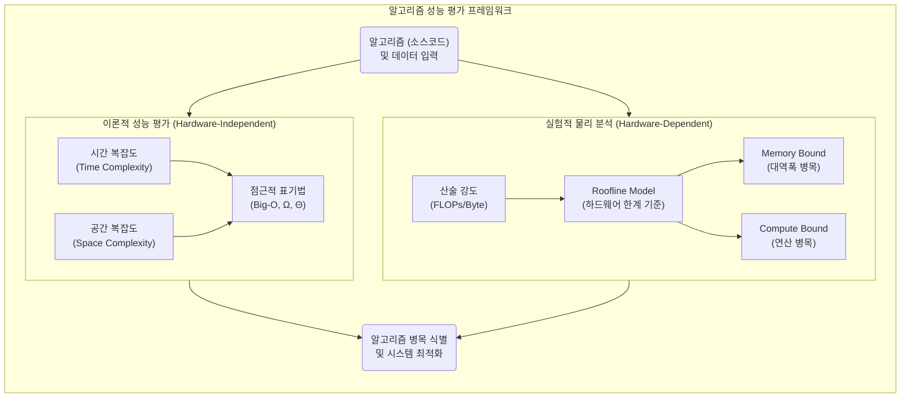

# 알고리즘 성능평가

---

## I. 컴퓨팅 자원의 효율성 확보를 위한, 알고리즘 성능평가의 개요

### 가. 알고리즘 성능평가의 정의

* 특정한 문제를 해결하는 알고리즘이 소모하는 연산 시간과 메모리 자원 등의 시스템 자원 활용 효율성을 정량적, 점근적으로 분석하는 기법
* 하드웨어 비종속적인 이론적 수학 분석과 최신 컴퓨팅 아키텍처 한계를 고려한 실험적 물리 분석을 포괄하는 평가 체계

### 나. 알고리즘 성능평가의 필요성 및 특징

* **필요성**: 대규모 데이터 처리, [[초거대 언어 모델|LLM]] 등 대형 AI 모델 연산, 제한된 자원([[EDGE|Edge]] AI) 환경에서 최적의 응답 속도 및 메모리 활용을 위한 [[알고리즘]] 선정 기준 제시
* **특징**: 하드웨어 독립적인 수학적 점근 분석(시간/공간 복잡도)과 하드웨어 종속적인 물리적 한계 분석(루프라인 모델) 병행

---

## II. 알고리즘 성능평가의 개념도 및 핵심 기술 요소

### 가. 알고리즘 성능평가의 개념도 및 동작 원리

* 기존의 시간/공간 복잡도 기반 독립적 수학적 점근 분석과 함께, 최신 하드웨어([[CPU]]/[[GPU]]/[[NPU]]) 아키텍처 특성을 반영한 루프라인(Roofline) 모델 기반 병목 식별 [[프로세스]] 수행

### 나. 알고리즘 성능평가의 핵심 기술 및 구성 요소

| 분류 | 요소기술(키워드) | 세부 설명 |
| --- | --- | --- |
| **이론적 평가** | 시간 복잡도 (Time Complexity) | - 입력 데이터 크기($n$) 증가에 따른 연산(비교, 대입, 이동 등) 수행 횟수 추이 분석 |
| **이론적 평가** | 공간 복잡도 (Space Complexity) | - 알고리즘 실행 시 요구되는 고정 메모리 공간 및 가변 메모리 공간(콜 스택, 동적 할당 등) 크기 분석 |
| **이론적 평가** | 점근적 표기법 (Big-O) | - 최악의 경우(Worst-case)를 상정하여 성능 상한선을 수학적 다항식으로 표기 ($O(1), O(n), O(n^2)$ 등) |
| **물리적 분석** | 루프라인 모델 (Roofline Model) | - 하드웨어의 연산 성능(Peak FLOPs)과 최대 메모리 대역폭(GB/s) 한계를 기준선으로 삼아 알고리즘 병목 구간을 시각적으로 식별 |
| **물리적 분석** | 산술 강도 (Arithmetic Intensity) | - 메모리 바이트당 수행되는 부동 소수점 연산 횟수(FLOPs/Byte)로, 알고리즘의 컴퓨팅 집중도 측정 지표 |
| **병목 식별** | 메모리 바운드 (Memory Bound) | - 산술 강도가 낮아, 프로세서의 연산 속도보다 메모리 대역폭 데이터 전송 한계에 의해 전체 알고리즘 성능이 지연되는 상태 |
| **병목 식별** | 컴퓨트 바운드 (Compute Bound) | - 산술 강도가 높아, 프로세서의 최대 연산 [[처리량]](Peak FLOPs) 한계에 도달하여 성능이 제약되는 상태 |
| **최적화 기법** | 공간 국소성 최적화 (Loop Tiling) | - 캐시(Cache) 계층의 활용도를 극대화하여 메모리 바운드 문제를 완화하고 산술 강도를 높이는 알고리즘 재구성 기법 |

---

## III. 알고리즘 성능평가의 비교 및 최신 동향

### 가. 이론적 성능 평가와 실험적 물리 분석의 상세 비교

| 비교 항목 | 이론적 성능 분석 (Theoretical) | 실험적 물리 분석 (Empirical / Roofline) |
| --- | --- | --- |
| **평가 기준** | 연산 수행 횟수(Steps) 및 필요 메모리 공간 | 초당 부동소수점 연산(FLOPs), 메모리 대역폭(GB/s) |
| **환경 종속성** | 하드웨어 독립적 (수학적 개념 모델) | 하드웨어 종속적 (CPU, GPU 아키텍처 특성 반영) |
| **주요 평가지표** | Big-O ($O(\log n), O(n), O(n\log n)$) | 산술 강도(AI), 처리량(Throughput), 지연 시간(Latency) |
| **최적화 목표** | 점근적 상한선(Worst-case) 증가율 최소화 | 캐시 히트율 제고 및 하드웨어 연산기 활용률(Utilization) 극대화 |
| **주요 활용 분야** | 알고리즘 설계 초기 단계의 논리적 타당성 검증 | 대규모 AI 모델 최적화, HPC 분산 컴퓨팅 환경의 병목 제거 |

* **최신 전망**: 최근 대규모 AI 모델 연산(Transformer 등)의 성능 최적화를 위해, 단순한 알고리즘 시간 복잡도($O(n)$) 개선을 넘어 FlashAttention, 모델 양자화(Quantization)와 같이 루프라인 모델 기반의 메모리 바운드(Memory Bound)를 직접적으로 해소하는 하드웨어-소프트웨어 공동 설계(Co-design) 기반의 최적화 기법이 핵심 알고리즘 기술로 대두됨.

---

### 🔗 연관 토픽

- **소속 도메인**: [[00_컴퓨터구조_MOC|💻 컴퓨터구조]]
- **세부 분류**: `2. 캐시 & 메모리 계층 구조 · 스토리지`
- **핵심 연관 토픽**:
  - [[GPU]]
  - [[초거대 언어 모델|초거대 언어 모델(Large Language Model)]]
  - [[CPU]]
  - [[NPU|NPU(Neural Processing Unit)]]
  - [[처리량]]
