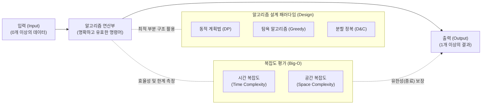

# 알고리즘 (Algorithm)

---

## I. 문제 해결의 명확한 논리적 절차와 자원 최적화의 핵심, 알고리즘의 개요

* **정의**: 주어진 문제를 해결하기 위해 컴퓨터가 수행해야 하는 명확하고 유한한 횟수의 명령어(연산)들의 절차적 집합
* **필요성 및 5대 성립 조건**:
* **컴퓨팅 [[자원 최적화]]**: 한정된 [[CPU]] 및 메모리 자원 내에서 최적의 시간(Time)과 공간(Space) 비용으로 해 도출
* **5대 조건**: 입력(Input, 0개 이상), 출력(Output, 1개 이상), 명확성(Definiteness), 유한성(Finiteness), 유효성(Effectiveness)

* **최신 트렌드**: 전통적인 결정론적(Deterministic) 알고리즘에서 벗어나, 양자 컴퓨팅 기반 알고리즘(Shor, Grover) 및 AI 기반 휴리스틱 탐색으로 패러다임 진화

---

## II. 알고리즘의 설계/평가 아키텍처 및 핵심 기술 요소

### 가. 알고리즘 동작 메커니즘 및 설계·평가 개념도

* 알고리즘은 0개 이상의 입력을 받아 명확한 연산을 거쳐 반드시 유한한 시간 내에 1개 이상의 출력을 내고 종료되어야 함
* 설계 시 문제의 특성(최적 부분 구조, 중복 부분 문제 등)에 따라 DP, 분할 정복 등을 적용하며, 점근적 표기법(Big-O)으로 성능을 평가함

### 나. 알고리즘의 핵심 설계 기법 및 구성 요소

| 구분 | 요소 기술 (키워드) | 세부 설명 |
| --- | --- | --- |
| **성능 평가** | **점근적 표기법 (Big-O)** | 데이터 크기(N) 증가에 따른 최악의 경우(Worst-case) 연산 횟수 증가율을 표기하여 알고리즘 효율성 비교 |
| **설계 기법** | **분할 정복 (Divide & Conquer)** | 하향식(Top-down)으로 문제를 분할하고, 각각 정복한 후 결과를 병합하는 기법 (예: [[병합 정렬]], [[퀵 정렬]]) |
| **설계 기법** | **동적 계획법 (DP)** | 겹치는 부분 문제(Overlapping Subproblems)의 해를 메모이제이션(Memoization)하여 중복 연산을 제거 |
| **설계 기법** | **[[그리디 알고리즘|탐욕 알고리즘]] (Greedy)** | 미래를 고려하지 않고 매 순간 국소적인 최적의 해(Local Optimum)를 선택하여 전역 최적해를 찾는 기법 |
| **설계 기법** | **백트래킹 (Backtracking)** | 상태 공간 트리를 DFS로 탐색하며, 유망하지 않은 노드(Non-promising)를 가지치기(Pruning)하여 효율성 극대화 |
| **탐색 기법** | **휴리스틱 (Heuristic)** | 완벽한 최적해를 구하기 어려운 NP-Hard 문제에서, 허용 가능한 시간 내에 실용적인 근사해를 도출 |
| **알고리즘 속성** | **최적 부분 구조** | 큰 문제의 최적해가 작은 부분 문제들의 최적해로 구성될 수 있는 특성 (DP와 Greedy 적용의 필수 조건) |
| **차세대 기술** | **양자 알고리즘 (Quantum)** | 양자 얽힘과 중첩을 활용하여 시간 복잡도를 지수적으로 감소시키는 차세대 알고리즘 (Shor의 소인수분해 등) |

---

## III. 주요 알고리즘 설계 패러다임 비교 및 향후 전망

### 가. 알고리즘 3대 핵심 설계 기법(분할 정복, 동적 계획법, 탐욕법) 비교

| 비교 항목 | 분할 정복 (Divide & Conquer) | [[동적 계획법|동적 계획법 (Dynamic Programming)]] | 탐욕 알고리즘 (Greedy) |
| --- | --- | --- | --- |
| **문제 분할 방식** | 하향식 분할 (Top-down) | 상향식(Bottom-up) 또는 하향식 | 문제 분할 없음 (순차적 접근) |
| **부분 문제 중복** | **중복 없음** (독립적 해결) | **중복 발생** (메모이제이션 재활용) | 해당 없음 |
| **최적해 보장 여부** | **보장됨** | **보장됨** (모든 경우의 수 탐색 효과) | **보장되지 않음** (근사해 도출 가능성) |
| **주요 적용 사례** | 병합 정렬(Merge), 퀵 정렬, 이진 탐색 | 피보나치 수열, 0-1 배낭(Knapsack) 문제 | 다익스트라([[다익스트라 알고리즘|Dijkstra]]) 최단 경로, 크루스칼 |

### 나. 알고리즘 분야의 향후 전망 및 기술 동향

* **[[인공지능]] 융합 메타휴리스틱(Meta-Heuristics) 발전**: [[유전 알고리즘]](GA), 모방 학습 등 딥러닝과 강화학습을 결합하여, 기존 다항 시간(Polynomial Time) 내 풀기 힘든 물류 최적화 및 신약 탐색 문제의 근사해 도출 가속화
* **양자 우위(Quantum Supremacy) 달성**: 기존 고전 컴퓨터의 O($N^2$) 연산을 O($\sqrt{N}$)으로 줄이는 그로버(Grover) 검색 알고리즘 등 양자 알고리즘의 실용화가 임박함에 따라, 암호 체계 무력화 대응(PQC, [[양자내성암호]]) 연구 본격화
* **알고리즘 공정성 및 [[XAI]] (Explainable AI) 요구 강화**: [[딥러닝]] 알고리즘의 블랙박스 특성으로 인한 [[편향]](Bias) 현상을 완화하고, 알고리즘 감사(Auditing) 및 투명성을 법제화(EU AI Act 등)하는 기술적/제도적 대응 확대

---

### 🔗 연관 토픽

- **소속 도메인**: [[00_컴퓨터구조_MOC|💻 컴퓨터구조]]
- **세부 분류**: `1. CPU 프로세서 & 마이크로아키텍처`
- **핵심 연관 토픽**:
  - [[동적 계획법|동적 계획법 (Dynamic Programming)]]
  - [[그리디 알고리즘|그리디 (탐욕) 알고리즘]]
  - [[XAI]]
  - [[다익스트라 알고리즘|다익스트라 (Dijkstra) 알고리즘]]
  - [[딥러닝]]
