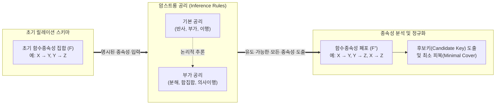

# 암스트롱 공리 (Armstrong's Axioms)

---

## I. 관계형 DB 정규화의 수학적 기반, 암스트롱 공리의 개요

* **정의**: 관계형 데이터베이스에서 주어진 함수종속성(FD: Functional Dependency) 집합으로부터 논리적으로 유도 가능한 모든 함수종속성을 추론해 내기 위한 연역적 규칙(규범)
* **필요성 및 등장배경**:
* **정규화(Normalization) 수행 기준**: 데이터 중복과 이상현상([[Anomaly(이상현상)|Anomaly]])을 제거하기 위한 릴레이션 무손실 분해 및 키(Key) 식별 알고리즘의 수학적 증명 필요
* **최소 피복(Minimal Cover) 도출**: 중복되거나 불필요한 종속성을 제거하여 [[데이터베이스]] [[스키마]] 설계의 최적화 달성

* **핵심 특징**: 도출된 종속성이 모두 참임을 보장하는 건전성(Soundness)과, 존재하는 모든 참인 종속성을 찾을 수 있는 완전성(Completeness)을 가짐

---

## II. 암스트롱 공리의 메커니즘 및 핵심 추론 규칙

### 가. 암스트롱 공리를 활용한 함수종속성 폐포(Closure) 도출 개념도

* 명시적으로 주어진 초기 함수종속성 집합($F$)에 암스트롱의 공리를 반복 적용하여, 논리적으로 내포된 모든 함수종속성의 집합인 폐포($F^+$)를 도출함
* 도출된 폐포($F^+$)를 기반으로 속성의 종속 여부를 파악하고, 후보키를 식별하여 3NF, [[BCNF]] 등의 정규화 작업을 수행함

### 나. 암스트롱 공리의 핵심 추론 규칙 (6대 공리 및 2대 특성)

| 구분 | 요소 기술 (키워드) | 세부 설명 (X, Y, Z, W는 릴레이션의 속성 집합) |
| --- | --- | --- |
| **기본 공리** | **반사의 원칙 (Reflexivity)** | 부분집합은 전체집합에 종속됨. $Y \subseteq X$ 이면 $X \rightarrow Y$ 이다. (자명한 함수종속성) |
| **기본 공리** | **부가의 원칙 (Augmentation)** | 종속성에 같은 속성을 더해도 유지됨. $X \rightarrow Y$ 이면 $XZ \rightarrow YZ$ 이다. |
| **기본 공리** | **이행의 원칙 (Transitivity)** | 논리적 꼬리물기가 성립함. $X \rightarrow Y$ 이고 $Y \rightarrow Z$ 이면 $X \rightarrow Z$ 이다. |
| **부가 공리** | **분해의 원칙 (Decomposition)** | 우변의 속성 집합은 분할될 수 있음. $X \rightarrow YZ$ 이면 $X \rightarrow Y$ 이고 $X \rightarrow Z$ 이다. |
| **부가 공리** | **합집합의 원칙 (Union)** | 동일한 결정자에 대한 종속성은 병합됨. $X \rightarrow Y$ 이고 $X \rightarrow Z$ 이면 $X \rightarrow YZ$ 이다. |
| **부가 공리** | **의사이행의 원칙 (Pseudo-transitivity)** | 이행과 부가 원칙의 결합. $X \rightarrow Y$ 이고 $WY \rightarrow Z$ 이면 $WX \rightarrow Z$ 이다. |
| **핵심 특성** | **건전성 (Soundness)** | 암스트롱 공리를 통해 도출된 새로운 함수종속성은 본래의 릴레이션에서 반드시 유효(참)함 |
| **핵심 특성** | **완전성 (Completeness)** | 본래의 릴레이션에 존재하는 모든 유효한 함수종속성은 암스트롱 공리를 통해 반드시 도출 가능함 |

---

## III. 암스트롱 공리의 데이터베이스 설계 실무 활용 방안

### 가. 관계형 데이터베이스 설계 및 최적화 과정에서의 활용

| 활용 영역 | 수행 목적 및 적용 방식 | 설계 품질 향상 효과 |
| --- | --- | --- |
| **속성 폐포(Closure) 연산** | 특정 속성 집합 $X$에 암스트롱 공리를 적용하여 $X^+$ 도출 | $X$가 결정할 수 있는 모든 속성을 파악하여 스키마 구조의 [[무결성]] 검증 |
| **후보키 (Candidate Key) 식별** | 속성 폐포($X^+$) 연산 결과가 릴레이션의 모든 속성($R$)을 포함하는지 검사 | 유일성과 최소성을 만족하는 슈퍼키/후보키를 수학적 알고리즘으로 자동 추출 |
| **최소 피복 (Minimal Cover)** | 분해/이행 공리를 역이용하여 중복되거나 자명한 종속성을 모두 제거한 $F_{min}$ 집합 도출 | 갱신 이상(Update Anomaly)을 방지하고 [[조인|조인(Join)]] 비용을 최소화하는 최적 스키마 구성 |
| **종속성 보존형 분해** | 정규화를 위해 릴레이션을 분해할 때, $F^+$가 분해된 릴레이션들 사이에서도 그대로 유지되는지 검증 | 무손실 조인(Lossless Join) 보장 및 3NF/BCNF 정규화 수행의 타당성 확보 |

* **동향 및 전망**: 현대의 [[NoSQL (CAP 이론 BASE 속성)|NoSQL]] 및 [[분산 데이터베이스]] 환경에서는 스키마리스(Schemaless)와 데이터 중복(Denormalization)을 허용하는 추세이나, 데이터 정합성(Consistency)이 극도로 중요한 금융/코어 시스템의 RDBMS 설계 [[프로세스]] 및 메타데이터 자동화 도구(CASE Tool) 내부 엔진에서는 암스트롱 공리가 여전히 핵심 검증 알고리즘으로 작동하고 있음.

---

### 🔗 연관 토픽

- **소속 도메인**: [[00_데이터베이스_MOC|🗄️ 데이터베이스]]
- **세부 분류**: `1. 데이터 모델링 & 관계형 DB 설계`
- **핵심 연관 토픽**:
  - [[데이터베이스]]
  - [[스키마]]
  - [[Anomaly(이상현상)]]
  - [[조인|조인(Join)]]
  - [[BCNF|BCNF (Boyce-Codd Normal Form 3.5NF)]]
