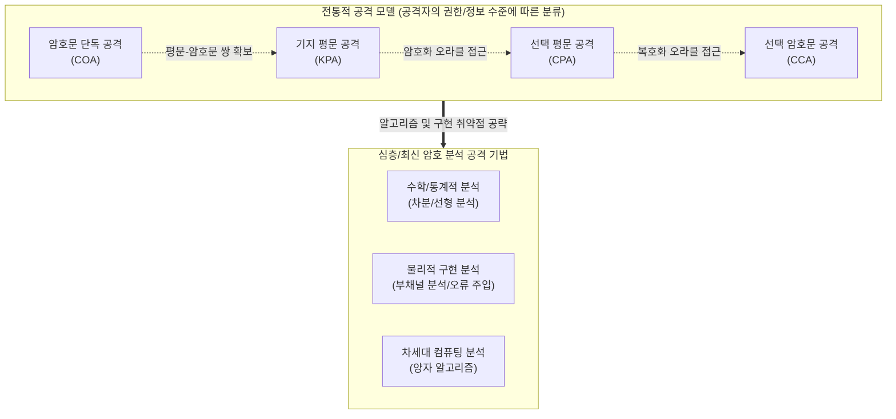

# 암호 분석 공격 (Cryptanalysis Attacks)

---

## I. 안전한 암호 체계 설계를 위한 위협 식별, 암호 분석 공격의 개요

* **정의**: 암호 알고리즘의 수학적 취약점이나 시스템의 물리적 구현 특성을 분석하여, 비밀키(Key)를 알아내거나 암호문으로부터 평문(Plaintext)을 해독해 내는 일련의 공격 기법
* **배경 및 특징**:
* **케르크호프스의 원리(Kerckhoffs's Principle)**: "암호 시스템의 안전성은 알고리즘의 비밀성이 아닌 키의 비밀성에 의존해야 함"을 전제로 알고리즘이 공개된 상태에서 공격 수행
* **패러다임 진화**: 과거 통계적/수학적 기법(차분/선형 분석)에서 최근 H/W 물리적 특성을 노리는 [[부채널 공격]] 및 양자 컴퓨팅 기반 공격으로 위협 고도화

---

## II. 암호 분석 공격의 아키텍처 및 핵심 기법

### 가. 암호 분석 공격 모델 및 발전 개념도

* 공격자의 능력(확보한 정보 및 오라클 접근 권한)이 커질수록 COA에서 CCA 모델로 진화함 (CCA 환경에서도 안전해야 현대 암호로 인정됨)
* 정보 탈취 후 이를 기반으로 수학적, 물리적, 양자역학적 심층 분석을 통해 최종적인 마스터키를 탈취함

### 나. 암호 분석 공격의 핵심 기술 및 세부 기법

| 분류 | 핵심 기법 (키워드) | 세부 설명 |
| --- | --- | --- |
| **기본 공격 모델** | **COA (암호문 단독 공격)** | 단지 암호문(Ciphertext)만 주어진 상태에서 언어의 통계적 특성이나 빈도수를 분석하여 해독 시도 |
| **기본 공격 모델** | **KPA (기지 평문 공격)** | 공격자가 일정량의 평문(Plaintext)과 그에 대응하는 암호문 쌍을 알고 있는 상태에서 키를 추론 |
| **기본 공격 모델** | **CPA (선택 평문 공격)** | 공격자가 임의의 평문을 선택하여 [[암호화]] 시스템(Oracle)에 입력하고 생성된 암호문을 얻어 분석 |
| **기본 공격 모델** | **CCA (선택 암호문 공격)** | 가장 강력한 형태로, 임의의 암호문을 선택하여 복호화된 평문을 얻어낼 수 있는 환경에서의 공격 |
| **수학적 분석** | **차분 암호 분석 (Differential)** | 두 평문의 차이(XOR)가 암호문에 미치는 영향을 확률적으로 추적하여 블록 암호의 키를 찾는 기법 |
| **수학적 분석** | **선형 암호 분석 (Linear)** | 평문, 암호문, 키 비트 간의 선형 관계식을 근사화하여 확률이 가장 높은 비밀키 비트를 도출하는 기법 |
| **물리적 분석** | **부채널 공격 (Side-Channel)** | 암호 연산 중 발생하는 물리적 누출 정보(전력 소모량, 연산 시간, 전자파 방사 등)를 수집하여 키를 복원 |
| **차세대 위협** | **[[양자 암호]] 분석 (Quantum)** | 쇼어(Shor) [[알고리즘]](인수분해 파훼) 및 그로버(Grover) 알고리즘(대칭키 전수조사 가속)을 활용한 해독 |

---

## III. 최신 암호 분석 공격 동향 및 방어 체계(향후 전망)

### 가. 최신 공격 트렌드 및 방어 대책

| 위협 동향 (공격) | 최신 방어 대책 (방어) | 기대 효과 및 동향 |
| --- | --- | --- |
| **양자 컴퓨팅 위협 현실화** ([[RSA (Rivest Shamir Adleman)|RSA]], [[ECC]] 붕괴) | **[[양자내성암호]] (PQC) 전환** | 격자(Lattice), 해시(Hash) 기반 등 양자 알고리즘에도 안전한 수학적 난제로 암호 체계 전면 교체 (NIST 표준화) |
| **[[딥러닝]] 기반 부채널 분석(DL-SCA)** 등장 | **마스킹(Masking) 및 하이딩(Hiding)** | 연산 시 난수(Random Value)를 섞어 전력 소비 패턴을 평탄화하거나 무작위로 변경하여 딥러닝 패턴 인식 무력화 |
| **구현 취약점(오류 주입) 고도화** | **화이트박스 암호 (WBC) 적용** | 키를 소프트웨어 코드와 데이터에 섞어(Obfuscation), 실행 환경이 공격자에게 완전히 장악된 상태에서도 키 유출 방지 |

### 나. 산업 적용 방향 및 전망

* **Crypto-Agility(암호 민첩성) 확보 필수**: 신종 암호 분석 공격이 등장하더라도 시스템 전체를 중단하지 않고 신규 암호 알고리즘으로 유연하게 교체할 수 있는 플러그인(Plug-in) 형태의 암호 아키텍처 설계가 요구됨
* **데이터 활용 모델 변화**: 원본 데이터 복호화 시 발생할 수 있는 노출 위협을 원천 차단하기 위해, 암호화된 상태 그대로 연산이 가능한 **동형암호([[동형 암호|Homomorphic Encryption]])** 체계에 대한 연구 및 상용화가 가속화되고 있음

---

### 🔗 연관 토픽

- **소속 도메인**: [[00_보안_MOC|🛡️ 보안]]
- **세부 분류**: `2. 현대 암호학 & 키 관리 · 전자서명`
- **핵심 연관 토픽**:
  - [[RSA (Rivest Shamir Adleman)]]
  - [[ECC|ECC(Elliptic Curve Cryptography)]]
  - [[양자내성암호]]
  - [[동형 암호|동형 암호 (Homomorphic Encryption)]]
  - [[부채널 공격|부채널 공격(Side Channel Attack)]]
