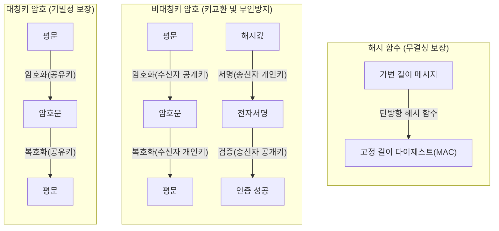

# 암호 알고리즘 (Cryptographic Algorithms)

---

## I. 안전한 디지털 환경의 핵심 기반, 암호 알고리즘의 개요

* **정의**: [[기밀성]], [[무결성]], 인증, 부인방지를 보장하기 위해 수학적 연산을 통해 평문(Plaintext)을 인가받지 않은 자가 해독할 수 없는 암호문(Ciphertext)으로 변환하고 역변환하는 논리적 체계
* **필요성 및 주요 특징**:
* **정보보안 3요소(CIA) 충족**: 암호화를 통한 기밀성 확보, 해시를 통한 무결성 검증, 전자서명을 통한 부인방지 구현
* **컴퓨팅 패러다임 변화 대응**: 양자 컴퓨터의 쇼어(Shor), 그로버(Grover) [[알고리즘]] 등장에 따른 기존 수학적 난제(소인수분해, 이산대수) 기반 암호 체계의 붕괴 위협에 대응 필요

---

## II. 암호 알고리즘의 분류별 개념도 및 핵심 구성 요소

### 가. 3대 핵심 암호 알고리즘 메커니즘 개념도

* 대칭키는 기밀성(고속 [[암호화]]), 비대칭키는 키 교환 및 전자서명(부인방지), 해시는 데이터 무결성 검증을 위해 상호 보완적으로 사용(하이브리드 암호 체계)됨

### 나. 암호 알고리즘의 주요 분류 및 핵심 요소 기술

| 분류 | 요소기술(키워드) | 세부 설명 |
| --- | --- | --- |
| **대칭키 (블록)** | **[[AES]], ARIA, SEED** | 평문을 고정된 블록 단위(예: 128bit)로 나누어 SPN 또는 Feistel 구조로 암호화 (대용량 데이터 처리에 적합) |
| **대칭키 (스트림)** | **ChaCha20, RC4** | LFSR 등을 이용해 생성된 의사난수열(Keystream)과 평문을 비트 단위로 XOR 연산 (음성/영상 스트리밍에 적합) |
| **비대칭키 (공개키)** | **[[RSA (Rivest Shamir Adleman)|RSA]], [[ECC]]** | 소인수분해(RSA), 타원곡선 이산대수(ECC) 등 수학적 난제 기반. 키 분배 문제 해결 및 전자서명 용도로 활용 |
| **단방향 암호** | **SHA-2, SHA-3** | 메시지를 입력받아 고정된 길이의 다이제스트를 출력하며, 눈사태 효과(Avalanche Effect) 및 충돌 회피성 보장 |
| **차세대 (양자내성)** | **ML-KEM, ML-[[DSA]]** | 양자 컴퓨팅 공격에 내성을 갖는 격자(Lattice) 기반 암호 알고리즘 (NIST [[FIPS (Federal Information Processing Standards)|FIPS]] 203, 204 표준 확정) |
| **차세대 (동형)** | **HE (동형암호)** | 암호화된 상태 그대로 사칙연산을 수행하고 복호화 시 평문 연산과 동일한 결과를 얻는 프라이버시 보존 암호 |
| **차세대 (경량)** | **ASCON, LEmmon** | IoT/[[EDGE|Edge]] 등 제한된 자원(전력, 메모리) 환경에서 수행 가능하도록 경량화된 암호 (NIST 경량암호 표준 ASCON) |
| **운영 모드** | **GCM, CBC** | 블록 암호를 실제 평문에 적용하는 운용 방식으로, 최근 기밀성과 무결성을 동시 제공하는 AEAD(GCM) 방식 권장 |

---

## III. 대칭키와 비대칭키 암호 알고리즘 비교 및 차세대 동향

### 가. 대칭키 암호와 비대칭키 암호 알고리즘 비교

| 비교 항목 | 대칭키 암호 (Symmetric Key) | 비대칭키 암호 (Asymmetric Key / Public Key) |
| --- | --- | --- |
| **암·복호화 키** | 암호화 키 = 복호화 키 (비밀키 1개) | 암호화 키(공개키) $\neq$ 복호화 키(개인키) |
| **수학적 기반** | 혼돈(Confusion)과 확산(Diffusion) | 소인수분해, 이산대수 문제 등 단방향 함수 난제 |
| **처리 속도** | **매우 빠름** (H/W 가속 용이) | **느림** (대칭키 대비 약 100~1000배 느림) |
| **키 관리(분배)** | 사용자 증가에 따라 기하급수적 증가 $O(n^2)$ | 키 분배 용이, 사용자당 1쌍의 키만 필요 $O(n)$ |
| **핵심 용도** | 대용량 데이터 및 파일의 기밀성 유지 보장 | 대칭키 교환(세션키) 및 전자서명, 사용자 인증 |

### 나. 암호 알고리즘 최신 트렌드 및 산업 적용 방향

* **[[양자내성암호]](PQC) 마이그레이션 본격화**: 양자 컴퓨터 위협(Y2Q)에 대비하여 미국 NIST의 PQC 표준안(FIPS 203, 204 등) 확정에 따라, 글로벌 금융 및 공공기관의 PQC 전환(Crypto-Agility 아키텍처 도입) 프로젝트 가속화
* **AI 결합을 통한 프라이버시 보존 연산(PET) 실용화**: 데이터 결합 및 AI 모델 학습 시 개인정보 유출을 원천 차단하기 위해 동형암호([[동형 암호|Homomorphic Encryption]])와 영지식 증명([[영지식증명|ZKP]]) 기술의 소프트웨어적/하드웨어적 처리 속도 최적화 선행 중
* **암호 민첩성(Crypto-Agility) 설계의 의무화**: 암호화 알고리즘에 심각한 취약점이 발견되더라도 시스템 코어의 수정 없이 설정 변경이나 플러그인 교체만으로 암호 체계를 갱신할 수 있는 유연한 [[클라우드 네이티브]] 보안 아키텍처 필수 도입

---

### 🔗 연관 토픽

- **소속 도메인**: [[00_보안_MOC|🛡️ 보안]]
- **세부 분류**: `1. 정보보안 원칙 & 거버넌스 · 인증`
- **핵심 연관 토픽**:
  - [[암호화|암호화 (Encryption)]]
  - [[양자내성암호]]
  - [[FIPS (Federal Information Processing Standards)]]
  - [[AES]]
  - [[기밀성]]
