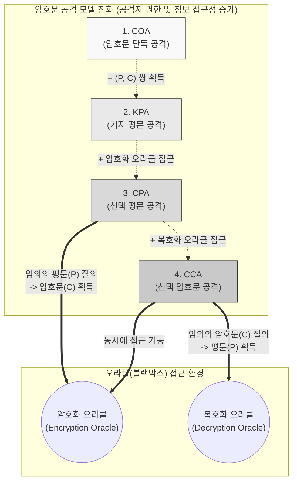

# 암호문 공격 기법 (Ciphertext Attack)

---

## I. 안전한 암호 시스템 설계를 위한 위협 모델, 암호문 공격 기법의 개요

* **정의**: 암호 해독을 위해 공격자가 사전에 확보한 정보(평문, 암호문 쌍 등)와 접근 권한(오라클)의 수준을 기준으로 암호 알고리즘의 취약점을 분석하는 논리적 공격 모델
* **필요성 및 핵심 특징**:
* **케르크호프스의 원리(Kerckhoffs's Principle) 준수**: 암호 알고리즘의 내부 구조가 공개되어 있다는 전제하에 공격을 수행하여 실질적인 안전성 평가
* **현대 암호 안전성 기준(IND-CCA) 제시**: 공격자의 능력이 가장 강력한 '선택 암호문 공격(CCA)' 환경에서도 평문의 정보를 유출하지 않아야 안전한 암호로 인정
* **공격 권한의 계층화**: 획득 정보가 가장 적은 COA부터 오라클(Oracle) 접근이 가능한 CCA까지 4단계의 공격 모델로 분류

---

## II. 암호문 공격 기법의 4대 모델 및 핵심 기술 요소

### 가. 공격자 권한(능력) 확대에 따른 암호문 공격 모델 개념도

* 공격 모델은 단방향적인 수동적 분석(COA, KPA)에서 오라클에 질의를 던지며 반응을 살피는 능동적 분석(CPA, CCA)으로 발전함
* 현대 암호 시스템은 공격자가 암/복호화 오라클에 자유롭게 접근할 수 있는 CCA 환경을 방어 목표로 설계됨

### 나. 암호문 공격 기법의 핵심 요소 기술

| 분류 | 요소 기술 (키워드) | 세부 설명 |
| --- | --- | --- |
| **공격 모델** | **COA (Ciphertext-Only)** | 공격자가 **암호문(C)만**을 가진 상태에서 언어의 통계적 빈도수나 패턴을 분석하여 평문이나 키를 추론 (가장 낮은 수준의 권한) |
| **공격 모델** | **KPA (Known-Plaintext)** | 다수의 **(평문, 암호문) 쌍**을 이미 알고 있는 상태에서 이들 간의 연관성을 분석하여 비밀키를 도출 (2차 세계대전 에니그마 해독 모델) |
| **공격 모델** | **CPA (Chosen-Plaintext)** | 공격자가 **원하는 평문(P)**을 암호기에 입력하여 대응하는 **암호문(C)을 획득**할 수 있는 상태에서의 공격 ([[암호화]] 오라클 활용) |
| **공격 모델** | **CCA (Chosen-Ciphertext)** | 공격자가 **원하는 암호문(C)**을 복호기에 입력하여 대응하는 **평문(P)을 획득**할 수 있는 상태에서의 공격 (복호화 오라클 활용) |
| **수학적 분석** | **차분 분석 (Differential)** | 주로 **CPA 환경**에서 사용되며, 두 평문의 차이(XOR)가 암호문에 미치는 영향을 확률적으로 추적하여 키를 찾는 해독법 |
| **수학적 분석** | **선형 분석 (Linear)** | 주로 **KPA 환경**에서 사용되며, 평문, 암호문, 키 비트 간의 선형 관계식(근사식)을 도출하여 키를 찾는 기법 |
| **안전성 증명** | **IND-CPA (구별 불가능성)** | CPA 공격 하에서 공격자가 두 개의 평문 중 어느 것이 암호화되었는지 확률적으로 구별(Indistinguishability)할 수 없음을 의미 |
| **분석 환경** | **오라클 (Oracle)** | 내부의 비밀키를 모르더라도, 입력값에 대해 정상적인 암호화 또는 복호화 결과를 반환해 주는 블랙박스 시스템 |

---

## III. 4대 암호문 공격 기법 비교 및 최신 동향

### 가. 4대 암호문 공격 모델(COA, KPA, CPA, CCA) 심층 비교

| 비교 항목 | COA (암호문 단독 공격) | KPA (기지 평문 공격) | CPA (선택 평문 공격) | CCA (선택 암호문 공격) |
| --- | --- | --- | --- | --- |
| **사전 확보 정보** | 암호문 ($C$) | 평문-암호문 쌍 ($P, C$) | 임의 평문 선택권 | 임의 암호문 선택권 |
| **오라클 접근성** | 불가 | 불가 | 암호화 오라클 (Enc) | 암/복호화 오라클 모두 |
| **공격자 능력** | 매우 낮음 | 낮음 | 높음 | **매우 높음 (가장 강력함)** |
| **공격 난이도** | 매우 어려움 | 어려움 | 보통 | 비교적 쉬움 |
| **방어 성공 시** | 고전 암호 수준의 안전성 | 취약한 대칭키 수준 | 기본적인 현대 암호 인정 | **현대 암호학의 표준 안전성** |

### 나. 암호문 공격 대응을 위한 현대 암호 설계 및 최신 동향

* **패딩 오라클 공격(Padding Oracle Attack) 방어**: CCA의 대표적 사례인 패딩 오라클 공격(서버의 패딩 에러 메시지를 악용해 평문 복원)을 차단하기 위해, 암호문에 인증 태그([[MAC]])를 결합한 **AEAD(Authenticated Encryption with Associated Data)** 모드(예: [[AES]]-GCM)가 산업 표준으로 정착
* **양자 [[알고리즘]] 기반 공격 위협(Q-Day) 가시화**: 그로버(Grover) 알고리즘을 통한 대칭키 전수조사 가속(128bit $\rightarrow$ 64bit 수준 하락)에 대응하여, AES-256 등 키 길이를 2배로 확장하는 선제적 조치 필수
* **화이트박스 암호화(WBC) 도입**: 모바일, IoT 등 엔드포인트 기기가 공격자에게 물리적/논리적으로 완전히 장악된(오라클 접근 수준을 넘어서 메모리 덤프까지 가능한) 극단적 분석 환경에서도 키를 보호하기 위해, 알고리즘 내에 [[난독화]] 기법으로 키를 숨기는 설계 확산

---

### 🔗 연관 토픽

- **소속 도메인**: [[00_보안_MOC|🛡️ 보안]]
- **세부 분류**: `2. 현대 암호학 & 키 관리 · 전자서명`
- **핵심 연관 토픽**:
  - [[AES]]
  - [[암호화|암호화 (Encryption)]]
  - [[난독화]]
  - [[RSA (Rivest Shamir Adleman)]]
  - [[ECC|ECC(Elliptic Curve Cryptography)]]
