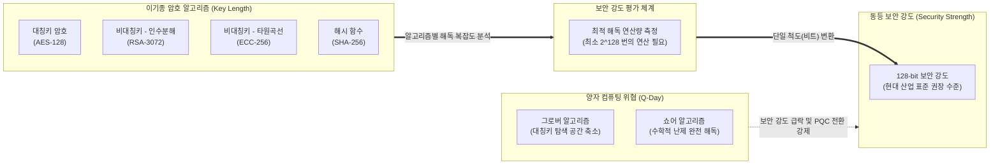

# 암호학적 보안 강도 (Security Strength)

---

## I. 이기종 암호 알고리즘 간의 객관적 안전성 지표, 암호학적 보안 강도의 개요

* **정의**: 특정 암호 알고리즘이나 시스템을 해독하여 평문이나 비밀키를 알아내는 데 필요한 최적의 공격 연산량(Work Factor)을 비트(bit) 단위로 수치화한 척도
* **필요성 및 핵심 특징**:
* **안전성 척도 통일**: 대칭키, 비대칭키, 해시 함수 등 구조가 전혀 다른 [[암호 알고리즘]] 간의 동등한 안전성(Equivalent Security) 비교 기준 제공
* **시스템 수명주기 관리**: IT 시스템의 기대 수명과 컴퓨팅 파워 발전을 고려한 적정 암호 키 길이 선정의 글로벌 표준 가이드라인(NIST SP 800-57) 역할 수행
* **양자 위협 평가 기준**: 양자 컴퓨터의 연산 능력에 따른 기존 암호 체계의 보안 강도 하락 수준 정량화

---

## II. 보안 강도의 산정 메커니즘 및 핵심 기술 요소

### 가. 이기종 암호 알고리즘의 동등 보안 강도(128-bit 기준) 매핑 개념도

* 대칭키(128bit), [[RSA (Rivest Shamir Adleman)|RSA]](3072bit), [[ECC]](256bit), 해시(256bit)는 키 길이는 다르나 모두 해독에 $2^{128}$번의 연산이 필요하므로 '128-bit 동등 보안 강도'를 가짐
* 양자 [[알고리즘]] 등장 시 보안 강도가 절반(Grover)으로 줄거나 0(Shor)으로 수렴하므로 안전성 재설계 필수

### 나. 암호학적 보안 강도의 핵심 산출 요소 및 양자 위협 기술

| 구분 | 요소 기술 (키워드) | 세부 설명 |
| --- | --- | --- |
| **평가 기준** | **작업 증명량 (Work Factor)** | 특정 암호를 깨기 위해 요구되는 최소 연산 횟수. $n$비트 보안 강도는 $2^n$번의 연산량을 의미 |
| **알고리즘별 특성** | **대칭키 강도 매핑** | 키 길이가 보안 강도와 직접 일치함 (예: [[AES]]-128 = 128-bit, AES-256 = 256-bit 강도) |
| **알고리즘별 특성** | **비대칭키 (인수분해) 강도** | 소인수분해(NFS 공격 등) 난이도에 제약을 받아 키 길이가 비약적으로 커야 함 (RSA-3072 = 128-bit) |
| **알고리즘별 특성** | **비대칭키 (타원곡선) 강도** | RSA 대비 짧은 키로 동일 강도 구현 가능. 키 길이의 약 1/2이 보안 강도 (ECC-256 = 128-bit) |
| **알고리즘별 특성** | **해시 충돌 회피 강도** | 생일 공격(Birthday Attack) 특성상 출력 해시값 길이의 절반이 보안 강도 (SHA-256 = 128-bit) |
| **양자 위협 영향** | **쇼어(Shor) 알고리즘** | 소인수분해 및 이산대수 문제를 다항 시간 내에 해결하여 RSA, ECC의 보안 강도를 '0'으로 무력화 |
| **양자 위협 영향** | **그로버(Grover) 알고리즘** | 대칭키 전수조사 시간을 $O(N)$에서 $O(\sqrt{N})$으로 가속하여 대칭키 보안 강도를 정확히 반토막($n/2$) 냄 |
| **관리 [[프레임워크]]** | **NIST SP 800-57** | 키 관리에 대한 미국 국립표준기술연구소 지침으로 보안 강도별 알고리즘 선택 및 전환 타임라인 규정 |

---

## III. 동등 보안 강도 비교 및 최신 보안 아키텍처 동향

### 가. NIST 기준 알고리즘별 동등 보안 강도(Equivalent Security Strength) 매핑 표

| 보안 강도 (수명) | 대칭키 암호 | 비대칭키 (RSA) | 비대칭키 (ECC) | 해시 함수 |
| --- | --- | --- | --- | --- |
| **112 bit** (~2030년) | 3TDEA (Triple [[DES]]) | RSA-2048 | ECC-224 | SHA-224 / SHA3-224 |
| **128 bit** (현재 표준) | **AES-128** | **RSA-3072** | **ECC-256** | **SHA-256 / SHA3-256** |
| **192 bit** (고도 보안) | AES-192 | RSA-7680 | ECC-384 | SHA-384 / SHA3-384 |
| **256 bit** (양자 내성) | AES-256 (Grover 대응) | RSA-15360 (비현실적) | ECC-512 | SHA-512 / SHA3-512 |

### 나. 보안 강도 유지를 위한 최신 기술 트렌드 및 향후 전망

* **대칭키 알고리즘의 키 길이 2배 확장 (AES-256 필수화)**: 그로버(Grover) 양자 알고리즘에 의해 AES-128의 보안 강도가 64-bit 수준으로 하락함에 따라, 향후 128-bit 보안 강도를 안전하게 확보하기 위해 AES-256 도입 의무화 추세
* **[[양자내성암호]](PQC) 기반 격자(Lattice) 암호 표준화 완료**: 쇼어 알고리즘에 의해 보안 강도가 소멸하는 RSA/ECC를 대체하기 위해, 최근 NIST가 [[FIPS (Federal Information Processing Standards)|FIPS]] 203(ML-KEM), 204(ML-[[DSA]])를 최종 표준으로 확정하며 공공/금융 인프라의 마이그레이션 본격화
* **암호 민첩성(Crypto-Agility) 아키텍처 도입**: 단일 암호 알고리즘의 보안 강도가 붕괴(취약점 발견 등)하더라도, 소스코드 수정 없이 설정만으로 새로운 암호 모듈(플러그인)로 즉각 교체할 수 있는 유연한 보안 시스템 설계 의무화

---

### 🔗 연관 토픽

- **소속 도메인**: [[00_보안_MOC|🛡️ 보안]]
- **세부 분류**: `2. 현대 암호학 & 키 관리 · 전자서명`
- **핵심 연관 토픽**:
  - [[RSA (Rivest Shamir Adleman)]]
  - [[AES]]
  - [[ECC|ECC(Elliptic Curve Cryptography)]]
  - [[양자내성암호]]
  - [[FIPS (Federal Information Processing Standards)]]
