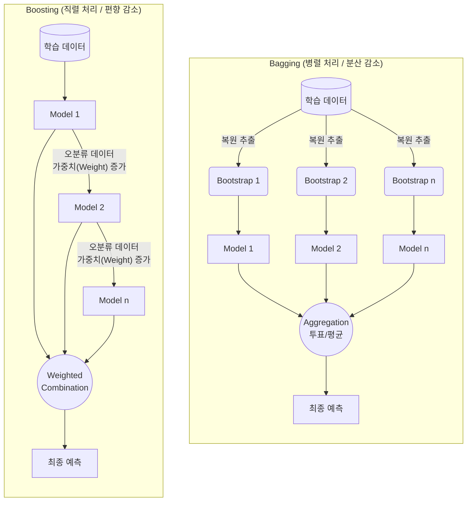

# 앙상블 학습 (Ensemble Learning)

---

## I. 기계학습 모델의 일반화 성능 향상을 위한, 앙상블 학습의 개요

* **정의**: 여러 개의 약한 학습기(Weak Learner)를 생성하고 그 예측을 결합하여, 단일 모델보다 더 정확하고 [[신뢰성]] 높은 강한 학습기(Strong Learner)를 만드는 기계학습 최적화 기법
* **필요성 및 핵심 특징**:
* **과적합(Overfitting) 방지**: 개별 모델의 예측 분산(Variance)을 줄여 미지의 데이터에 대한 [[일반화]](Generalization) 성능 향상
* **[[편향]]-분산 트레이드오프 극복**: [[배깅]](Bagging)을 통한 분산 감소 및 부스팅([[부스팅|Boosting]])을 통한 편향(Bias) 감소 동시 모색
* **비정형/정형 데이터 최적화**: [[딥러닝]] 부상에도 불구, Tabular(정형) 데이터 분류/회귀 분석에서는 앙상블(Tree 기반) 기법이 여전히 최고 성능 유지

---

## II. 앙상블 학습의 개념도 및 핵심 기술 요소

### 가. 앙상블 학습의 핵심 동작 원리 (배깅 및 부스팅)

* 배깅(Bagging)은 데이터를 복원 추출하여 여러 모델을 병렬로 학습하고 결합하여 예측의 안정성(분산 감소)을 확보함
* 부스팅(Boosting)은 이전 모델이 틀린 데이터에 가중치를 부여하여 다음 모델이 직렬로 집중 학습함으로써 정확도(편향 감소)를 극대화함

### 나. 앙상블 학습의 핵심 기술 및 구성 요소

| 구분 | 요소 기술 (키워드) | 세부 설명 |
| --- | --- | --- |
| **데이터 샘플링** | **부트스트랩 (Bootstrap)** | 전체 데이터 셋에서 중복을 허용하여(복원 추출) 원본과 동일한 크기의 데이터 샘플을 여러 개 생성하는 통계적 기법 |
| **병렬 앙상블** | **[[랜덤 포레스트|랜덤 포레스트 (Random Forest)]]** | 다수의 의사결정 나무(Decision Tree)를 배깅 방식으로 결합하고, 노드 분할 시 변수(Feature)도 무작위로 선택하여 상관성을 낮춤 |
| **직렬 앙상블** | **GBM (Gradient Boosting)** | 이전 트리의 예측 오차(Residual)를 최소화하는 방향으로 다음 트리를 학습시키는 [[경사하강법]] 기반 부스팅 |
| **결합 방식** | **보팅 (Voting)** | 서로 다른 [[알고리즘]] 모델의 결과를 결합. 다수결(Hard Voting)과 [[클래스]] 확률의 평균(Soft Voting) 적용 |
| **메타 모델링** | **스태킹 (Stacking)** | 개별 기반 모델(Base Model)들의 예측 결과값을 다시 메타 모델(Meta Model)의 학습 데이터로 사용하여 최종 예측 |
| **고성능 구현체** | **XGBoost** | GBM을 병렬 학습 및 정규화(Regularization) 기능으로 개선하여 과적합을 방지하고 속도를 극대화한 라이브러리 |
| **고성능 구현체** | **LightGBM** | 수직적 확장(Leaf-wise) 트리 분할 방식을 사용하여 XGBoost보다 학습 시간이 빠르고 메모리 사용량이 적음 |
| **고성능 구현체** | **CatBoost** | 범주형(Categorical) 변수를 자체적으로 타겟 인코딩(Target Encoding) 처리하여 정형 데이터 예측에 특화됨 |

---

## III. 배깅과 부스팅 비교 및 최신 동향

### 가. 핵심 앙상블 기법 비교: Bagging vs Boosting

| 비교 항목 | Bagging (Bootstrap Aggregating) | Boosting |
| --- | --- | --- |
| **학습 방식** | **병렬 (Parallel)** 독립적 학습 | **직렬 (Sequential)** 순차적 학습 |
| **데이터 샘플링** | 무작위 복원 추출 (동일한 가중치) | 오분류 데이터에 높은 가중치 부여 |
| **주요 감소 목표** | **분산 (Variance) 감소** (안정성 증대) | **편향 (Bias) 감소** (정확도 증대) |
| **과적합 위험도** | 낮음 (일반화 능력이 뛰어남) | 상대적으로 높음 (노이즈에 민감함) |
| **대표 알고리즘** | Random Forest, Bagged CART | AdaBoost, XGBoost, LightGBM, CatBoost |

### 나. 앙상블 학습의 최신 트렌드 및 향후 전망

* **생성형 AI(LLM)의 MoE([[MOE(Mixture of Experts)|Mixture of Experts]]) 적용**: 최근 [[초거대 언어 모델]](GPT-4, Mixtral 등)은 연산 효율성을 높이기 위해 입력 토큰에 따라 최적의 전문가 신경망(Expert)을 동적으로 선택 및 결합(Routing)하는 희소(Sparse) 앙상블 기법 채택
* **[[AutoML (Automated Machine Learning)|AutoML]] 기반 앙상블 파이프라인 자동화**: DataRobot, H2O 등 최신 [[MLOps]] 플랫폼은 최적의 개별 알고리즘 탐색을 넘어, 하이퍼파라미터 튜닝 및 스태킹(Stacking) 기반의 복합 앙상블 가중치 최적화 전 과정을 완전 자동화
* **정형 데이터(Tabular) 분석의 표준 정립**: 이미지, 자연어 처리에서는 딥러닝이 압도적이나, 금융(신용평가), 유통(수요예측) 등의 정형 데이터 영역에서는 여전히 설명 가능성([[XAI]] 연동)과 성능이 우수한 XGBoost, LightGBM 앙상블이 산업 표준으로 자리매김함

---

### 🔗 연관 토픽

- **소속 도메인**: [[00_인공지능_MOC|🤖 인공지능]]
- **세부 분류**: `2. 머신러닝 기초 & 핵심 알고리즘`
- **핵심 연관 토픽**:
  - [[경사하강법|경사하강법 (Gradient Descent Algorithm)]]
  - [[랜덤 포레스트|랜덤 포레스트 (Random Forest)]]
  - [[딥러닝]]
  - [[편향]]
  - [[XAI]]
