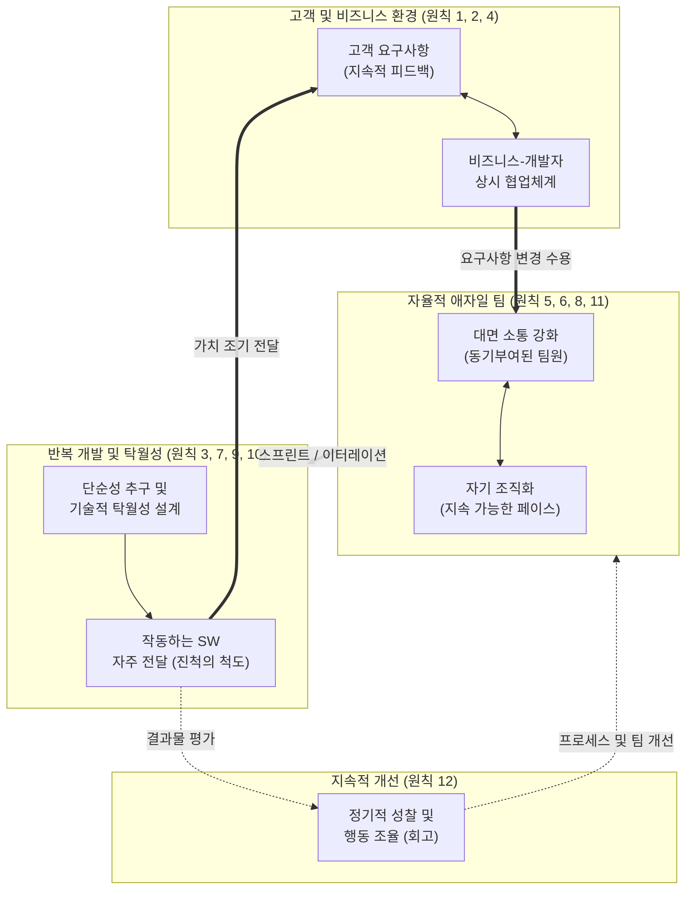

# 애자일 12개 원칙 (12 Agile Principles)

---

## I. 고객 가치 창출과 유연한 대응을 위한, 애자일 12개 원칙의 개요

* **정의**: 소프트웨어 개발의 민첩성, 유연성, 협업을 강조하는 [[애자일 선언문]]([[Agile]] Manifesto)의 4대 핵심 가치를 실무에 적용하기 위해 제정된 12가지 구체적인 행동 지침 및 가치 판단 기준
* **필요성 및 등장배경**:
* **비즈니스 불확실성 증대**: 요구사항이 급변하는 환경에서 기존 [[워터폴|폭포수]](Waterfall) 모델의 경직성 극복 및 Time-to-Market 단축 필요
* **문서 위주 프로세스의 한계**: 방대한 문서 작업보다 '작동하는 소프트웨어'와 '고객 만족'을 최우선으로 하는 패러다임 전환 요구

* **특징**: 반복적 가치 전달(Iterative), 변화 수용, 자율적 팀 구성, 지속적인 품질 개선 및 반성

---

## II. 애자일 12개 원칙의 메커니즘 및 핵심 요소

### 가. 애자일 12개 원칙 기반의 가치 전달 및 지속적 개선 사이클

* 비즈니스 부서와 개발 팀 간의 상시 협업 체계 하에서 변경되는 요구사항을 적극 수용하여 지속적으로 가치를 전달함
* '작동하는 소프트웨어'를 진척의 기준으로 삼으며, 정기적인 회고(Retrospective)를 통해 팀의 효율성을 끊임없이 조율함

### 나. 애자일 12개 원칙의 8대 핵심 테마 및 세부 내용

| 분류 (테마) | 요소 기술 및 핵심 원칙 (키워드) | 세부 설명 (12개 원칙 매핑) |
| --- | --- | --- |
| **고객 가치** | **가치 조기 전달 / 작동하는 SW** | 가치 있는 소프트웨어를 일찍, 지속적으로 전달하며(원칙1), 작동하는 S/W를 진척의 주된 척도로 삼음(원칙7, 3) |
| **변화 수용** | **요구사항 변경 환영** | 개발 후반부의 요구사항 변경도 환영하며, 변화를 고객의 경쟁력 강화를 위한 도구로 활용함(원칙2) |
| **상호 협업** | **비즈니스와 개발자의 협력** | 프로젝트 기간 내내 비즈니스 담당자와 개발자가 매일 함께 일해야 함(원칙4) |
| **소통 방식** | **대면 대화 (Face-to-Face)** | 개발 팀 내부 및 팀 간의 정보를 전달하는 가장 효율적이고 효과적인 방법은 대면 대화임(원칙6) |
| **팀 환경** | **동기부여 및 자기 조직화** | 동기부여된 개인들로 팀을 구성하고 지원(원칙5), 최상의 아키텍처와 설계는 자기 조직화된 팀에서 도출됨(원칙11) |
| **지속 가능성** | **일정한 속도 (Pace) 유지** | 스폰서, 개발자, 사용자가 일정한 속도를 무한히 유지할 수 있는 지속 가능한 개발 환경 조성(원칙8) |
| **설계/품질** | **기술적 탁월성과 단순성** | 우수한 기술과 설계에 대한 지속적 관심(원칙9), 안 해도 될 일은 최대한 피하는 단순성(Simplicity) 극대화(원칙10) |
| **지속적 개선** | **정기적인 성찰 및 조율** | 팀은 정기적으로 업무 효율을 높이는 방법을 성찰하고, 그에 따라 행동을 조율하고 수정함(원칙12) |

---

## III. 애자일 원칙 적용의 진화 및 최신 동향

### 가. 전통적 개발 방법론(폭포수)과의 가치 지향점 비교

| 비교 항목 | 전통적 방법론 (Waterfall) | 애자일 방법론 (Agile Principles) |
| --- | --- | --- |
| **주요 진척 척도** | 단계별 산출물 및 문서 (Milestone) | **작동하는 소프트웨어** (Working Software) |
| **변화에 대한 태도** | 통제 대상 (형상통제위원회 등을 통한 억제) | **수용 대상** (고객 경쟁력 향상을 위한 기회) |
| **팀의 구조/권한** | 명령과 통제 (Command & Control), 하향식 | **자기 조직화 (Self-Organizing)**, 수평적 협업 |
| **가치 전달 주기** | 프로젝트 종료 시점 (빅뱅 방식 일괄 인도) | **짧은 주기 (2~4주)**로 지속적 가치 전달 |

### 나. 애자일 원칙의 최신 트렌드 및 산업 적용 전망

* **[[DevOps]] 및 CI/CD 파이프라인 결합**: 애자일 12개 원칙 중 '소프트웨어의 빠르고 지속적인 전달'을 물리적으로 구현하기 위해, 릴리스 프로세스를 자동화하는 DevOps 철학과 결합하여 Time-to-Market 최적화
* **분산 환경에서의 원칙 보완 (Remote Agile)**: 팬데믹 이후 '대면 대화' 원칙의 한계를 극복하기 위해, Jira, Confluence, [[메타버스]] 워크스페이스 등 협업 툴과 AI 기반 회의 요약 비서를 활용하여 커뮤니케이션 밀도 유지
* **전사적 애자일 확장 (Scaled Agile Framework, SAFe)**: 단일 개발 팀 단위의 원칙 적용을 넘어, 대규모 엔터프라이즈 환경에서 포트폴리오, 프로그램, 팀 계층 전반에 걸쳐 애자일 원칙을 적용하는 SAFe, LeSS 방법론 도입 확산

---

### 🔗 연관 토픽

- **소속 도메인**: [[00_프로젝트관리_MOC|📋 프로젝트관리]]
- **세부 분류**: `1. PMBOK 표준 & 프로젝트 거버넌스`
- **핵심 연관 토픽**:
  - [[애자일 선언문]]
  - [[Agile]]
  - [[Agile 선언문과 12개 원칙]]
  - [[워터폴]]
  - [[SCRUM]]
