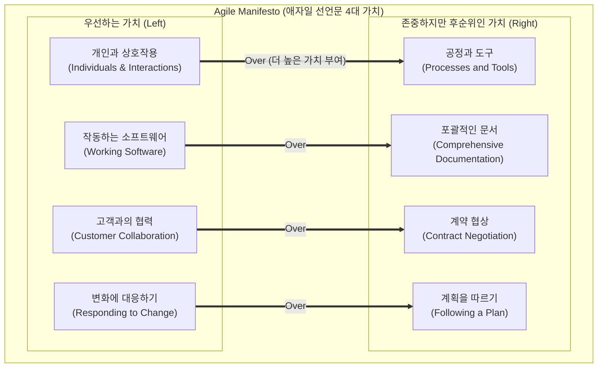

# 애자일 선언문 (Agile Manifesto)

---

## I. 민첩성과 고객 가치 중심의 소프트웨어 개발 패러다임, 애자일 선언문의 개요

* **정의**: 기존 [[워터폴|폭포수]](Waterfall) 모델의 경직성과 문서 위주의 [[프로세스]] 한계를 극복하기 위해, 민첩성·유연성·상호 협력을 강조하며 소프트웨어 개발의 4대 핵심 가치와 12개 원칙을 정리한 선언문(2001년 제정)
* **필요성 및 등장배경**:
* **비즈니스 불확실성 대응**: 시장 요구사항이 급변하는 환경에서 개발 후반부의 변경 수용 및 Time-to-Market(TTM) 단축 필요
* **경량화 방법론 통합**: [[스크럼]]([[SCRUM|Scrum]]), XP(eXtreme Programming), 칸반(Kanban) 등 경량 방법론들의 공통 철학과 가치를 통합하여 표준화 제시

* **특징**: 좌측(Left) 가치 우선, 작동하는 S/W 중심, 반복적 가치 전달(Iterative), 피드백 기반 지속 개선

---

## II. 애자일 선언문의 핵심 가치 개념도 및 12가지 원칙

### 가. 애자일 선언문의 4대 핵심 가치 구조도

* 우측 항목(공정/도구, 문서, 계약, 계획)의 가치를 인정하지만, 성공적인 프로젝트를 위해 좌측 항목(사람, 동작 SW, 협력, 변화 수용)에 더 높은 가치를 둠

### 나. 애자일 12가지 원칙 (8대 테마로 그룹핑)

| 분류 (테마) | 핵심 원칙 (키워드) | 세부 설명 (12개 원칙 기반) |
| --- | --- | --- |
| **고객 만족** | **가치 조기 전달 (작동하는 SW)** | 가치 있는 소프트웨어를 조기에 지속적으로 전달하며, 작동하는 S/W를 진척도의 최우선 척도로 삼음 |
| **변화 수용** | **요구사항 변경 환영** | 개발 후반부라도 요구사항 변경을 기꺼이 수용하여 고객의 비즈니스 경쟁력 강화에 기여함 |
| **상호 협력** | **비즈니스와 개발자 협업** | 프로젝트 기간 내내 비즈니스 담당자와 개발자가 매일 긴밀하게 협력하며 개발을 진행함 |
| **팀 환경** | **자기조직화 및 동기부여** | 동기부여된 개인들로 팀을 구성하여 자율성을 부여하고, 최선의 아키텍처는 자기 조직화된 팀에서 창출됨 |
| **소통 방식** | **대면 대화 (Face-to-Face)** | 팀 내외부에 정보를 전달하는 가장 효과적이고 효율적인 방법은 직접 얼굴을 맞대고 소통하는 것임 |
| **지속 가능성** | **일정한 속도 (Pace) 유지** | 스폰서, 개발자, 사용자가 무한히 유지할 수 있는 일정한(지속 가능한) 개발 페이스 지향 |
| **설계/품질** | **기술적 탁월성과 단순성** | 우수한 설계에 대한 지속적 관심으로 민첩성을 높이며, 안 해도 될 일을 최대한 피하는 단순성을 극대화함 |
| **지속적 개선** | **정기적인 성찰 및 조율(회고)** | 팀이 정기적으로 업무 효율을 성찰하고 그에 맞춰 행동을 조율함으로써 프로세스를 지속 개선함 |

---

## III. 전통적 방법론과의 비교 및 애자일의 향후 발전 전망

### 가. 전통적 개발 방법론(폭포수)과 애자일 선언 기반 방법론 비교

| 비교 항목 | 폭포수 방법론 (Waterfall) | 애자일 방법론 ([[Agile]]) |
| --- | --- | --- |
| **가치 중심** | 프로세스, 도구, 문서화 | **사람, 상호작용, 작동하는 SW** |
| **진척도 척도** | 산출물 완료(문서) 및 마일스톤 달성 | **실제 작동하는 소프트웨어 (Working SW)** |
| **변화에 대한 태도** | 통제 대상 (형상통제위원회 등을 통한 억제) | **수용 대상** (비즈니스 기회 창출을 위한 무기) |
| **조직 및 문화** | 수직적, 하향식(Command & Control) | **수평적, 자기 조직화 (Self-Organizing)** |

### 나. 애자일 철학의 확장 및 최신 산업 적용 동향 (전망)

* **전사적 애자일(SAFe, LeSS) 확산**: 단일 개발팀 단위의 적용을 넘어, 대규모 엔터프라이즈 환경에서 포트폴리오, 프로그램 단위까지 애자일 철학을 확장 적용하는 Scaled Agile Framework 채택 증가
* **[[DevSecOps]] 및 BizDevOps 연계**: 작동하는 SW의 '지속적 전달' 원칙을 인프라 레벨로 구체화하기 위해 CI/CD 파이프라인과 보안, 비즈니스 조직이 결합하는 통합 파이프라인으로 진화
* **AI-Augmented Agile의 대두**: 생성형 AI(GenAI)를 스크럼 마스터 및 보조자로 활용하여 백로그(Backlog) 초안 작성, 회고 회의 자동 요약, 스토리 포인트 산정 보조 등을 수행해 애자일 프로세스의 오버헤드 최소화 시도

---

### 🔗 연관 토픽

- **소속 도메인**: [[00_프로젝트관리_MOC|📋 프로젝트관리]]
- **세부 분류**: `1. PMBOK 표준 & 프로젝트 거버넌스`
- **핵심 연관 토픽**:
  - [[Agile]]
  - [[SCRUM]]
  - [[애자일 12개 원칙]]
  - [[스크럼|스크럼 (SCRUM)]]
  - [[워터폴]]
