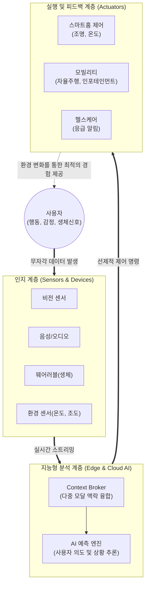

# 앰비언트 컴퓨팅 (Ambient Computing)

---

## I. 사용자 개입 없는 지능형 맞춤형 서비스 제공, 앰비언트 컴퓨팅의 개요

* **정의**: 컴퓨팅 기기와 센서가 일상 환경에 보이지 않게 스며들어(Invisible), 사용자의 명시적인 조작이나 명령 없이도 상황을 인지하고 능동적으로 서비스를 제공하는 차세대 지능형 컴퓨팅 패러다임
* **필요성 및 등장배경**:
* **사용자 피로도 증가**: 기기 파편화 및 복잡한 앱/GUI 환경으로 인한 사용자 인지 부하(Cognitive Load) 해소 필요
* **AIoT 생태계 성숙**: 인공지능과 IoT의 결합, 엣지 컴퓨팅의 발전으로 초저지연 실시간 상황 분석 가능

* **특징**: 무자각 인터페이스(Zero UI), 선제적 서비스(Proactive Service), 맥락 인식(Context-Awareness)

---

## II. 앰비언트 컴퓨팅의 개념도 및 핵심 기술 요소

### 가. 앰비언트 컴퓨팅의 서비스 아키텍처 및 동작 원리

* 사용자의 별도 조작 없이 인지 계층에서 환경 및 맥락 데이터를 수집하여, 지능형 분석 계층이 의도를 추론함
* 실행 계층을 통해 물리적 환경을 제어(Actuation)함으로써 사용자에게 선제적(Proactive) 편의성을 제공하는 폐쇄 루프(Closed-loop) 구조

### 나. 앰비언트 컴퓨팅의 핵심 기술 요소

| 구분 | 핵심 기술 (키워드) | 세부 설명 |
| --- | --- | --- |
| **인터페이스** | **Zero UI / NUI** | 화면 중심의 GUI를 탈피하여 음성(VUI), 제스처, 시선 등 사용자의 자연스러운 행동을 입력으로 인식 |
| **상황 인지** | **Context-Awareness** | 위치, 시간, 활동 상태, 과거 이력 데이터를 융합하여 사용자의 현재 의도와 맥락을 수학적으로 추론 |
| **데이터 수집** | **AIoT (AI + IoT)** | 지능형 센서와 사물인터넷 망을 통해 일상의 모든 공간에서 끊김 없는(Seamless) 실시간 데이터 수집 |
| **연산 아키텍처** | **엣지 컴퓨팅 ([[EDGE|Edge]])** | 클라우드 의존을 줄이고 단말(스마트 스피커, [[NPU]] 탑재 기기)에서 즉시 연산하여 지연시간 및 보안성 개선 |
| **초연결 표준** | **Matter (매터)** | 이기종 스마트홈 기기 간의 끊김 없는 상호 연동을 보장하는 CSA 주도의 로컬 통신 기반 글로벌 연동 표준 |
| **지능화 모델** | **[[온디바이스 AI]] / [[sLLM (Smaller Large Language Model)|sLLM]]** | 네트워크 연결 없이도 기기 자체적으로 경량화된 언어 모델 및 [[딥러닝]] 알고리즘을 구동하여 즉각적 판단 |
| **보안/프라이버시** | **연합학습 (Federated Learning)** | 사용자의 민감한 일상 데이터가 클라우드로 전송되지 않고 로컬에서 모델을 학습하여 프라이버시 보호 |
| **행동 제어** | **액추에이터 (Actuator)** | AI의 판단에 따라 조명, 온도, 잠금장치 등 물리적 환경을 실제로 구동하고 변화시키는 제어 장치 |

---

## III. 유비쿼터스와의 비교 및 앰비언트 컴퓨팅의 최근 동향

### 가. 유비쿼터스 컴퓨팅과 앰비언트 컴퓨팅 비교

| 비교 항목 | 유비쿼터스 컴퓨팅 (Ubiquitous) | 앰비언트 컴퓨팅 (Ambient) |
| --- | --- | --- |
| **핵심 철학** | **존재 (Everywhere)**: 언제 어디서나 컴퓨팅 자원에 접속 | **경험 (Invisible)**: 컴퓨팅이 백그라운드로 사라짐 |
| **상호작용 방식** | **반응형 (Reactive)**: 사용자의 명시적 명령(버튼, 클릭) 필요 | **선제적 (Proactive)**: AI가 상황을 인지하여 스스로 동작 |
| **인터페이스** | GUI (디스플레이, 스마트폰, 웹) | **Zero UI**, VUI (음성), 생체 신호 |
| **기술적 성숙도** | 초고속 통신망, 소형화된 단말기 보급 달성 | AI(딥러닝), NPU, 엣지 컴퓨팅의 고도화로 실현 단계 |

### 나. 앰비언트 컴퓨팅의 최신 트렌드 및 산업 적용 전망

* **생성형 AI(GenAI) 기반 에이전트 연동**: 단순 규칙(Rule-based) 기반의 스마트홈을 넘어, [[초거대 언어 모델|LLM]] 기반의 AI 에이전트가 사용자의 복잡한 일상적 맥락을 이해하고 스스로 시나리오를 생성하여 구동하는 자율적 앰비언트 환경으로 진화
* **공간 컴퓨팅(Spatial Computing)과의 융합**: SDV(소프트웨어 정의 차량), 스마트 시티 등 이동 및 주거 공간 자체가 거대한 컴퓨팅 플랫폼으로 변화하며, 센서 퓨전 기술을 통한 공간 맞춤형(Ambient Space) 서비스 확산
* **프라이버시 보존 연산(PET)의 필수화**: 생활 공간 내 카메라와 마이크 상시 가동에 따른 '빅 브라더' 논란 및 감시 위험을 해소하기 위해, 데이터 파편화, 동형암호, 온디바이스 AI 처리 등 프라이버시 보호 기술(Privacy-Enhancing Technologies)의 내재화가 핵심 성공 요인으로 대두

---

### 🔗 연관 토픽

- **소속 도메인**: [[00_디지털서비스_MOC|🚀 디지털서비스]]
- **세부 분류**: `5. 기능안전 (Functional Safety) & 신뢰성 표준`
- **핵심 연관 토픽**:
  - [[초거대 언어 모델|초거대 언어 모델(Large Language Model)]]
  - [[sLLM (Smaller Large Language Model)]]
  - [[온디바이스 AI]]
  - [[딥러닝]]
  - [[NPU|NPU(Neural Processing Unit)]]
