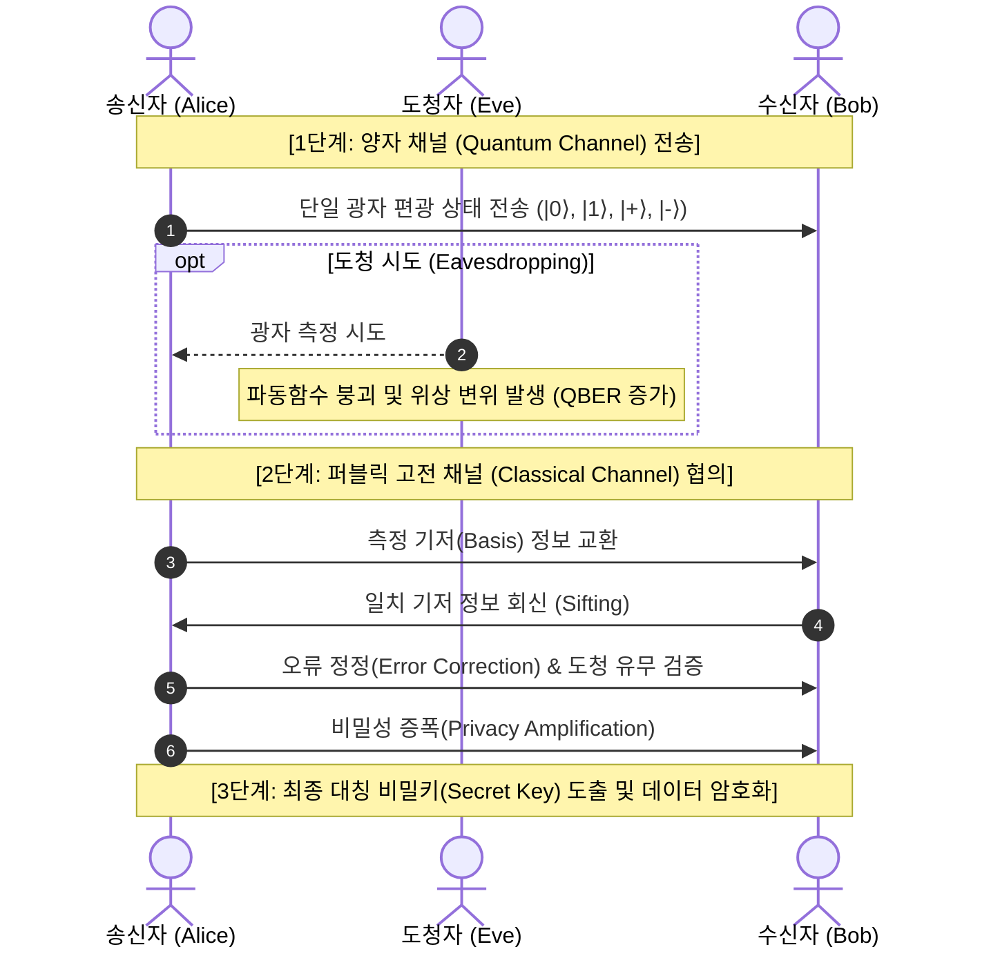

# 양자 암호 (Quantum Cryptography)

## I. 양자역학적 물리 특성 기반의 무조건적 보안, 양자 암호의 개요

* **정의**: 양자의 물리적 특성(중첩, 얽힘, 불확정성, 복제 불가능성)을 적용하여 도청 및 복제를 원천 차단하고 정보 전송의 무조건적 보안성(Information-Theoretic Security)을 보장하는 암호 통신 기술
* **등장 배경**: 쇼어(Shor) [[알고리즘]] 기반 양자컴퓨터의 기존 공개키 암호체계([[RSA (Rivest Shamir Adleman)|RSA]], [[ECC]]) 무력화 위협 대응 및 국가·금융 핵심 인프라 보안 강화 필요
* **핵심 특징**: 도청 즉시 양자 상태 붕괴(측정의 불가역성), 양자 복제 불가능(No-Cloning), 도청 탐지 기반 즉각적 키 폐기 구조

---

## II. 양자 암호의 메커니즘 및 핵심 기술 요소

### 가. 양자 암호(QKD 기반) 메커니즘 및 개념도

* 양자 채널을 통해 단일 광자를 전송하고 고전 채널로 기저를 대조하여 키를 선별(Sifting)하며, 도청 시 양자 붕괴로 오류율(QBER)이 임계치 초과 시 즉각 통신을 폐기함

### 나. 양자 암호의 핵심 기술 요소

| 구분 | 요소 기술 | 세부 설명 |
| --- | --- | --- |
| **물리 법칙** | 불확정성 원리 / 복제 불가 | 하이젠베르크 불확정성 및 단일 양자 복제 불가(No-Cloning Theorem) 기반 도청 원천 차단 |
| **난수 생성** | QRNG (양자난수생성기) | 양자 위상 요동, 광자 방출 등 순수 물리적 확률 현상을 이용한 예측 불가능한 순수 난수 생성 |
| **키 분배 [[프로토콜]]** | BB84 / Decoy-State | 단일 광자의 4가지 편광 상태와 2개 기저 활용 프로토콜 및 다중광자 분할 도청(PNS) 방어 기술 |
| **장거리 확장** | 양자 중계기 (Quantum Repeater) | 광섬유 감쇠 극복을 위한 양자 얽힘 스와핑(Entanglement Swapping) 및 양자 메모리 기반 장거리 전송 기술 |
| **네트워크 제어** | QKD-[[KMS]] | 생성된 양자키의 저장, 수명 주기 관리 및 [[IP Sec|IPSec]]/MACsec 연동 키 제공 소프트웨어 계층 |
| **네트워크 신뢰** | Trusted Relay (신뢰 노드) | 완전 양자 중계기 상용화 전까지 거점 노드에서 복호화-재암호화를 수행하여 전송 거리를 연장하는 구조 |
| **수신 검출** | 단일 광자 검출기 (SPAD/SNSPD) | 초전도 나노와이어(SNSPD) 등을 활용하여 극미세 단일 광자 신호를 고효율·저잡음으로 수신 감지 |
| **글로벌 인프라** | 위성 QKD (Satellite QKD) | 대기 감쇠가 적은 자유공간 광통신(FSO)을 활용하여 대륙 간 장거리 양자키 분배망 구성 |

---

## III. 양자 암호(QKD)와 포스트 양자 암호(PQC) 비교 및 도입 방안

### 가. QKD vs PQC 비교

| 비교 항목 | 양자키분배 (QKD) | [[양자내성암호]] (PQC) |
| --- | --- | --- |
| **보안 기반** | 양자역학 물리 법칙 (무조건적 보안성) | 수학적 난제 (격자, 다변수, 해시 기반 복잡도) |
| **구현 방식** | 전용 하드웨어, 광섬유/자유공간 양자 채널 필수 | 기존 네트워크 및 컴퓨팅 인프라(S/W 업그레이드) |
| **확장성/거리** | 물리적 전송 거리 제한 (100~200km 내외, 중계 노드 필요) | 거리 제한 없음, 글로벌 인터넷망 즉시 적용 가능 |
| **표준화/성숙도** | ITU-T Y.3800 시리즈, ETSI 표준화 진행 | NIST 표준화 확정([[FIPS (Federal Information Processing Standards)|FIPS]] 203 ML-KEM, FIPS 204 ML-[[DSA]] 등) |
| **주요 적용처** | 데이터센터 백본, 국가 전력망, 군 통신망 | 범용 웹 보안(TLS), 전자서명, 금융 [[트랜잭션]], IoT |

### 나. 향후 전망 및 하이브리드 적용 전략

* **QKD-PQC 상호보완적 융합(Defense-in-Depth)**: 물리적 완벽성을 갖는 QKD 백본 네트워크 위에 확장성이 뛰어난 PQC를 종단 간([[End-to-End]]) 애플리케이션 계층에 적용하는 이중화(Hybrid) 모델 구축 확산
* **글로벌 양자 인터넷(Quantum Internet) 진화**: 단순 키 분배를 넘어 양자 컴퓨터, 양자 센서 간 분산 양자 컴퓨팅을 지원하는 차세대 양자 인터넷 인프라로의 발전 가속화

---

### 🔗 연관 토픽

- **소속 도메인**: [[00_보안_MOC|🛡️ 보안]]
- **세부 분류**: `2. 현대 암호학 & 키 관리 · 전자서명`
- **핵심 연관 토픽**:
  - [[ECC|ECC(Elliptic Curve Cryptography)]]
  - [[양자내성암호]]
  - [[FIPS (Federal Information Processing Standards)]]
  - [[RSA (Rivest Shamir Adleman)]]
  - [[암호 분석 공격 기법|암호 분석 공격(Cryptanalysis Attacks) 기법]]
