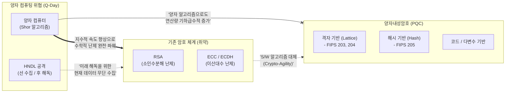

# 양자내성암호 (PQC: Post-Quantum Cryptography)

---

## I. 양자 컴퓨터 위협에 대응하는 소프트웨어 암호 체계, 양자내성암호의 개요

* **정의**: 양자 컴퓨터의 강력한 연산 능력(쇼어 [[알고리즘]] 등)으로도 다항 시간 내에 해독하기 어려운 복잡한 수학적 난제(격자, 해시 등)를 기반으로 설계된 차세대 공개키 [[암호 알고리즘]]
* **등장배경 및 특징**:
* **HNDL(Harvest Now, Decrypt Later) 위협**: 공격자가 현재 암호화된 기밀 데이터를 탈취 후, 미래 양자 컴퓨터 상용화 시점(Q-Day)에 복호화하는 선제적 공격 방어 필요
* **소프트웨어적 유연성**: 양자키분배(QKD)와 달리 전용 하드웨어나 통신망 구축 없이 기존 인터넷 인프라망([[TCP]]/IP)에서 알고리즘 업데이트만으로 전환 가능

---

## II. 양자내성암호의 개념도 및 핵심 구성 요소

### 가. 양자 컴퓨팅 위협 모델 및 양자내성암호 방어 개념도

* 양자 컴퓨터의 연산력 앞에 기존의 공개키 암호([[RSA (Rivest Shamir Adleman)|RSA]], [[ECC]])는 수학적 기저가 붕괴되어 해독 위험에 노출됨
* 양자내성암호(PQC)는 격자 등의 다차원 기하학적/대수적 난제를 활용하여 양자 알고리즘을 이용한 공격도 무력화함

### 나. 양자내성암호의 핵심 수학적 기반 및 국제 표준 기술

| 분류 | 요소기술(키워드) | 세부 설명 |
| --- | --- | --- |
| **수학적 기반** | **격자 (Lattice) 기반** | 다차원 격자 공간에서 '최단 벡터 문제(SVP)' 등의 난제를 활용하여 암/복호화 효율성이 가장 우수함 |
| **수학적 기반** | **해시 (Hash) 기반** | 해시 함수의 충돌 회피성(Collision Resistance)을 이용하며, 주로 전자서명(Digital Signature)에 특화됨 |
| **수학적 기반** | **코드 (Code) 기반** | 오류 정정 부호(Error Correcting Code)의 복호화 난해성을 활용하며 보안성은 높으나 키 크기가 큼 |
| **수학적 기반** | **다변수 (Multivariate) 기반** | 유한체 상의 다원 이차 연립방정식 해를 구하는 NP-Hard 문제 활용 |
| **국제 표준** | **[[FIPS (Federal Information Processing Standards)|FIPS]] 203 (ML-KEM)** | 2024년 8월 최종 승인된 **키 [[캡슐화]] 메커니즘(KEM)** 표준으로 기존 RSA, ECDH 키 교환 알고리즘 대체 |
| **국제 표준** | **FIPS 204/205 (ML-[[DSA]]/SLH-DSA)** | **디지털 서명(전자서명)** 영역의 승인된 표준 알고리즘. 각각 격자 및 해시 기반 인증 체계 적용 |
| **위협 모델** | **HNDL 방어** | 현재 통신망에서 유통되는 기밀 데이터를 수집 후 저장하는 '선 수집 후 해독(Harvest Now Decrypt Later)' 차단 |
| **마이그레이션** | **하이브리드 암호 체계** | PQC 알고리즘의 예기치 못한 취약점 발견에 대비해, 기존 RSA/ECC와 PQC를 결합 적용하는 과도기적 설계 |

---

## III. 양자보안 패러다임 비교(PQC vs QKD) 및 향후 전망

### 가. 양자보안 2대 핵심 기술: 양자내성암호(PQC)와 양자키분배(QKD) 비교

| 비교 항목 | 양자내성암호 (PQC) | 양자키분배 (QKD) |
| --- | --- | --- |
| **보안 원리** | **알고리즘적 복잡도** (수학적 난제) | **양자역학의 물리 법칙** (복제 불가능성 등) |
| **구현 방식 / 비용** | 소프트웨어 기반 (기존 H/W 및 통신망 [[재사용]]) / **저비용** | 하드웨어 장비 및 전용 양자 채널 광케이블 구축 / **고비용** |
| **확장성(거리)** | 제한 없음 (범용 인터넷, 클라우드 환경) | 전송 거리 제약 존재 (중계기 필요, 약 100~200km 한계) |
| **국제 표준화** | NIST FIPS 203, 204, 205 승인 완료 (2024.08) | ITU-T Y.3800 시리즈 기반 통신사 중심 표준화 진행 중 |

### 나. 향후 전망 및 산업 적용 동향

* **암호 민첩성(Crypto-Agility) 아키텍처 의무화**: PQC 알고리즘마저 향후 붕괴될 가능성에 대비하여, IT 시스템의 소스코드 수정 없이 설정(플러그인 교체)만으로 즉시 새로운 암호 체계로 전환할 수 있는 민첩한 구조 설계가 글로벌 필수 요건으로 부상
* **한국형 PQC(K-PQC) 마이그레이션 가속화**: 국가정보원 및 과기정통부를 중심으로 공공 사이버보안 실태평가에 PQC 도입 여부를 반영하고, 국가망([[국가 망 보안체계|N2SF]]) 및 위성 통신 등에 격자 기반 암호(SMAUG-T, HAETAE 등) 시범 적용 및 2030년 완전 전환 추진 중

---

### 🔗 연관 토픽

- **소속 도메인**: [[00_보안_MOC|🛡️ 보안]]
- **세부 분류**: `2. 현대 암호학 & 키 관리 · 전자서명`
- **핵심 연관 토픽**:
  - [[ECC|ECC(Elliptic Curve Cryptography)]]
  - [[FIPS (Federal Information Processing Standards)]]
  - [[암호 알고리즘]]
  - [[알고리즘]]
  - [[RSA (Rivest Shamir Adleman)]]
