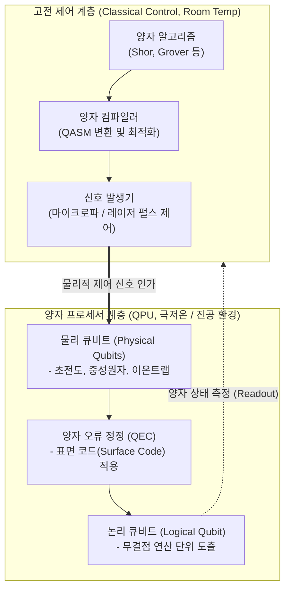

# 양자컴퓨터 (Quantum Computer)

---

## I. 초고속 병렬 연산의 패러다임, 양자컴퓨터의 개요

* **정의**: 중첩(Superposition)과 얽힘(Entanglement) 등 양자역학적 물리 현상을 활용하여 양자 비트(Qubit) 단위로 정보를 동시에 처리함으로써 기하급수적인 초고속 연산을 수행하는 차세대 컴퓨팅 시스템
* **필요성 및 등장배경**:
* **고전 컴퓨팅 한계 극복**: 실리콘 반도체 집적도의 물리적 한계(무어의 법칙 한계)를 양자 병렬성으로 돌파
* **난제 해결**: 신약 개발, 기후 시뮬레이션, 복잡한 물류 최적화 및 수학적 난제(Shor 알고리즘을 통한 소인수분해 등)의 다항 시간 내 해결
* **FTQC로의 진화**: 기존 노이즈가 있는 중간 규모(NISQ) 단계를 넘어, 양자 오류 정정(QEC) 기반의 결함 허용 양자 컴퓨팅(FTQC) 시대로 본격 진입 중

---

## II. 양자컴퓨터의 아키텍처 및 핵심 기술 요소

### 가. 양자컴퓨터의 아키텍처 및 동작 원리

* 고전 제어 계층에서 작성된 양자 알고리즘을 펄스 신호로 변환하여 극저온 또는 진공 상태의 물리 큐비트를 미세 제어함
* 다수의 불안정한 물리 큐비트를 양자 오류 정정(QEC) 코드로 묶어 에러율이 낮은 신뢰할 수 있는 하나의 '논리 큐비트'로 추상화하여 연산 무결성을 확보함

### 나. 양자컴퓨터의 핵심 기술 및 구성 요소

| 분류 | 요소기술(키워드) | 세부 설명 |
| --- | --- | --- |
| **양자 특성** | **양자 중첩 (Superposition)** | 0과 1의 상태가 확률적으로 동시에 존재하게 하여 기하급수적인 병렬 연산을 가능하게 하는 핵심 기반 |
| **양자 특성** | **양자 얽힘 (Entanglement)** | 두 큐비트 간 거리에 상관없이 한 큐비트의 상태가 다른 큐비트의 상태를 즉각 결정하는 물리적 상관관계 |
| **H/W 플랫폼** | **초전도 (Superconducting)** | 조셉슨 접합을 이용해 절대영도(mK) 환경에서 저항 없이 큐비트 구현. 연산 속도가 빠르며 IBM, Google 주도 |
| **H/W 플랫폼** | **중성원자 (Neutral Atom)** | 광학 집게(레이저)로 루비듐 등 중성원자를 포획해 제어. 3차원 확장이 용이하고 논리 큐비트 구현에 최근 두각 (QuEra 등) |
| **H/W 플랫폼** | **이온트랩 (Trapped Ion)** | 전자기장으로 이온을 진공에 가두어 제어. 상온 동작이 가능하고 결맞음(Coherence) 시간이 매우 길어 에러율이 낮음 |
| **오류 제어** | **QEC (양자 오류 정정)** | 표면 코드(Surface Code) 등을 이용하여 큐비트의 양자 상태 붕괴(Decoherence) 및 연산 에러를 실시간 탐지하고 복원 |
| **연산 진화** | **FTQC (결함 허용 연산)** | QEC를 통해 물리적 오류를 극복하고, 유의미한 규모의 논리 큐비트(Logical Qubit) 연산을 안정적으로 수행하는 양자 시스템 |
| **소프트웨어** | **양자 컴파일러 / QASM** | 고전 프로그래밍 언어로 작성된 회로를 특정 양자 하드웨어(QPU)의 물리적 제어 펄스 및 양자 어셈블리어로 변환 |

---

## III. 양자컴퓨터 하드웨어 플랫폼 비교 및 최신 동향

### 가. 3대 주요 양자 하드웨어 플랫폼 비교

| 비교 항목 | 초전도 (Superconducting) | 이온트랩 (Trapped Ion) | 중성원자 (Neutral Atom) |
| --- | --- | --- | --- |
| **동작 환경** | 절대영도 극저온 (mK 수준 유지용 냉각기 필수) | 상온 근처 (전자기장 진공 챔버) | 상온 근처 (광학 진공 챔버) |
| **핵심 제어 방식** | 마이크로파 펄스 인가 | 전자기장 포획 및 레이저 조사 | 광학 렌즈(광학 집게) 및 레이저 |
| **기술적 장점** | 가장 빠른 게이트 연산 속도, 기존 반도체 공정 활용 | 큐비트 간 연결성 우수, 양자 결맞음 유지 시간(수명)이 매우 긺 | 동일한 원자 특성으로 확장(Scale-up) 용이, 큐비트 동적 재배치 가능 |
| **대표 주자** | IBM (Condor), Google (Willow) | Quantinuum (Helios), IonQ | QuEra, Atom Computing |

### 나. 양자컴퓨터의 최신 기술 동향 및 산업 전망

* **논리 큐비트(Logical Qubit) 상용화 경쟁 본격화**: 최근 중성원자 방식(QuEra 등)과 초전도 방식(Google Willow)이 다수의 물리 큐비트를 묶어 오류를 정정하는 '논리 큐비트' 실증을 연이어 성공하며, FTQC 상용화 원년에 진입
* **하이브리드 컴퓨팅 아키텍처 도입**: 고전 슈퍼컴퓨터(HPC/[[GPU]])와 양자 프로세서(QPU)를 연동하여, 대규모 데이터 처리는 GPU가 담당하고 복잡한 최적화 난제만 양자컴퓨터로 오프로딩하는 클라우드 기반 하이브리드 연산 모델 확산
* **Q-Day 위협 대비 및 [[양자내성암호]](PQC) 전환 필수**: 양자컴퓨터의 성능 향상으로 기존 공개키 암호체계([[RSA (Rivest Shamir Adleman)|RSA]], [[ECC]]) 무력화 시점이 앞당겨짐에 따라, 글로벌 금융 및 공공 인프라를 중심으로 PQC(양자내성암호)로의 시스템 마이그레이션이 최우선 보안 과제로 부상

---

[양자컴퓨터 하드웨어 기술 경쟁 (YTN)](https://www.youtube.com/watch?v=OIrcP5MDxNQ&utm_source=gemini)
위 영상은 초전도, 이온트랩, 중성원자 등 최신 양자컴퓨터 하드웨어 플랫폼들의 각축전과 기술적 특징을 시각적으로 이해하는 데 도움을 줍니다.

---

### 🔗 연관 토픽

- **소속 도메인**: [[00_디지털서비스_MOC|🚀 디지털서비스]]
- **세부 분류**: `5. 기능안전 (Functional Safety) & 신뢰성 표준`
- **핵심 연관 토픽**:
  - [[암호화|암호화 (Encryption)]]
  - [[ECC|ECC(Elliptic Curve Cryptography)]]
  - [[양자내성암호]]
  - [[RSA (Rivest Shamir Adleman)]]
  - [[GPU]]
