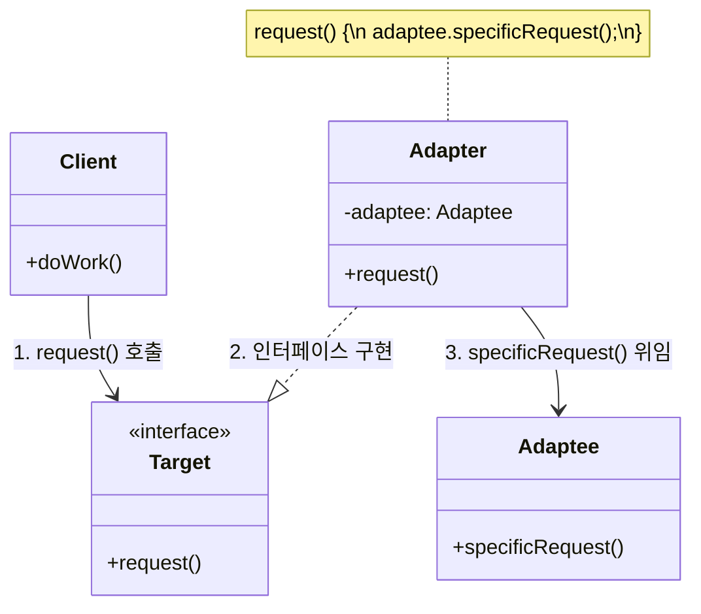

# 어댑터 패턴 (Adapter Pattern)

---

## I. 이기종 인터페이스 간의 호환성 보장, 어댑터 패턴의 개요

* **정의**: 호환되지 않는 인터페이스를 가진 객체들이 협업할 수 있도록 기존 클래스의 인터페이스를 클라이언트가 기대하는 인터페이스 형태로 변환하는 구조적(Structural) [[디자인 패턴]]
* **필요성 및 등장배경**:
* **코드 재사용성 극대화**: 기존 레거시 시스템이나 외부 서드파티 라이브러리의 소스코드 수정 없이 신규 시스템과 연동 필요
* **OCP(개방-폐쇄 원칙) 준수**: 비즈니스 로직의 변경 없이 새로운 어댑터 [[클래스]] 추가만으로 기능 확장 및 통합 가능

* **특징**: 래퍼(Wrapper) 역할, 객체 합성(Composition) 또는 클래스 상속(Inheritance) 방식 활용, 의존성 역전(DIP) 지원

---

## II. 어댑터 패턴의 아키텍처 및 핵심 구성요소

### 가. 어댑터 패턴의 아키텍처 및 동작 원리 (객체 어댑터 기준)

* 클라이언트는 Target 인터페이스만을 바라보고 `request()`를 호출함
* Adapter는 Target을 구현하면서, 내부에 포함된 Adaptee의 `specificRequest()`를 호출(위임)하여 인터페이스 불일치를 해소함

### 나. 어댑터 패턴의 핵심 기술 및 구성 요소

| 구분 | 핵심 요소 (키워드) | 세부 설명 |
| --- | --- | --- |
| **구성 요소** | **Target** | 클라이언트가 접근하기 위해 기대하는 표준화된 도메인 종속적 인터페이스 |
| **구성 요소** | **Client** | Target 인터페이스를 통해 외부 시스템과 상호작용하는 핵심 비즈니스 로직 |
| **구성 요소** | **Adaptee** | 연동 대상이 되는 기존 레거시 클래스나 외부 라이브러리 (호환되지 않는 인터페이스 보유) |
| **구성 요소** | **Adapter** | Target 인터페이스를 구현하고, 내부적으로 Adaptee를 호출하여 양방향 호환성을 제공하는 래퍼 클래스 |
| **구현 방식** | **객체 어댑터 (Object Adapter)** | 클래스 합성(Composition)과 위임(Delegation)을 활용하여 구현 (결합도가 낮아 널리 권장됨) |
| **구현 방식** | **클래스 어댑터 (Class Adapter)** | 다중 상속(Multiple Inheritance)을 활용하여 구현 (자바 등 단일 상속 언어에서는 사용 제약) |
| **설계 원칙** | **개방-폐쇄 원칙 (OCP)** | 기존 Client나 Adaptee의 코드를 변경하지 않고 Adapter 클래스만 추가하여 확장 가능 |
| **설계 원칙** | **단일 책임 원칙 (SRP)** | 데이터 변환 및 인터페이스 매핑 책임을 어댑터로 분리하여 메인 비즈니스 로직의 복잡도 감소 |

---

## III. 어댑터 패턴의 유사 패턴 비교 및 최신 아키텍처 활용 동향

### 가. 어댑터 패턴과 유사 구조적 디자인 패턴 비교

| 비교 항목 | Adapter (어댑터) | Facade (퍼사드) | Decorator (데코레이터) |
| --- | --- | --- | --- |
| **설계 목적** | 인터페이스 **변환 및 호환성 확보** | 복잡한 서브시스템 인터페이스 **단순화** | 객체에 동적으로 새로운 **기능 추가** |
| **래핑 대상** | 단일 객체 (호환되지 않는 객체) | 다수의 서브시스템 (객체 그룹) | 단일 객체 (동일한 인터페이스 유지) |
| **방향성** | 기존 인터페이스 $\rightarrow$ 목표 인터페이스 | 복잡성 $\rightarrow$ 단순성 (고수준 인터페이스 제공) | 기본 기능 $\rightarrow$ 부가 기능 런타임 적층 |
| **적용 시점** | 사후 (이미 존재하는 클래스 연동 시) | 사전/사후 (시스템 접근점 일원화 시) | 런타임 (동적인 기능 조합 필요 시) |

### 나. 최신 소프트웨어 아키텍처에서의 어댑터 패턴 활용 동향

* **헥사고날 아키텍처 (Ports and Adapters)**: 도메인 비즈니스 로직(내부 육각형)과 외부 인프라(DB, UI, 외부 API)를 완벽히 분리하기 위해 **인바운드/아웃바운드 어댑터**를 적용하여 의존성 역전 및 테스트 용이성 극대화
* **[[MSA (Micro Service Architecture)|MSA]] 부패 방지 계층 (ACL, Anti-Corruption Layer)**: 도메인 주도 설계([[DDD (Domain Driven Design)|DDD]])에서 레거시 시스템의 구형 데이터 모델이나 프로토콜이 신규 마이크로서비스 도메인을 오염시키지 않도록 중간에서 번역하는 어댑터 레이어 구축
* **클라우드 벤더 종속성(Lock-in) 회피**: 멀티 클라우드 환경에서 AWS, Azure 등 [[CSP]]별 상이한 스토리지/메시지 큐 API를 표준화된 내부 인터페이스로 래핑(Adapter 적용)하여 클라우드 전환 및 인프라 이관 시 유연성 확보

---

### 🔗 연관 토픽

- **소속 도메인**: [[00_소프트웨어공학_MOC|🏗️ 소프트웨어공학]]
- **세부 분류**: `4. 아키텍처 스타일 & 객체지향 설계 원리`
- **핵심 연관 토픽**:
  - [[MSA (Micro Service Architecture)]]
  - [[DDD (Domain Driven Design)]]
  - [[디자인 패턴|디자인 패턴 (Design Pattern)]]
  - [[Proxy Pattern|Proxy (대리자, 최근 기출)]]
  - [[클래스]]
