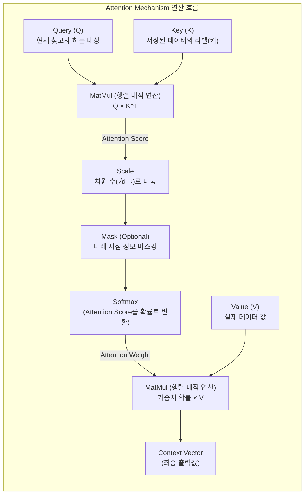

# 어텐션 매커니즘 (Attention Mechanism)

---

## I. 시퀀스 데이터의 장기 의존성 한계 극복, 어텐션 매커니즘의 개요

* **정의**: 입력 시퀀스의 전체 정보 중 특정 시점의 출력과 연관성이 높은 정보(단어 등)에 가중치(Attention Weight)를 동적으로 부여하여 문맥 벡터(Context Vector)를 생성하는 [[딥러닝]] 기법
* **등장배경**: 기존 [[RNN (Recurrent Neural Network)|RNN]]/[[LSTM (Long Short-Term Memory)|LSTM]] 기반 [[seq2seq|Seq2Seq]] 모델의 고정 크기 컨텍스트 벡터로 인한 정보 손실(Information Loss) 및 장기 의존성(Long-Term Dependency) 문제 발생
* **특징**: 동적 가중치 할당, Query-Key-Value 기반 연산, Transformer 모델 및 최신 [[초거대 언어 모델]](LLM)의 핵심 아키텍처로 활용

---

## II. 어텐션 매커니즘의 개념도 및 핵심 기술 요소

### 가. 어텐션 매커니즘의 아키텍처 및 동작 원리 (Scaled Dot-Product 기반)

* Query와 Key의 내적(Dot-product)을 통해 [[유사도]](Score)를 구하고, 이를 Softmax 함수를 거쳐 가중치(Weight)로 변환한 뒤 Value와 곱해 최종 문맥 벡터를 산출함

### 나. 어텐션 매커니즘의 핵심 구성 요소

| 구분 | 요소기술(키워드) | 세부 설명 |
| --- | --- | --- |
| **핵심 변수** | Query (Q) | 현재 시점에서 디코더(또는 기준점)가 필요로 하는 정보를 나타내는 벡터 |
| **핵심 변수** | Key (K) | 입력 시퀀스의 각 단어가 가지고 있는 고유한 속성(라벨)을 나타내는 벡터 |
| **핵심 변수** | Value (V) | 입력 시퀀스의 각 단어가 지니는 실제 정보(의미)를 담고 있는 벡터 |
| **연산 함수** | Attention Score | 특정 Query에 대해 모든 Key와의 유사도를 측정한 스칼라 값 (주로 내적 활용) |
| **연산 함수** | Softmax | Attention Score를 정규화하여 총합이 1이 되는 확률값(Attention Weight)으로 변환 |
| **주요 모델** | Self-Attention | Q, K, V가 모두 동일한 시퀀스에서 유래하여 문장 내 단어 간의 관계를 파악하는 기법 |
| **주요 모델** | Multi-Head Attention | 어텐션 연산을 병렬로 여러 개(Head) 배치하여 다양한 관점의 문맥 정보를 동시 학습 |
| **최적화 기법** | Masked Attention | 디코더 트레이닝 시 자기 시점 이후의(미래) 토큰을 참조하지 못하게 차단하는 기법 |

---

## III. 기존 기법과의 비교 및 LLM 시대 어텐션 최신 동향

### 가. 기본 Seq2Seq 모델과 어텐션 기반 모델의 비교

| 비교 항목 | 기본 Seq2Seq | Attention 기반 모델 (Transformer 등) |
| --- | --- | --- |
| **정보 압축 방식** | 고정 크기 벡터 (Context Vector)에 전체 압축 | 시점마다 다른 동적(Dynamic) 벡터 생성 |
| **장기 의존성** | 시퀀스가 길어질수록 앞부분 정보 소실 심화 | 거리에 상관없이 중요한 토큰에 직접 참조 가능 |
| **연산 방식** | 순차적(Sequential) 연산 처리 (RNN/LSTM) | 행렬 연산 기반 병렬(Parallel) 처리 가능 |
| **번역/생성 품질** | 긴 문장에서 품질이 급격히 하락 | 문장 길이에 구애받지 않고 높은 품질 유지 |

### 나. 최신 LLM 아키텍처 관점의 어텐션 발전 동향

* **메모리 최적화 추론 (MQA/GQA)**: 초거대 AI 추론 시 KV Cache 메모리 폭증 문제를 해결하기 위해, 다중 Query가 동일한 K, V를 공유하는 Multi-Query Attention이나 그룹핑하는 Grouped-Query Attention이 Llama 3 등 최신 모델의 표준으로 채택됨
* **하드웨어 친화적 연산 (FlashAttention)**: [[GPU]]의 [[HBM]](메모리)과 SRAM(캐시) 간의 데이터 이동(I/O 병목)을 최소화하기 위해 타일링(Tiling) 기법을 적용, 어텐션 연산 속도를 획기적으로 개선하여 Long-Context LLM 구현을 견인함

---

### 🔗 연관 토픽

- **소속 도메인**: [[00_인공지능_MOC|🤖 인공지능]]
- **세부 분류**: `3. 딥러닝 핵심 아키텍처 & 신경망`
- **핵심 연관 토픽**:
  - [[초거대 언어 모델|초거대 언어 모델(Large Language Model)]]
  - [[딥러닝]]
  - [[RNN (Recurrent Neural Network)]]
  - [[LSTM (Long Short-Term Memory)]]
  - [[seq2seq]]
