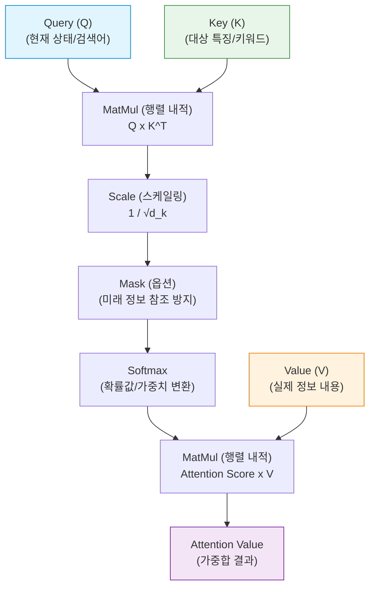

# 어텐션 메커니즘 (Attention Mechanism)

---

## I. LLM 문맥 이해의 핵심 원리, 어텐션 메커니즘의 개요

* **정의**: 시퀀스 데이터(자연어, 이미지 등) 처리 시 출력 결과를 예측할 때, 입력 데이터의 모든 부분을 동일하게 보지 않고 **연관성이 높은 특정 부분에 가중치(Attention)를 두어 집중**하게 하는 [[딥러닝]] 메커니즘
* **등장배경 및 특징**:
* **정보 손실 한계 극복**: 기존 [[seq2seq|Seq2Seq]] 모델의 고정 길이 컨텍스트 벡터(Context Vector) 병목 현상 해결
* **장기 의존성(Long-term Dependency) 문제 해결**: 입력 시퀀스가 길어져도 [[RNN (Recurrent Neural Network)|RNN]]의 기울기 소실 문제 없이 중요 정보 보존
* **설명 가능성 향상**: 어텐션 스코어(가중치)를 통해 모델이 어느 정보에 집중했는지 시각적 해석 가능

---

## II. 어텐션 메커니즘의 아키텍처 및 핵심 기술 요소

### 가. 어텐션 메커니즘 (Scaled Dot-Product Attention) 동작 원리

* Query(찾고자 하는 값)와 Key(정보의 위치)를 내적하여 [[유사도]](Score)를 구하고, 이를 Softmax 연산 후 Value(실제 정보)와 가중합(Weighted Sum)하여 최종 결과를 산출함
* 내적 값이 지나치게 커져 Softmax의 기울기가 소실되는 것을 방지하기 위해 키 차원의 제곱근($\sqrt{d_k}$)으로 스케일링 수행

### 나. 어텐션 메커니즘의 핵심 기술 요소

| 구분 | 요소기술(키워드) | 세부 설명 |
| --- | --- | --- |
| **핵심 연산체** | **Q, K, V** | 정보 검색 구조를 차용. Query(기준), Key(검색 대상), Value(실제 데이터)로 입력 벡터 [[추상화]] |
| **유사도 연산** | **Scaled Dot-Product** | Q와 K의 전치행렬 내적 후, 차원 크기($\sqrt{d_k}$)로 나누어 기울기 소실(Vanishing Gradient) 방지 |
| **문맥 인지** | **Self-Attention** | Q, K, V가 모두 동일한 입력 시퀀스에서 유래하여 단어들 간의 내부 연관성과 문맥적 의미 파악 |
| **성능 확장** | **Multi-Head Attention** | 어텐션 연산을 병렬로 여러 개(Head) 구성하여, 모델이 다양한 관점(시제, 주어/동사 등)의 특징을 동시 학습 |
| **디코더 특화** | **Masked Attention** | 디코더 예측 시 순차적 특성을 유지하기 위해 미래 시점의 단어들을 참고하지 못하도록 마스킹(음의 무한대 처리) |
| **메모리 최적화** | **KV Cache** | 생성형 AI 추론 시 중복 연산을 피하기 위해 이전에 계산된 Key와 Value 텐서를 메모리에 캐싱 |
| **주의집중 패턴** | **Local / Global Attention** | 모든 입력 토큰을 참조(Global)하거나 특정 윈도우 크기 내의 토큰만 참조(Local)하여 연산량 조절 |
| **정규화** | **Softmax 함수** | 산출된 내적 점수(Score)를 0~1 사이의 확률값으로 정규화하여 각 단어의 기여도(가중치) 결정 |

---

## III. 최신 LLM에서의 어텐션 최적화 기술 비교 및 동향

### 가. LLM 추론 메모리 최적화를 위한 어텐션 변형 아키텍처 비교

| 비교 항목 | MHA (Multi-Head Attention) | MQA (Multi-Query Attention) | GQA (Grouped-Query Attention) |
| --- | --- | --- | --- |
| **구조 특성** | 모든 Query 헤드가 각각 고유한 Key, Value 헤드를 가짐 | **모든 Query 헤드가 단 1개의 Key, Value 헤드를 공유** | **Query 헤드들을 그룹(Group)화하여 그룹당 1개의 K, V 공유** |
| **추론 속도** | 느림 (메모리 대역폭 병목) | **매우 빠름** | 빠름 |
| **성능 (정확도)** | **가장 높음** | 다소 낮음 (표현력 감소) | MHA에 근접한 수준 달성 |
| **KV Cache 용량** | 매우 큼 (VRAM 부족 유발) | 가장 작음 (극단적 메모리 절약) | 적음 (성능과 메모리의 타협점) |
| **적용 모델 예시** | GPT-3, 초기 Transformer | PaLM, StarCoder | **Llama 2/3, Mistral** |

### 나. 어텐션 메커니즘의 향후 전망 및 기술 동향

* **FlashAttention 표준화**: [[GPU]]의 SRAM과 [[HBM]] 간의 데이터 이동(Memory IO) 병목을 극복하기 위해, 타일링(Tiling) 기법을 적용한 하드웨어 친화적 어텐션 [[알고리즘]](FlashAttention 2, 3)이 최신 [[초거대 언어 모델|LLM]] 학습/추론의 기본 탑재 기술로 자리매김함
* **초장문(Long-Context) 윈도우 지원**: 수백만 토큰(1M+)을 한 번에 처리하기 위해 기존 $O(N^2)$의 연산 복잡도를 지닌 어텐션을 선형적 복잡도($O(N)$)로 낮추는 Sparse Attention, Ring Attention 기법 발전
* **Transformer 대안 아키텍처의 등장**: 어텐션 연산량 급증 문제를 원천 해결하기 위해, Mamba(SSM, 상태공간모델), RWKV와 같이 RNN의 특성을 결합한 Non-Attention 기반 병렬 처리 모델 아키텍처 연구 부상

---

### 🔗 연관 토픽

- **소속 도메인**: [[00_인공지능_MOC|🤖 인공지능]]
- **세부 분류**: `3. 딥러닝 핵심 아키텍처 & 신경망`
- **핵심 연관 토픽**:
  - [[seq2seq]]
  - [[초거대 언어 모델|초거대 언어 모델(Large Language Model)]]
  - [[딥러닝]]
  - [[RNN (Recurrent Neural Network)]]
  - [[GPU]]
