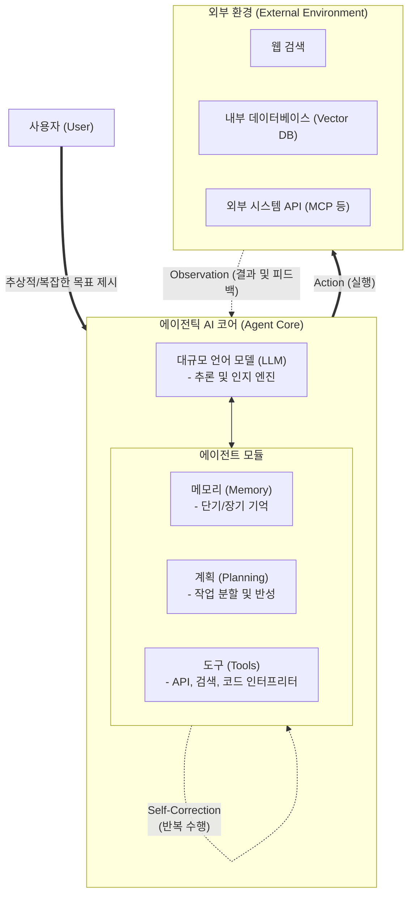

# 에이전틱 AI (Agentic AI)

---

## I. 자율적 문제 해결을 위한 능동형 인공지능, 에이전틱 AI의 개요

* **정의**: 대규모 언어 모델([[초거대 언어 모델|LLM]])을 두뇌(Brain)로 삼아, 인간의 개입 없이 스스로 목표를 분할(Planning)하고 도구를 활용(Tool Use)하며 결과를 반성(Reflection)하여 최종 목표를 달성하는 자율형 [[인공지능]] 시스템
* **필요성 및 등장배경**:
* **단순 생성형 AI의 한계 극복**: 1회성 프롬프트-응답 구조의 수동적 챗봇을 넘어, 복잡한 다단계 비즈니스 워크플로우의 완전 자동화 요구 증대
* **환각(Hallucination) 감소 및 [[신뢰성]] 확보**: 검색 증강 생성(RAG)과 더불어, 외부 API 호출 및 코드 실행, 자기 검증(Self-Correction)을 통해 환각을 억제하고 실행력 확보

* **특징**: 목표 지향성, 능동적 환경 상호작용, 자기 반성 및 학습, 멀티 에이전트 협업 체계

---

## II. 에이전틱 AI의 개념도 및 핵심 기술 요소

### 가. 에이전틱 AI의 아키텍처 및 동작 원리

* 사용자가 추상적인 목표를 주면, 에이전트는 LLM을 기반으로 계획(Plan)을 세우고, 메모리를 참조하며, 외부 도구를 호출하여 액션(Action)을 수행함
* 액션의 결과를 관찰(Observation)하고 목표 달성 여부를 스스로 반성(Reflection)하여 계획을 수정하는 피드백 루프(Loop)로 동작함

### 나. 에이전틱 AI의 핵심 기술 및 구성 요소

| 구분 | 요소 기술 (키워드) | 세부 설명 |
| --- | --- | --- |
| **두뇌 / 인지** | **LLM (Large Language Model)** | 에이전트의 중심에서 컨텍스트를 이해하고 의사결정(Reasoning)을 수행하는 지능 코어 엔진 |
| **추론 및 계획** | **Planning & Reflection** | 복잡한 작업을 하위 태스크로 분할([[COT|CoT]], [[ToT]])하고, 실행 결과를 평가하여 스스로 오류를 수정하는 자기 반성 기법 |
| **도구 활용** | **Function Calling / Tool Use** | LLM이 외부 웹 검색, 계산기, 코드 실행기, 사내 시스템 API 등을 스스로 호출하고 결과를 해석하는 기술 |
| **기억 장치** | **Memory (단기 / 장기)** | 단기 기억(현재 세션의 프롬프트 컨텍스트)과 장기 기억(Vector DB를 통한 과거 경험 및 지식)의 통합 관리 |
| **실행 및 관찰** | **Action & Observation** | ReAct(Reasoning and Acting) 프레임워크를 기반으로 환경과 상호작용하고 상태 변화를 인지하는 메커니즘 |
| **협업 체계** | **Multi-Agent System ([[MAS (Multi Agent System)|MAS]])** | 코더, 리뷰어, 기획자 등 각기 다른 역할을 부여받은 다수의 에이전트가 상호 소통하며 협업 (AutoGen, CrewAI) |
| **데이터 연동** | **[[MCP|MCP (Model Context Protocol)]]** | AI 에이전트가 안전하고 표준화된 방식으로 외부 데이터 소스 및 로컬 환경과 통신하기 위한 개방형 [[프로토콜]] |
| **[[프레임워크]]** | **LangChain / LlamaIndex** | 에이전틱 워크플로우를 구현하고 LLM과 다양한 도구, 메모리를 결합하기 위한 애플리케이션 개발 프레임워크 |

---

## III. 전통적 생성형 AI와의 비교 및 최신 동향

### 가. 전통적 생성형 AI(대화형)와 에이전틱 AI 비교

| 비교 항목 | 전통적 생성형 AI (Chatbot) | 에이전틱 AI (Autonomous Agent) |
| --- | --- | --- |
| **작동 방식** | 수동적 (사용자의 프롬프트에 단발성 응답) | **능동적 / 자율적** (스스로 목표 달성 시까지 순환 실행) |
| **문제 해결 방식** | 단일 스텝 추론 (Single-step) | **다단계 계획 및 실행 (Multi-step Planning)** |
| **외부 연동성** | 제한적 (사전 학습된 가중치에 주로 의존) | **적극적** (외부 도구, API, 코드 인터프리터 주도적 활용) |
| **오류 제어** | 사용자의 후속 프롬프트를 통한 수동 정정 | **자기 반성(Self-Reflection)을 통한 자동 오류 수정** |

### 나. 에이전틱 AI의 최신 트렌드 및 향후 전망

* **에이전틱 워크플로우(Agentic Workflow)의 표준화**: 단순한 제로샷(Zero-shot) 프롬프팅을 넘어, 앤드류 응(Andrew Ng)이 제안한 4대 패턴(Reflection, Tool Use, Planning, Multi-agent Collaboration)이 엔터프라이즈 AI 아키텍처의 표준으로 정착 중
* **멀티 에이전트 협업(Multi-Agent Collaboration) 가속화**: 단일 에이전트의 환각 및 성능 한계를 극복하기 위해, Microsoft AutoGen, CrewAI 등을 활용하여 '작업자-검토자-관리자' 형태의 자율 에이전트 조직 구성 확산
* **[[범용 인공지능]]([[AGI]])으로의 진화 촉매**: RPA(Robotic Process Automation) 영역이 에이전틱 AI와 결합된 지능형 자동화(Hyperautomation)로 진화 중이며, 이는 사용자 지시 없이도 환경 변화에 적응하는 AGI를 향한 핵심 마일스톤으로 평가됨

---

### 🔗 연관 토픽

- **소속 도메인**: [[00_인공지능_MOC|🤖 인공지능]]
- **세부 분류**: `2. 머신러닝 기초 & 핵심 알고리즘`
- **핵심 연관 토픽**:
  - [[인공지능]]
  - [[범용 인공지능]]
  - [[전용 인공지능]]
  - [[AGI|AGI (Artificial General Intelligence)]]
  - [[MAS (Multi Agent System)]]
