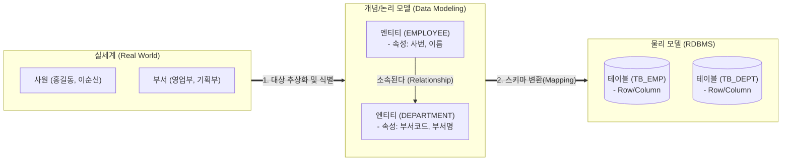

# 엔티티 (Entity)

---

## I. 실세계 정보의 논리적 추상화 단위, 엔티티의 개요

* **정의**: 비즈니스 업무를 수행하는 데 있어 관심의 대상이 되며, 실세계에서 독립적으로 존재하고 고유하게 식별 가능한 객체 또는 개념의 논리적 집합
* **필요성 및 특징**:
* **데이터 모델링의 근간**: ER(Entity-Relationship) 모델을 구성하는 최소이자 핵심 단위로 물리적 테이블(Table)로 매핑됨
* **정보의 집합체**: 반드시 2개 이상의 [[인스턴스]](Instance)와 2개 이상의 속성(Attribute)을 포함해야 함
* **명확한 식별성**: 각 인스턴스는 유일한 식별자(Identifier)에 의해 고유하게 구별되어야 함

---

## II. 엔티티의 도출 과정 및 핵심 기술 요소

### 가. 엔티티의 데이터 모델링 추상화 및 변환 과정

* 실세계의 비즈니스 요건을 추상화하여 논리적 구조인 '엔티티'와 '속성'으로 도출함
* 논리 모델의 엔티티는 물리 설계 단계를 거쳐 RDBMS의 '테이블(Table)'로, 인스턴스는 '행(Row)'으로 매핑됨

### 나. 엔티티의 핵심 구성 요소 및 분류

| 분류 | 요소 기술 (키워드) | 세부 설명 |
| --- | --- | --- |
| **구성 요소** | **인스턴스 (Instance)** | 엔티티를 구성하는 구체적인 단일 데이터 객체 (물리 모델의 Row/Tuple에 해당) |
| **구성 요소** | **속성 (Attribute)** | 엔티티가 가지는 고유한 성질이나 상태 정보 (물리 모델의 Column에 해당) |
| **구성 요소** | **식별자 (Identifier)** | 엔티티 내의 각 인스턴스를 유일하게 구별할 수 있는 논리적 이름 (물리 모델의 PK) |
| **존재 의존성** | **강한 엔티티 (Strong)** | 자신의 고유한 식별자로 존재를 증명할 수 있는 독립적인 주체 (부모 엔티티) |
| **존재 의존성** | **약한 엔티티 (Weak)** | 부모 엔티티의 식별자를 상속(식별 관계)받아야만 존재할 수 있는 종속적 주체 |
| **관계 해소** | **교차 엔티티 (Associative)** | 다대다(M:N) 관계를 1:M, M:1 관계로 해소하기 위해 인위적으로 도출된 엔티티 |
| **발생 시점** | **기본/중심/행위 엔티티** | 데이터 생성 흐름에 따라 키(Key) 엔티티, 메인 비즈니스 엔티티, [[트랜잭션]] 엔티티로 분류 |
| **도출 원칙** | **명명 규칙 (Naming Rule)** | 현업 비즈니스 용어 사용, 단수형 명사 부여, 엔티티명 유일성 보장 및 약어 지양 |

---

## III. 패러다임 변화에 따른 엔티티 개념 비교 및 최신 동향

### 가. 전통적 데이터 모델(ERD) vs 도메인 주도 설계(DDD)의 엔티티 비교

| 비교 항목 | 데이터 모델링 관점 (DB Entity) | 도메인 주도 설계 관점 ([[DDD (Domain Driven Design)|DDD]] Entity) |
| --- | --- | --- |
| **설계 목적** | 데이터의 **저장 구조 및 [[무결성]]** 최적화 (정규화) | 비즈니스 **도메인 규칙 및 행위** [[캡슐화]] |
| **핵심 구성** | 속성(데이터)의 집합 | 데이터(상태) + **메서드(행위)** |
| **식별성 유지** | 기본키(PK)를 통한 튜플 단위 식별 | 식별자가 동일하면 속성이 변해도 **동일 객체로 취급** |
| **관계 표현** | 외래키(FK)를 통한 테이블 [[조인|조인(Join)]] 구조 | **애그리거트 루트(Aggregate Root)** 중심의 참조 구조 |

### 나. 엔티티 기술의 최신 산업 적용 동향 및 전망

* **[[MSA (Micro Service Architecture)|MSA]] 전환에 따른 엔티티 분리**: 모놀리식 DB의 거대 엔티티들이 마이크로서비스(MSA) 전환 시 도메인 바운디드 컨텍스트(Bounded Context)에 따라 분리·중복 설계되며, 이벤트 소싱(Event Sourcing)을 통한 최종 일관성(Eventual Consistency) 유지로 발전
* **AI 및 지식 그래프(Knowledge Graph)의 개체명(NER) 활용**: [[초거대 언어 모델|LLM]] 및 검색 증강 생성(RAG) 고도화를 위해 비정형 텍스트에서 '엔티티(사람, 장소, 조직 등)'를 추출하고 관계를 벡터화하여 그래프 DB에 저장하는 형태로 데이터 자산화의 개념이 진화 중

---

### 🔗 연관 토픽

- **소속 도메인**: [[00_데이터베이스_MOC|🗄️ 데이터베이스]]
- **세부 분류**: `1. 데이터 모델링 & 관계형 DB 설계`
- **핵심 연관 토픽**:
  - [[스키마]]
  - [[조인|조인(Join)]]
  - [[NoSQL 데이터모델링 패턴]]
  - [[릴레이션 키|릴레이션 키(Key)]]
  - [[연결함정|연결함정(Connection Trap)]]
