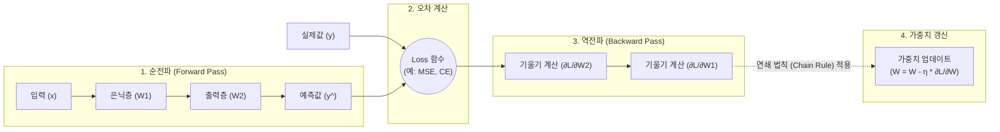

# 역전파 (Backpropagation)

---

## I. 인공신경망 최적화의 핵심 메커니즘, 역전파의 개요

* **정의**: 인공신경망의 출력 계층에서 발생한 오차를 최소화하기 위해 미분의 연쇄 법칙(Chain Rule)을 활용하여, 출력층에서 입력층 방향으로 기울기(Gradient)를 역으로 전달하며 파라미터(가중치/[[편향]])를 갱신하는 [[딥러닝]] 학습 [[알고리즘]]
* **필요성 및 등장배경**:
* **다층 신경망 학습 한계 극복**: 단층 퍼셉트론의 비선형(XOR) 분류 한계를 극복하기 위해 다층 퍼셉트론(MLP)의 은닉층 가중치를 효과적으로 학습할 메커니즘 필요
* **연산 복잡도 최소화**: 체인 룰(Chain Rule)을 활용하여 깊은 신경망의 수십억 개 파라미터 미분값을 효율적으로 연산
* **오차 최소화**: 예측값과 실제값의 차이(Loss)를 [[경사하강법]](Gradient Descent)을 통해 글로벌 최적해로 점진적 수렴

---

## II. 역전파의 아키텍처 및 핵심 구성요소

### 가. 역전파의 동작 메커니즘 및 개념도

* 입력값을 통한 순전파 진행 시 각 노드의 활성화 값(Activation)을 캐싱하여 저장함
* 오차(Loss) 산출 후, 출력층에서 입력층 방향으로 국소 미분값을 곱해 나가는 연쇄 법칙으로 기울기를 도출하여 가중치를 갱신함

### 나. 역전파의 핵심 기술 요소

| 구분 | 요소기술(키워드) | 세부 설명 |
| --- | --- | --- |
| **수학적 원리** | **편미분 (Partial Derivative)** | 전체 오차(Loss) 함수를 특정 가중치 변수에 대해서만 미분하여 오차의 변화량과 기울기를 정량적으로 측정 |
| **수학적 원리** | **연쇄 법칙 (Chain Rule)** | 합성함수의 미분 성질을 이용하여, 층별 국소 미분값들의 단순 곱셈만으로 최종 노드의 그래디언트를 도출 |
| **연산 과정** | **순전파 (Forward Pass)** | 입력에서 출력 방향으로 연산하며 예측값을 산출하고, 역전파 계산에 필요한 노드별 연산 결과값을 캐시(Cache)에 저장 |
| **연산 과정** | **비용 함수 (Cost Function)** | 실제 정답(Label)과 예측값 간의 차이를 수치화. 회귀는 MSE(평균제곱오차), 분류는 CE(교차엔트로피)를 주로 사용 |
| **최적화 기법** | **경사하강법 (Gradient Descent)** | 산출된 기울기 방향의 역방향으로 가중치를 이동시켜 신경망 전체의 손실(Loss)을 최소값(Global Minima)으로 수렴 |
| **하이퍼파라미터** | **학습률 (Learning Rate)** | 가중치를 갱신할 때 이동하는 보폭(Step Size). 과도하면 발산하고, 부족하면 학습 속도 저하 및 지역 최적해(Local Minima)에 빠짐 |
| **학습 안정화** | **가중치 초기화 (Initialization)** | Xavier, He 초기화 등을 적용하여 학습 초기 역전파 시 발생할 수 있는 신호 폭주나 소실을 사전 차단 |
| **문제점 극복** | **비선형 활성화 함수 (ReLU)** | 깊은 계층에서 Sigmoid 함수 사용 시 기울기가 0으로 수렴하는 기울기 소실(Vanishing Gradient) 현상을 방지 |

---

## III. 역전파의 한계 및 최신 최적화 기술 동향

### 가. 역전파의 구조적 한계점

* **메모리 오버헤드**: 역전파 시 그래디언트를 계산하기 위해 순전파 단계의 활성화(Activation) 텐서들을 메모리(VRAM)에 모두 유지해야 하므로 대규모 모델에서 메모리 낭비 심각
* **병렬화 병목**: 출력층에서 입력층으로 기울기가 순차적(Sequential)으로 전달되어야만 가중치 갱신이 가능하므로, 멀티 [[GPU]] 환경에서 파이프라인의 유휴 시간 발생

### 나. 한계 극복을 위한 최신 대안 알고리즘 및 튜닝 기술

* **BP-Free(역전파 대체) 알고리즘 연구 가속**: 제프리 힌튼(Geoffrey Hinton)의 **Forward-Forward(FF) 알고리즘** 및 NoProp 등은 글로벌 오차 전달(Backward Pass) 없이 층별 로컬 학습 메커니즘만을 이용해 생물학적 뇌 구조와 유사하게 학습하며 메모리 비용을 대폭 절감함
* **[[초거대 언어 모델|LLM]] 훈련을 위한 역전파 하드웨어 최적화**: GPU 메모리 한계를 극복하기 위해 그래디언트 계산 시 필요한 부분만 다시 연산하는 **Activation Checkpointing (재계산)** 기법과, 역전파 과정의 메모리 I/O 병목을 타일링(Tiling)으로 최소화하는 **FlashAttention Backward** 기술이 현재 거대 AI 모델 최적화의 필수 표준으로 정착 중임

---

### 🔗 연관 토픽

- **소속 도메인**: [[00_인공지능_MOC|🤖 인공지능]]
- **세부 분류**: `2. 머신러닝 기초 & 핵심 알고리즘`
- **핵심 연관 토픽**:
  - [[딥러닝]]
  - [[경사하강법|경사하강법 (Gradient Descent Algorithm)]]
  - [[지도학습]]
  - [[랜덤 포레스트|랜덤 포레스트 (Random Forest)]]
  - [[편향]]
