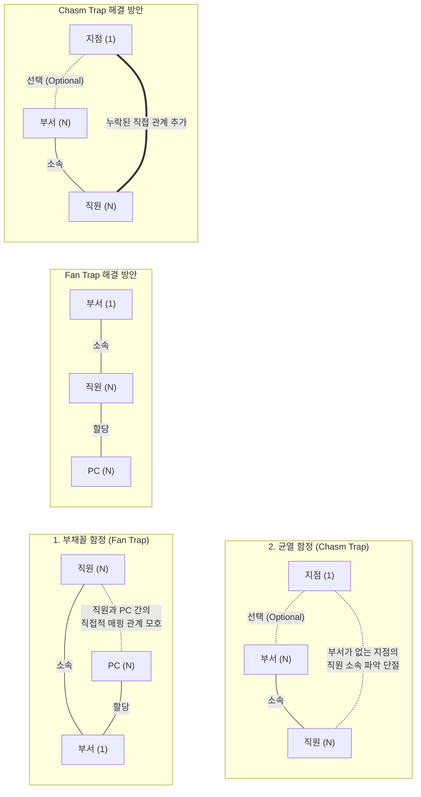

# 연결함정 (Connection Trap)

---

## I. 엔티티 간 조인 경로의 모호성, 연결함정의 개요

* **정의**: [[데이터베이스]] 논리적 모델링(ERD) 과정에서 [[엔티티|엔티티(Entity)]] 간의 관계(Relationship) 설정이 모호하거나 누락되어, [[SQL(Structured Query Language)|SQL]] [[조인|조인(Join)]] 시 정확한 데이터 검색이 불가능해지는 모델링 오류 현상
* **발생 배경 및 특징**:
* **논리적 설계 결함**: 업무 규칙(Business Rule)에 대한 이해 부족으로 다중 1:N 관계를 오배치하거나 선택적(Optional) 관계를 방치함
* **정보 유실 및 왜곡**: 쿼리 수행 시 카테시안 곱(Cartesian Product)에 의한 불필요한 데이터 폭증이나 경로 단절에 의한 데이터 조회 누락 발생

---

## II. 연결함정의 개념도 및 핵심 해결 방안

### 가. 연결함정의 유형별 모델링 개념도

* 부채꼴 함정(Fan Trap)은 구조적 재배치를 통해 해결하며, 균열 함정(Chasm Trap)은 단절된 구간에 직접적인 관계 선을 추가하여 해결함

### 나. 연결함정 유형별 문제점 및 핵심 해결 방안

| 구분 | 요소 (키워드) | 세부 설명 |
| --- | --- | --- |
| **유형** | **Fan Trap (부채꼴 함정)** | 두 개 이상의 엔티티가 하나의 엔티티와 각각 1:N 관계를 맺고 있는 구조 |
| **Fan Trap** | **발생 원인** | 중심 엔티티(1)에 여러 하위 엔티티(N)가 독립적으로 병렬 연결됨 |
| **Fan Trap** | **발생 문제점** | 하위 엔티티들 간에 직접적인 조인 경로가 없어 M:N 형태의 카테시안 곱 발생 |
| **Fan Trap** | **해결 방안** | 업무 흐름을 재분석하여 엔티티 간의 계층적 관계를 순차적(직렬)으로 재배치 |
| **유형** | **Chasm Trap (균열 함정)** | 엔티티 간의 연결 경로 중간에 선택적(Optional) 참여 관계가 존재하는 구조 |
| **Chasm Trap** | **발생 원인** | 특정 인스턴스에 값이 존재하지 않을 수 있는 부분 참여 조건 설정 |
| **Chasm Trap** | **발생 문제점** | 중간 엔티티의 인스턴스가 비어있을(Null) 경우, 연결된 양방향의 데이터 검색 경로 단절 |
| **Chasm Trap** | **해결 방안** | 단절을 유발하는 두 끝단 엔티티 사이에 논리적으로 누락된 직접 관계(Relationship) 추가 |
| **검증 방안** | **모델링 검수 및 역정규화** | ERD 완료 후 [[트랜잭션]] 패스(Transaction Path) 분석 및 필요시 식별자 상속/역정규화 수행 |

---

## III. 데이터베이스 패러다임별 관계(Relationship) 처리 비교

### 가. 전통적 RDBMS와 차세대 그래프 DB(Graph DB)의 관계 모델링 비교

| 비교 항목 | RDBMS (관계형 데이터베이스) | Graph DB (그래프 데이터베이스) |
| --- | --- | --- |
| **관계 표현 방식** | **외래키(Foreign Key) 및 조인(Join)** | **엣지([[EDGE|Edge]] / Relationship)** 형태의 명시적 선 |
| **연결함정 취약성** | 높음 (ERD 설계 오류 시 바로 함정 발생) | **원천 차단** (모든 관계가 일급 객체로 다뤄짐) |
| **성능 병목 요인** | 다중 테이블 조인 시 카테시안 곱 연산 부하 | 노드 간 연결(Traversal) 기반으로 고속 탐색 가능 |
| **최신 활용 동향** | 정형 데이터의 [[무결성]](ACID) 중심 트랜잭션 | 지식 그래프(Knowledge Graph), 추천 시스템, 사기 탐지 |

* **시사점**: 복잡한 네트워크 연관성 분석이 필수적인 최신 AI 및 빅데이터 환경에서는 RDBMS의 조인 성능 저하 및 연결함정의 한계를 극복하기 위해, 데이터 간의 연결(Connection) 자체를 최우선으로 취급하는 그래프 DB 도입이 가속화되고 있음

---

### 🔗 연관 토픽

- **소속 도메인**: [[00_데이터베이스_MOC|🗄️ 데이터베이스]]
- **세부 분류**: `1. 데이터 모델링 & 관계형 DB 설계`
- **핵심 연관 토픽**:
  - [[데이터베이스]]
  - [[엔티티|엔티티(Entity)]]
  - [[조인|조인(Join)]]
  - [[무결성]]
  - [[트랜잭션]]
