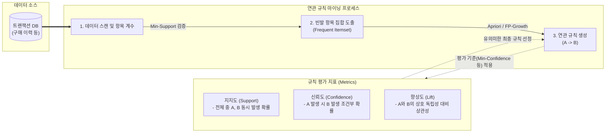

# 연관성 분석 (Association Analysis)

---

## I. 숨겨진 데이터 패턴 탐색, 연관성 분석의 개요

* **정의**: 대규모 데이터베이스의 [[트랜잭션]] 내에서 특정 항목들이 동시에 발생하는 패턴, 규칙(Rule), 연관성을 찾아내는 무감독 학습(Unsupervised Learning) 기반 [[데이터 마이닝]] 기법
* **필요성 및 특징**:
* **교차 판매(Cross-selling) 기회 창출**: 장바구니 분석(Market Basket Analysis)을 통한 상품 추천 및 매장 진열 최적화에 필수적
* **직관적 해석 가능**: 도출된 규칙(A $\rightarrow$ B)이 명확하여 비즈니스 의사결정에 직각적인 적용 가능
* **평가 지표 기반 필터링**: [[지지도]](Support), 신뢰도(Confidence), 향상도(Lift)를 통해 무의미한 규칙을 가지치기(Pruning)함

---

## II. 연관성 분석의 개념도 및 핵심 기술 요소

### 가. 연관성 분석의 개념도 및 동작 원리

* 트랜잭션 데이터에서 최소 지지도(Min-Support) 이상의 빈발 항목 집합을 추출하고, 알고리즘을 통해 규칙을 생성함
* 도출된 규칙은 신뢰도와 향상도를 기준으로 평가하여, 우연에 의한 결과(Lift=1)를 배제하고 유의미한 연관 규칙을 최종 선정함

### 나. 연관성 분석의 핵심 기술 및 구성 요소

| 구분 | 요소기술(키워드) | 세부 설명 |
| --- | --- | --- |
| **평가 지표** | **지지도 (Support)** | 전체 트랜잭션 중 항목 A와 B가 동시에 포함된 비율 ($P(A \cap B)$) |
| **평가 지표** | **신뢰도 (Confidence)** | 항목 A가 포함된 트랜잭션 중 항목 B가 포함될 확률 ($P(B\Vert{}A)$) |
| **평가 지표** | **향상도 (Lift)** | A와 B가 독립일 때 대비 함께 발생할 확률 비. 1보다 크면 양의 상관관계 |
| **핵심 [[알고리즘]]** | **Apriori** | 빈발 항목의 부분 집합도 빈발하다는 원리 활용. 반복적인 DB 스캔과 후보(Candidate) 생성 수행 |
| **핵심 알고리즘** | **FP-Growth** | 트리 구조(FP-Tree)를 활용하여 후보군 생성 없이 단 2번의 DB 스캔만으로 고속 연산 |
| **핵심 알고리즘** | **Eclat** | 데이터를 수직(Vertical) 포맷(항목-트랜잭션ID)으로 변환 후 교집합 연산을 통해 빈발 항목 추출 |
| **확장 기법** | **순차 패턴 마이닝 (SPM)** | 시간의 흐름(Sequence)을 고려하여 선후 관계가 있는 연관성 탐색 (GSP, PrefixSpan 알고리즘) |
| **분산 처리** | **Spark MLlib FPGrowth** | 대규모 빅데이터 환경에서 RDD/DataFrame 기반으로 병렬 연관성 분석을 수행하는 라이브러리 |

---

## III. 연관성 분석 알고리즘 비교 및 최신 활용 동향

### 가. 대표적 연관성 분석 알고리즘 비교 (Apriori vs FP-Growth)

| 비교 항목 | [[Apriori 알고리즘]] | FP-Growth 알고리즘 |
| --- | --- | --- |
| **작동 원리** | 후보 생성(Candidate Generation) 및 검증 | 분할 정복(Divide & Conquer) 및 FP-Tree 구축 |
| **DB 스캔 횟수** | 트랜잭션 최대 길이만큼 **반복 스캔 ($k$번)** | 트리 구축을 위해 **단 2회만 스캔** |
| **메모리 사용량** | 막대한 후보 항목 집합 저장으로 메모리 부하 큼 | FP-Tree 구조 압축 저장으로 메모리 효율적 |
| **처리 속도/규모** | 데이터가 클수록 기하급수적 성능 저하 (느림) | 대규모 데이터셋 처리에 매우 적합 (빠름) |

### 나. 연관성 분석의 향후 전망 및 산업 적용 동향

* **협업 필터링(CF)과의 하이브리드 추천**: 기존 연관성 분석의 콜드 스타트(Cold Start) 문제를 해결하기 위해, 사용자 기반/아이템 기반 협업 필터링과 결합하여 e-커머스 및 OTT 플랫폼의 초개인화 추천 엔진으로 고도화
* **지식 그래프(Knowledge Graph) 기반 실시간 연관성 탐색**: 전통적 RDBMS 트랜잭션 분석의 한계를 넘어, Graph DB(Neo4j 등) 상에서 노드(Entity)와 엣지(Relationship) 간의 경로(Traversal)를 실시간으로 추적하여 금융 사기 탐지(FDS) 및 복잡한 소셜 네트워크 연관성 분석에 활용

---

### 🔗 연관 토픽

- **소속 도메인**: [[00_데이터베이스_MOC|🗄️ 데이터베이스]]
- **세부 분류**: `2. 트랜잭션 & 동시성 제어 (Concurrency)`
- **핵심 연관 토픽**:
  - [[Apriori 알고리즘]]
  - [[트랜잭션]]
  - [[지지도]]
  - [[연관화]]
  - [[FP(Frequent Pattern) - Growth 알고리즘]]
