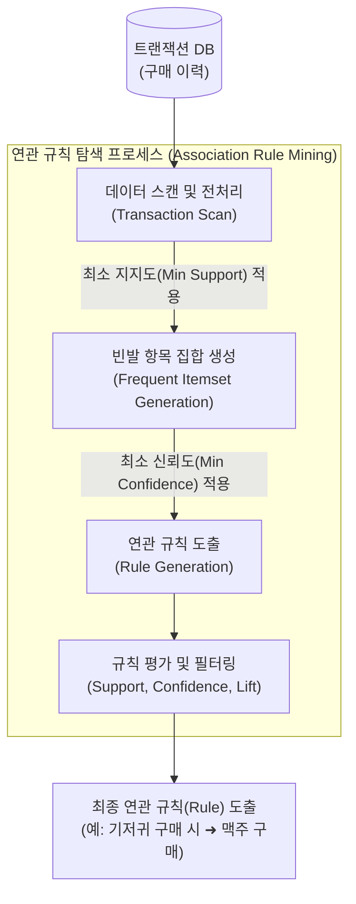

# 연관화

---

## I. 데이터 마이닝의 핵심 패턴 탐색 기법, 연관화(Association)의 개요

* **정의**: 대용량 [[트랜잭션]] 데이터베이스에서 항목(Item) 간의 조건부 확률을 기반으로 빈발하게 발생하는 패턴이나 유의미한 연관 규칙(Association Rule)을 발견하는 [[비지도 학습]] 기법
* 전통적 이커머스 및 리테일 산업의 장바구니 분석(Market Basket Analysis)에 주로 활용되며, 상품 배열 및 교차 판매(Cross-selling) 전략 수립의 핵심 이론으로 작용함
* **특징**: 무방향성 패턴 탐색, [[지지도]]/신뢰도/향상도 기반 정량적 규칙 평가, 이해하기 쉬운 직관적 규칙(If A then B) 생성

---

## II. 연관화의 개념도 및 핵심 기술 요소

### 가. 연관화의 개념도 및 동작 원리

* 원본 데이터에서 최소 지지도(Minimum Support) 이상을 만족하는 빈발 항목 집합을 선별한 후, 유의미한 연관 규칙을 생성하여 향상도(Lift)로 규칙의 실효성을 검증함

### 나. 연관화의 핵심 기술 요소 및 평가지표

| 분류 | 요소기술(키워드) | 세부 설명 |
| --- | --- | --- |
| **평가지표** | **지지도 (Support)** | - 전체 트랜잭션 중 항목 A와 B가 동시에 포함된 비율 ( $P(A \cap B)$ )- 빈발 항목 집합 추출의 1차 필터링 기준 |
| **평가지표** | **신뢰도 (Confidence)** | - 항목 A를 포함한 트랜잭션 중 항목 B가 포함될 조건부 확률 ( $P(B\Vert{}A)$ )- 도출된 연관 규칙의 [[신뢰성]] 및 강도 측정 |
| **평가지표** | **향상도 (Lift)** | - 항목 A 구매 시 항목 B의 구매 확률이 순수 기댓값 대비 증가하는 비율- **Lift > 1**: 양의 상관관계 (유효한 규칙)- **Lift = 1**: 독립관계, **Lift < 1**: 음의 상관관계 |
| **[[알고리즘]]** | **Apriori** | - 최소 지지도 기반으로 하향식 후보 항목 집합을 생성하는 대표 알고리즘- 후보군 탐색을 위해 DB 스캔 횟수가 기하급수적으로 늘어나는 단점 존재 |
| **알고리즘** | **FP-Growth** | - 후보 집합 생성 과정 없이 FP-Tree 자료구조를 활용하여 규칙을 도출- 분할 정복 방식 적용으로 Apriori 대비 DB 스캔 최소화 및 처리 속도 우수 |
| **알고리즘** | **ECLAT** | - 수직적 데이터 포맷과 트랜잭션 ID 교집합 연산을 이용한 깊이 우선 탐색 기법 |
| **응용 기법** | **순차 패턴 (Sequential Pattern)** | - 연관화에 '시간(Time)'의 개념을 추가하여 사건의 발생 선후 순서 규칙 탐색 |
| **응용 기법** | **다차원 연관 규칙** | - 아이템 외에 나이, 성별, 지역 등 다양한 속성 차원(Dimension)을 결합한 연관화 |

---

## III. 연관화와 협업 필터링 비교 및 향후 발전 동향

### 가. 추천 시스템 관점의 연관화 vs 협업 필터링 비교

| 비교 항목 | 연관화 (Association Rule) | 협업 필터링 (Collaborative Filtering) |
| --- | --- | --- |
| **분석 대상** | 개별 트랜잭션 (장바구니 내 동시 구매 품목) | 사용자-아이템 평점 행렬 (User-Item Matrix) |
| **추천 기준** | 항목 간의 동시 발생 확률 (통계적 패턴) | 사용자 간의 취향 [[유사도]] (이웃 기반/잠재 요인) |
| **핵심 알고리즘** | Apriori, FP-Growth, ECLAT | KNN(메모리 기반), 행렬 분해(Matrix Factorization) |
| **개인화 수준** | 보편적/집단적 규칙 기반 (Non-Personalized) | 고도화된 개인 맞춤형 프로파일링 (Personalized) |
| **콜드스타트** | 새로운 아이템 발생 시 지지도 미달로 규칙 도출 어려움 | 신규 사용자/아이템 발생 시 유사도 계산 불가 (극복 과제) |

### 나. 연관화의 최신 동향 및 향후 전망

* **그래프 신경망(GNN)과의 융합**: 단순 동시 발생 빈도를 넘어, 이분 그래프(Bipartite Graph)와 GNN을 활용하여 항목 간의 숨겨진 복잡한 연관 관계(High-order 연관성)를 추론하는 [[딥러닝]] 기반 연관화로 진화 중
* **하이브리드 추천 및 [[초거대 언어 모델|LLM]] 연계**: 전통적 장바구니 분석의 정적 한계를 극복하기 위해 사용자 문맥 정보(Context-aware) 및 대형언어모델(LLM)의 추론 능력을 결합하여, 실시간 초개인화(Hyper-personalization) 이커머스 추천 엔진의 기초 데이터로 융합 활용됨

---

### 🔗 연관 토픽

- **소속 도메인**: [[00_데이터베이스_MOC|🗄️ 데이터베이스]]
- **세부 분류**: `2. 트랜잭션 & 동시성 제어 (Concurrency)`
- **핵심 연관 토픽**:
  - [[트랜잭션]]
  - [[비지도 학습]]
  - [[지지도]]
  - [[딥러닝]]
  - [[유사도|유사도(Similarity)]]
